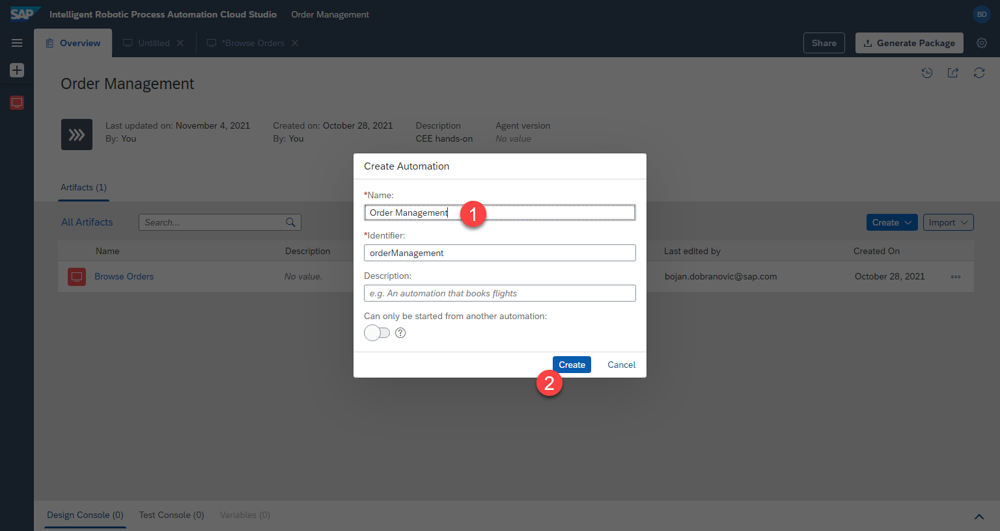

# Automation Intro

## Overview
The screens and elements have been defined. We can now create the actual automation.

Let's think about what our bot should do. On a very high level it should:
- Open Excel and read out some data from there
- Open a webpage and extract some other data from there, based on the data from excel
- Write the found data back into excel

We can start creating our automation from this high level and go down, implementing the details. 

## Creating sub-automations

Let's start by creating 3 automation: one main one, one for the UI5 part, one for Excel one

1. Click on `create` > `automation`


2. Select the version which is tagged `local`. This is the version of your desktop agent installed locally. Even if a higher version is available in the dropdown, please select the `local` version, to make sure that the automation can run on your machine.


3. Click `Confirm`


4. Name the automation, e.g.

```
Order Management
```




An empty automation has been created.


Repeat the steps `1` - `4` to create 2 more automations:

```
Web Portal
```

and 

```
Write Excel
```


## 🔹 How to add automation steps 

We will repeat this process multiple times to add new steps to the automation. Please do this in the following steps.

1. Press on the empty space within the preview to close all other open options

2. Search for the step name in the seach bar

3. If necessary, click on `clear filter` to show all available steps

4. Select the desired action and `drag and drop` it in the correct position

