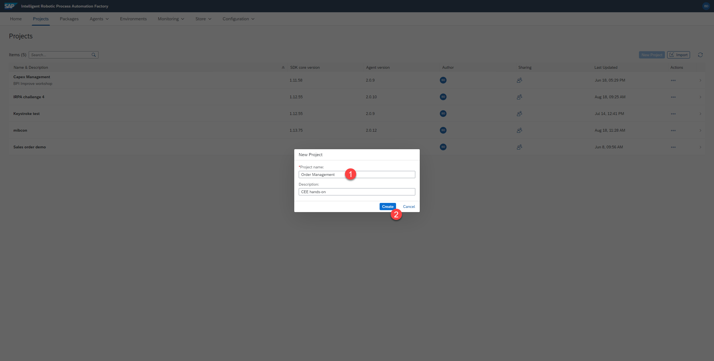

# Projekt erstellen

## Übersicht
Wir werden zunächst ein neues Projekt für diese Automatisierung erstellen.

## Schritte

1. Melden Sie sich bitte im `cloud studio` ein
2. Wählen Sie  `Projects` > `New Project` aus


3. Im `New Project` Popup-Fenster wählen Sie einen Namen (`name`) für das Projekt und klicken Sie auf `create`.  Zum Beispiel

```
Order Management
```



4. Sie sehen nun den Startbildschrim (`home screen`) des neuen Projekts.


