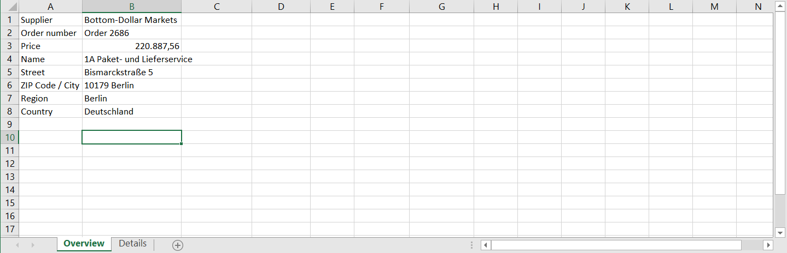

# Ende

## Automatisierung testen

Wenn wir nun die Automatisierung testen, sehen wir die erwarteten Ergebnisse. Es gibt zusätzliche Automatisierungsschritte in RPA, die zur Formatierung der Zellen verwendet werden können. Aufgrund der begrenzten Zeit, die in diesem Workshop zur Verfügung steht, haben wir diese Schritte nicht berücksichtigt.

## Herzlichen Glückwunsch! 🎉

Wir haben diese Automatisierung erfolgreich erstellt! 🎉

So sieht das Endergebnis aus:

[Video](../images/OrderManagementVideo.mp4 ':include :type=video width=100% controls' )