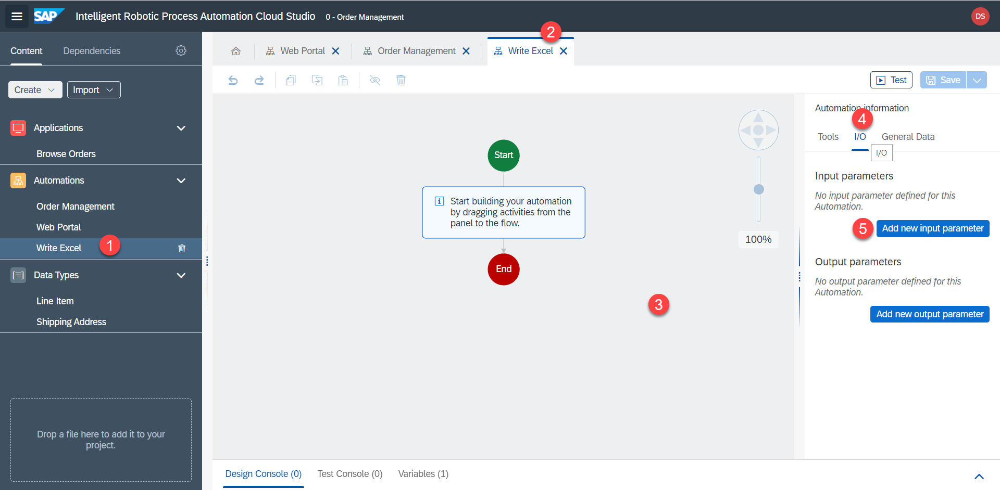
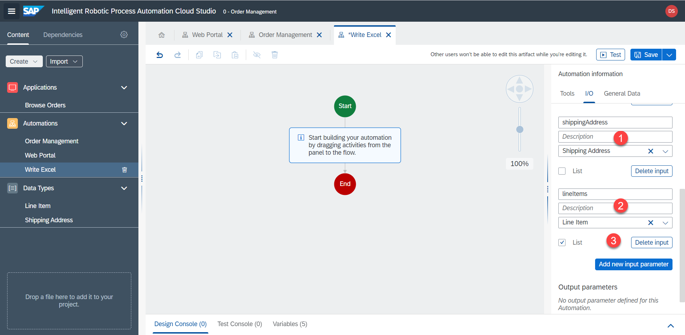
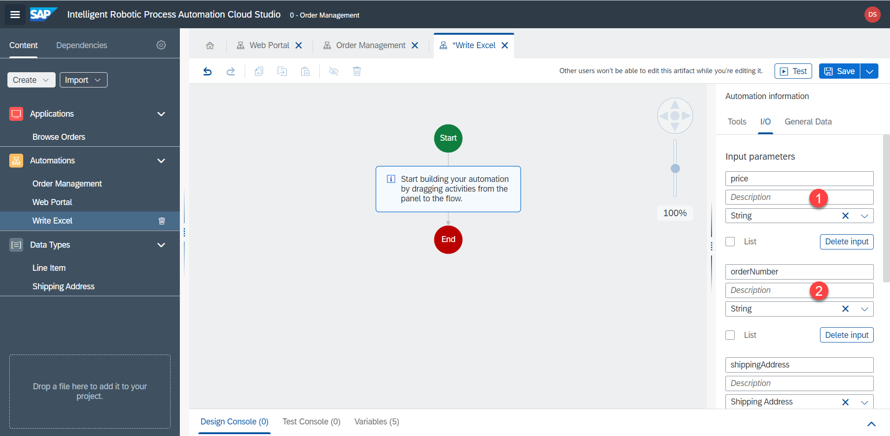
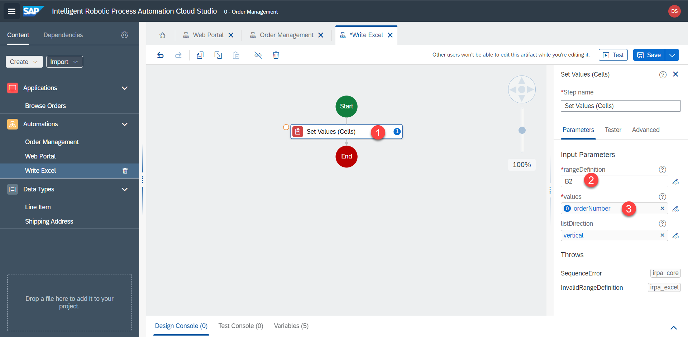
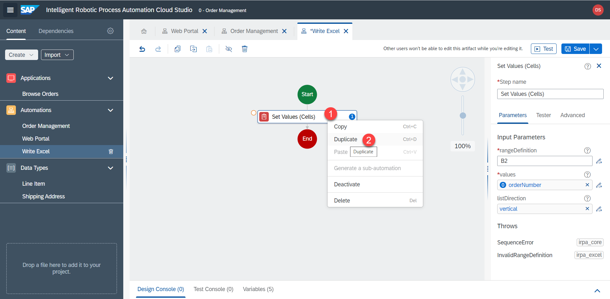
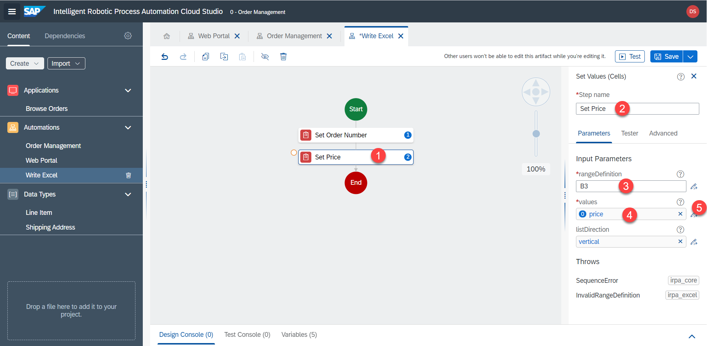
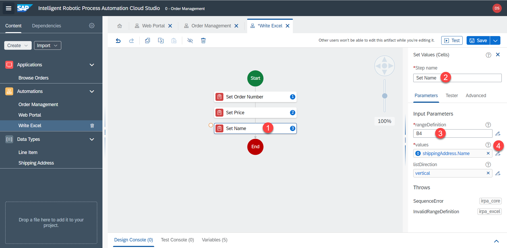
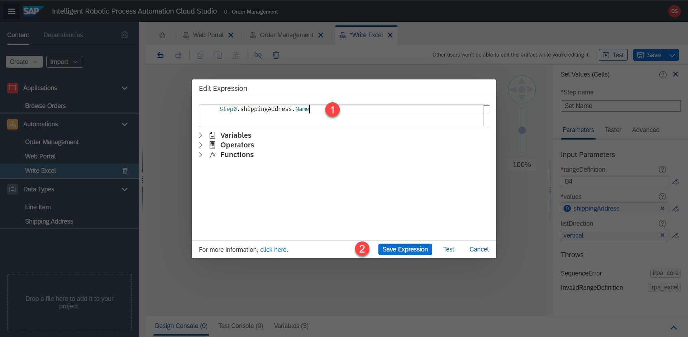
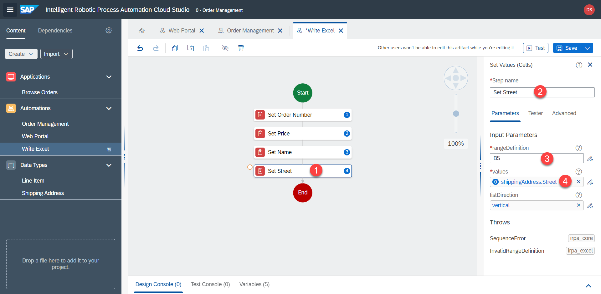

# Excel - Erstes Arbeitsblatt


<!-- ## Excel automation -->

Als nächstes automatisieren wir Excel. Wir haben die Daten von der UI5-App gesammelt. Jetzt müssen wir die Daten wieder in Excel einfügen. Wir werden dies in der Unter-Automatisierung `Write Excel` tun.

Hier ist das gewünschte Ergebnis:


1. Wechseln Sie zur Automatisierung `Write Excel`. Fügen Sie die Eingabeparametern hinzu, die wir aus der `Web Portal` Automatisierung erhalten haben.



2. Fügen Sie die gleichen Eingabeparameter hinzu wie die Ausgabeparameter, die wir in der Web-Automatisierung hinzugefügt haben:

| Name        | Type           | List  |
| ------------- |-------------| -----|
| orderNumber      | String | no |
| price      | String      |   no |
| shippingAddress | Shipping Address      |    no |
| lineItems | Line Item      |    yes |





3. Verwenden Sie den Schritt `Set Values (Cells)`, um Daten in eine bestimmte Zelle zu schreiben.

`B2` und `orderNumber`



4. Duplizieren Sie diesen Schritt



5. Verändern Sie die Parameter zu `B3` und `price`



6. Verwendem Sie den `expression editor`, um den Wert innerhalb des Datentyps zu erhalten.

`B4` 

```
Step0.shippingAddress.Name
```

`Step0` enthält die Eingabeparameter





7. Repeat the steps for `Street` inside the shipping address.
7. Wiederholen Sie die Schritte für `Street` in der Lieferadresse.




8. Duplizieren Sie die Schritte, um Zeit zu sparen, und passen Sie die Parameter gemäß dieser Tabelle an:

| rangeDefinition        | Value           | 
| ------------- |-------------|
| B2      | orderNumber |
| B3      | price      | 
| B4 | Step0.shippingAddress.Name      | 
| B5 | Step0.shippingAddress.Street      | 
| B6 | Step0.shippingAddress.ZIP      | 
| B7 | Step0.shippingAddress.Region      | 
| B8 | Step0.shippingAddress.Country      | 


