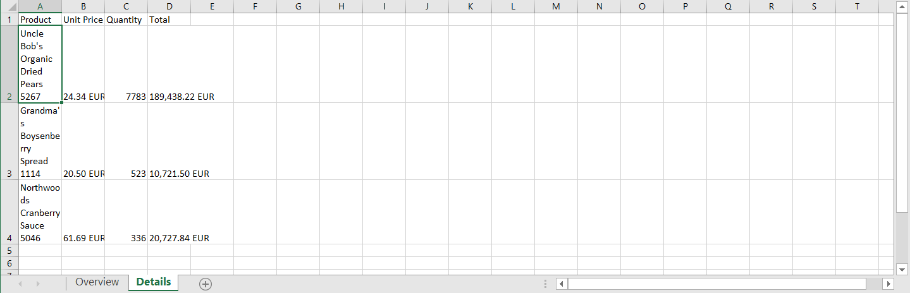
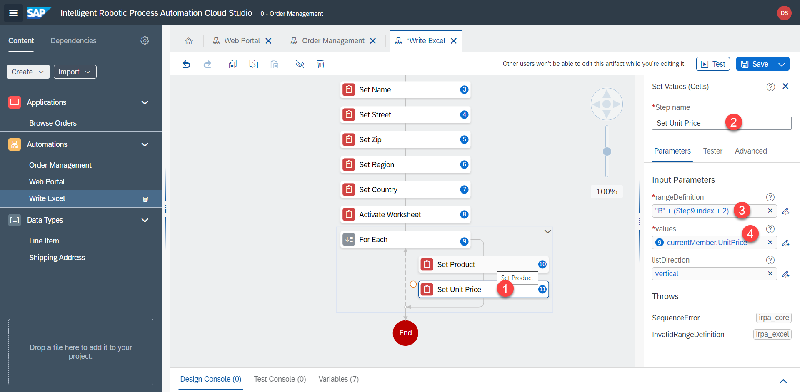

# Excel - Zweites Arbeitsblatt

Gewünschte Ergebnis:



1. Fügen Sie den Schritt `Active Worksheet`, um das zweite Arbeitsblatt mit den Auftragspositionen zu öffnen. worksheetName = `Details`


2. Erstellen Sie eine For `For Each` Schleife, um die Auftragspositionen zu durchlaufen. Die Liste für die Schleife ist `lineItems`


3. Fügen Sie den Schritt `Set Values (Cells)` innerhalb der Schleife ein.


4.	Passen Sie die Parameter an. Die Zellen beginnen in Zeile `2`, der Index beginnt bei `0`. Aus diesem Grund können wir diese Formel verwenden, um die richtige Zelle zu bestimmen:

```
"A" + (Step9.index + 2)
```

`Values` = 

```
Step9.currentMember.Product
```


5. Duplizieren Sie den Schritt und wiederholen Sie den Vorgang für den Stückpreis und Spalte `B`.




6. Duplizieren Sie den Schritt und wiederholen Sie den Vorgang für die Menge und Spalte `C`.


6. Duplizieren Sie den Schritt und wiederholen Sie den Vorgang für den Gesamtpreis und Spalte `D`.


8. Speichern Sie alle Automatisierungen

9. Innerhalb der Hauptautomatisierung `Order Management` übergeben wir nun die Ausgaben aus `Web Portal` in die Eingaben von `Write Excel`

