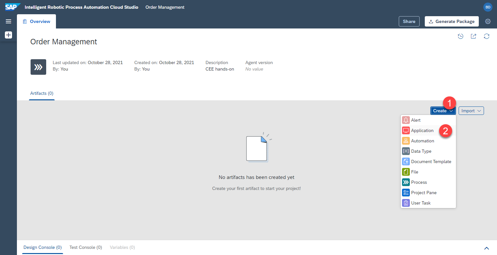
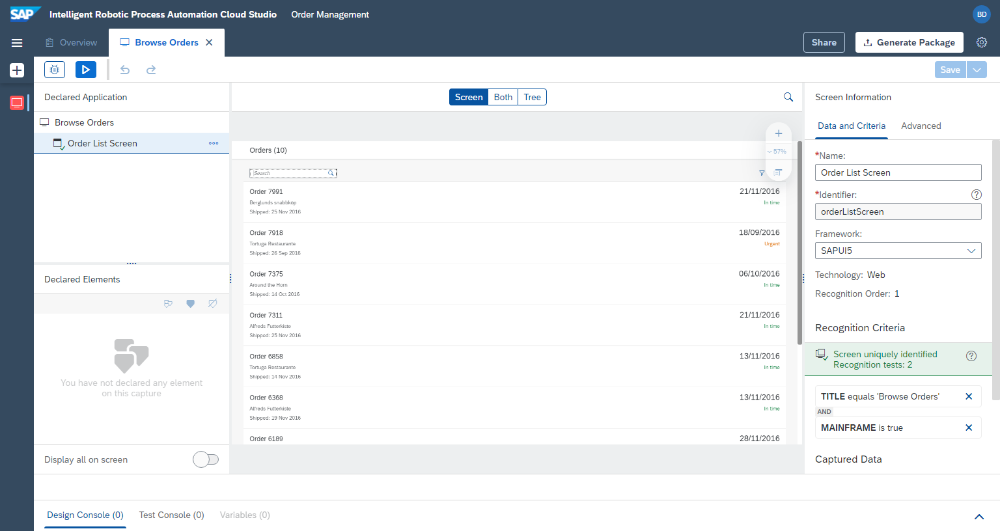
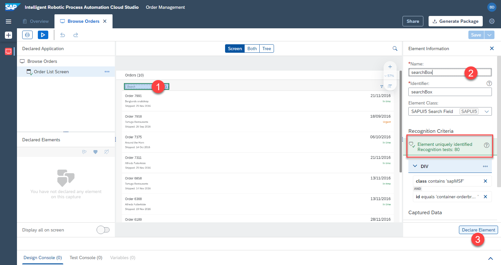

# Anwendung und ersten Bildschirm definieren

## Übersicht
Als Nächstes werden wir die Anwendung definieren, die in unserer Automatisierung verwendet werden soll. In unserem Fall werden wir die UI5-App für Bestellungen, die verschiedenen Bildschirme und die Elemente auf der Webseite definieren. Wir werden diese Bildschirme und Elemente später in der Automatisierung verwenden.

## Anwendung erstellen

1. Vergewissern Sie sich, dass die [UI5 app](https://openui5.hana.ondemand.com/test-resources/sap/m/demokit/orderbrowser/webapp/test/mockServer.html) in einem separaten Fenster geöffnet ist, nicht nur in einem neuen Tab. Der Desktop Agent sollte ebenfalls laufen und mit dem richtigen Tenant verbunden sein.

2. Wählen Sie  `Create` > `Application`




3. Klicken Sie mehrmals auf das `Aktualisierungssymbol`, um die aktuell geöffneten Fenster anzuzeigen

4. Wählen Sie das Fenster mit dem Titel `Browse order` aus. Dies ist unsere UI5-Anwendung

5. Geben Sie der Anwendung einen Namen (`Application name`), z.B.


```
Browse Orders
```

6. Geben Sie dem ersten Bildschirm (`screen`), den wir aufzeichnen, einen Namen. Die Anwendung ändert die Ansicht, wenn wir auf einen der Aufträge klicken. Es erscheint ein neuer Bildschirm / neue Ansicht mit den detaillierten Informationen. Aus diesem Grund werden wir mehrere Bildschirme einer einzigen Anwendung erfassen. Beispiel für einen Bildschirmnamen:


```
Orders List Screen
```

7. Klicken Sie auf `capture`


8. Das Ergebnis ist eine erfasste Anwendung und ein erfasster erster Bildschirm





## Elemente auf dem ersten Bildschirm definieren

Als Nächstes werden wir das einzige relevante Element auf dem ersten Bildschirm definieren: Suchfeld. Unser Bot wird in diesem Suchfeld nach dem Lieferanten suchen, also müssen wir dieses Element definieren.

1. Klicken Sie auf das Suchfeld in der Vorschau
2. Benennen Sie das Suchfeld-Element. z.B.

```
searchBox
```

3. Stellen Sie sicher, dass das Element eindeutig indentifiziert wird (grüner Status)
4. Vergessen Sie nicht, auf `declare element` zu klicken, um sicherzustellen, dass dieses Element auch wirklich gespeichert wird.
5. Das definierte Suchkastenelement wird unter `Declared elements` mit einem grünen Status angezeigt. Das bedeutet, dass das Element erfolgreich definiert wurde.

