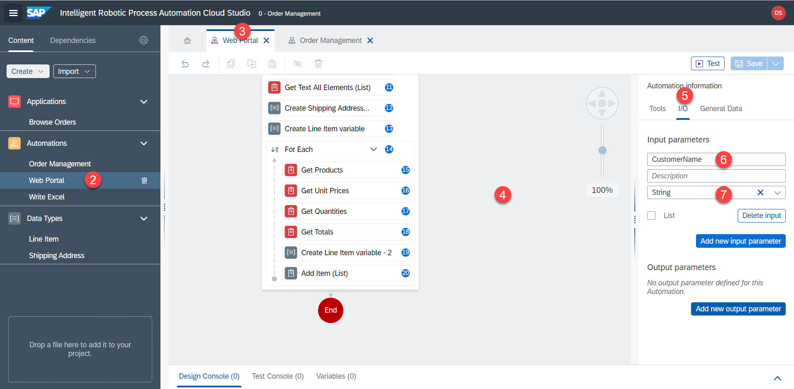
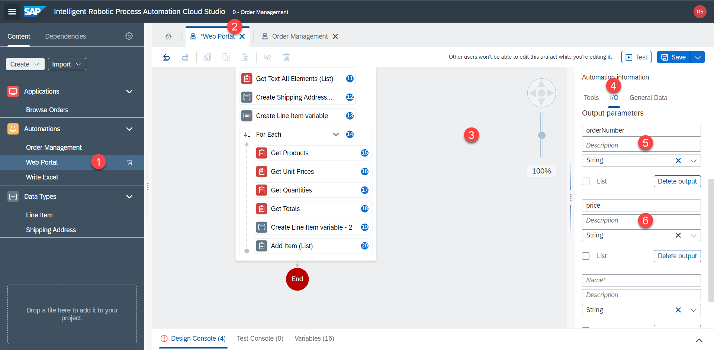
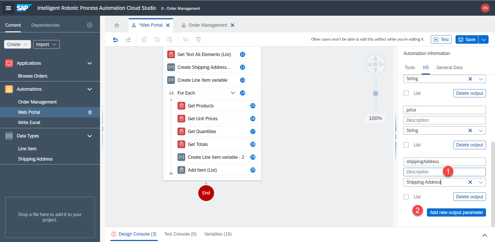

# Eingabe- / Ausgabeparameter

<!-- ## IO params - Web automation -->

Wir müssen Daten zwischen Unter-Automatisierungen weitergeben. Dies kann mit Hilfe von Eingabe- und Ausgabeparametern erfolgen.

Die Web-Automatisierung erhält den Namen des Lieferanten aus der Hauptautomatisierung und gibt die Bestellnummer, den Preis, die Versandinformationen und die Auftragspositionen zurück. Diese Daten werden wiederum an die Excel-Automatisierung weitergegeben.

1. Wählen Sie die Automatisierung `Web Portal` aus. Klicken Sie irgendwo auf die graue Fläche, um die Automatisierungsparameter zu öffnen.

2. Fügen Sie einen Eingabeparameter mit dem Namen `CustomerName` und Typ `string` hinzu.

3. Erstellen Sie auf ähnliche Weise folgende Ausgabeparameter:

| Name        | Type           | List  |
| ------------- |-------------| -----|
| orderNumber      | String | no |
| price      | String      |   no |
| shippingAddress | Shipping Address      |    no |
| lineItems | Line Item      |    yes |

4. Legen Sie nun fest, welche Variablen zurückgegeben werden sollen. Klicken Sie auf den Schritt `End`, wählen Sie `parameters` aus und wählen Sie die entsprechenden Variablen als Ausgabe.

5. Vergessen Sie nicht, die Automatisierung zu speichern.