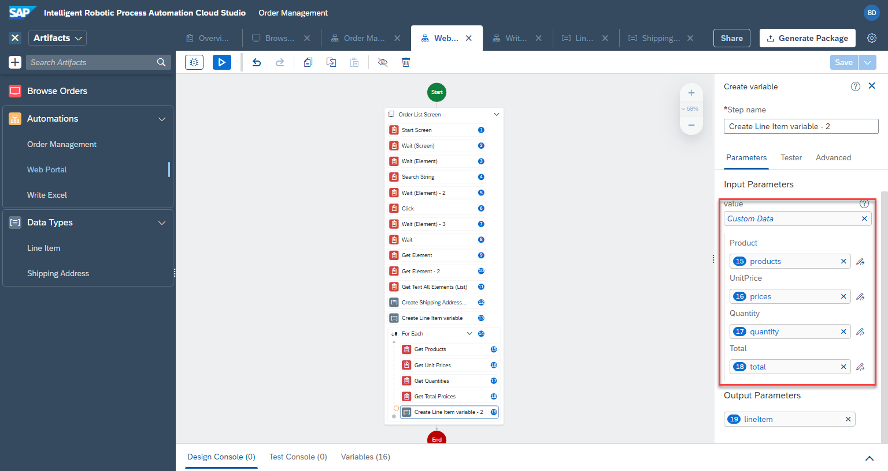

# Auftragspositionen

<!-- ## Saving line Items -->

1. Wir beginnen mit der Erstellung einer Variablen, die mehrere Auftragspositionen enthalten wird. Fügen Sie den Schritt  `Line Item` hinzu, aktivieren Sie die Option `list` und benennen Sie den Ausgabeparameter um in

```
lineItems
```


2. Erstellen eine `for each` Schleife


3. Wählen Sie `Products` als Liste für die Schleife aus


4. Fügen Sie innerhalb der for-Schleife den Schritt `Get Element` hinzu, setzen Sie target = `currentMember` und output = `products`. Benennen Sie den Schritt um


5. Duplizieren Sie nun den Schritt, indem Sie mit der rechten Maustaste auf den Schritt `get product` klicken. `right click` > `Duplicate`


6. Benennen Sie den Schritt um, setzen Sie das target = `unitPrices` und output = `price`


7. Duplizieren Sie den Schritt nochmal und setzen target = `quantities` Element und output = `quantity`.


8. Wiederholen Sie die Schritte für die Elemente der Gesamtpreise. Target = `totalPrices`. Output = `total`.


9. Fügen Sie einen Schritt für die Variable `line item` hinzu. Setzen Sie die Ausgabe auf `lineItem`.


10. Klicken Sie auf `Edit activity` und passen Sie die Variablen für diesen Datentyp an.



Wir fügen nun die Variable mit einer Auftragsposition zur Liste, die alle Auftragspositionen enthält.

11. Fügen Sie den Schritt `add item` hinzu. List = `lineItems`. itemToAdd = `lineItem`


Wenn wir die Automatisierung jetzt testen, werden wir sehen, dass die Liste erstellt wird.

