# Hauptautomatisierung

## Schritte definieren

Lassen Sie uns die allgemeine Struktur unserer Automatisierung definieren. Hier sind die Daten, die wir aus Excel benötigen:

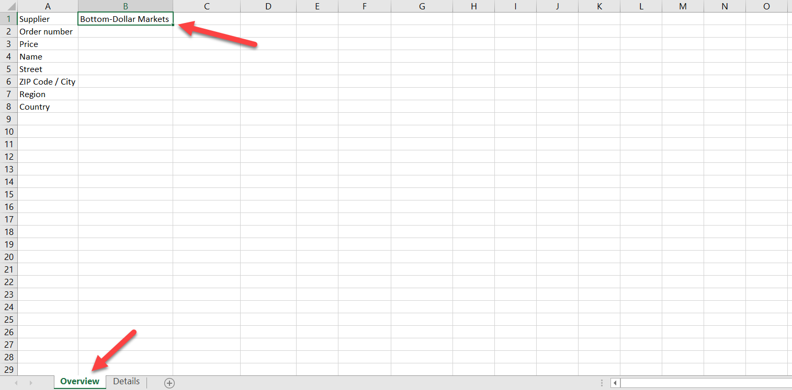

1. Wir möchten Excel öffnen. Wiederholen Sie die zuvor beschriebenen Schritte, um den Schritt `Open Excel Instance` hinzuzufügen.

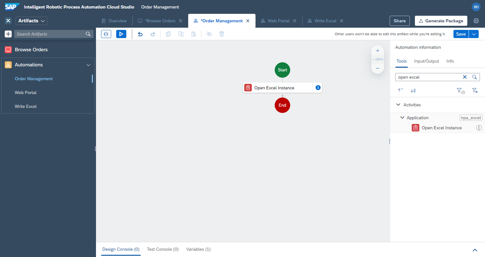

2. Wir möchten die richtige Arbeitsmappe öffnen. Fügen Sie den Schritt `Open Workbook` hinzu.

Bearbeiten Sie in den Parametern auf der rechten Seite, ändern Sie `expression` und geben Sie den vollständigen Pfad zu Ihrer Datei ein. Stellen Sie sicher, dass der Pfad in Anführungszeichen `"..."` steht, z.B.

```
"C:\Users\you\Desktop\Demo_Procurement.xlsx"
```


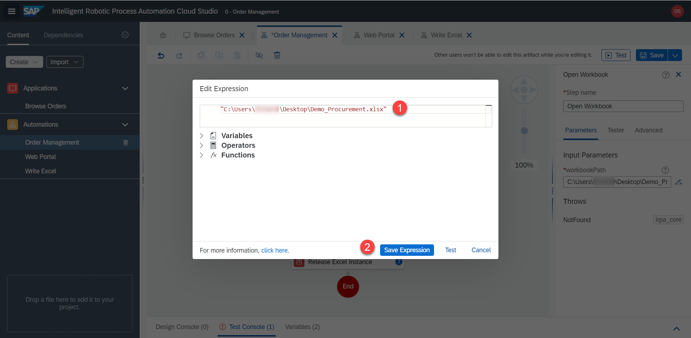

3. Wir möchten ein bestimmtes Arbeitsblatt öffnen. Fügen Sie den Schritt `Activate Worksheet` hinzu. `worksheetName` = 

```
Overview
```


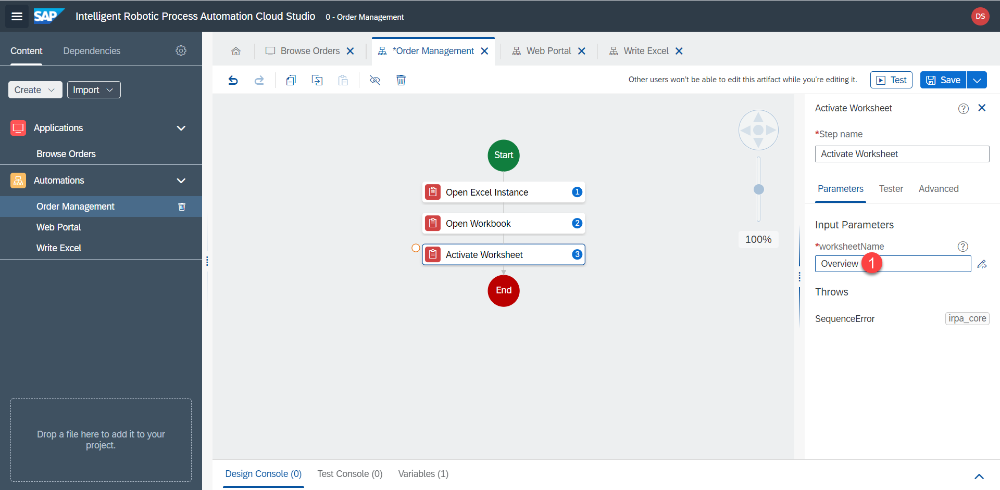


4. Wir möchten einen Wert aus einer Zelle auslesen. Fügen Sie den Schritt `Get Values (Cells)` hinzu. `rangeDefinition` = `B1`. Und benennen Sie `outputParamenter` um in

```
supplierName
```

Dies bedeutet, dass dieser Schritt ausgeführt wird und das Ergebnis (Wert aus Zelle B1) in einer Variablen namens `supplierName` gespeichert wird.


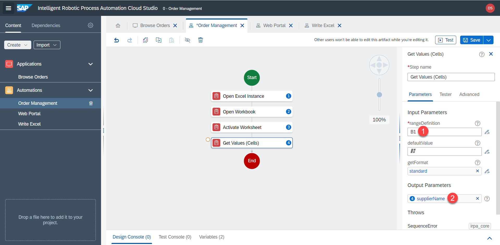

5. Fügen Sie `Web Portal` and `Write Excel`  Unter-Automatisierungen hinzu. Bislang tun sie nichts, sondern dienen nur als Platzhalter.


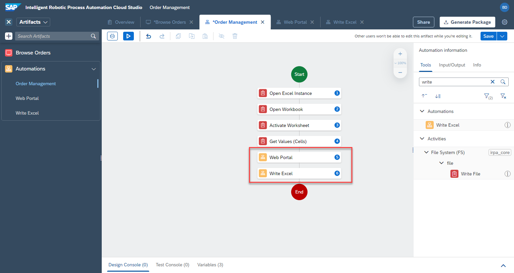

6. Am Ende möchten wir sicherstellen, dass Excel nicht mehr von iRPA verwendet wird. Wir geben die Instanz frei. Fügen Sie den Schritt `Release Excel Instance` hinzu.


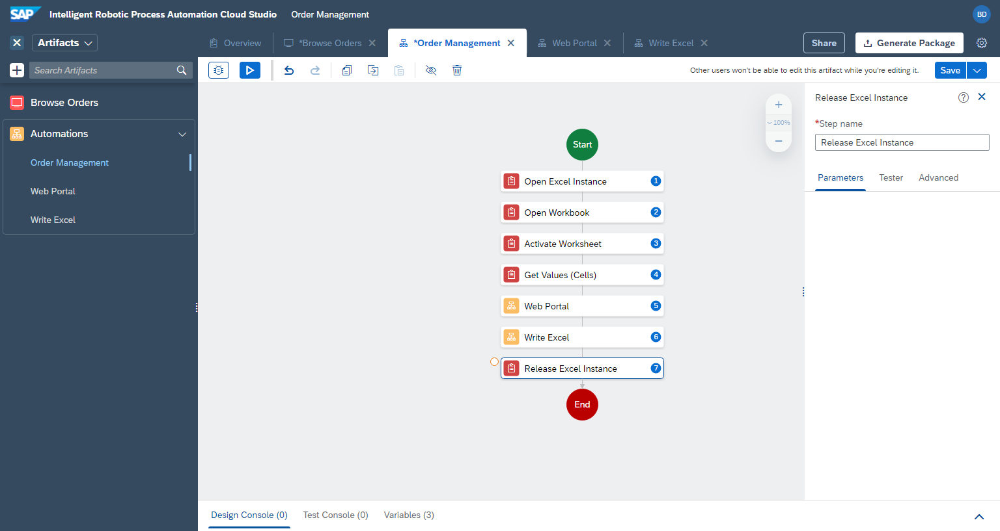

## 🔹 Umgebung einrichten

Bevor wir unsere Automatisierung testen können, müssen wir eine Umgebung einrichten, die eine Landschaft innerhalb von iRPA darstellt. Zum Beispiel können wir Umgebungen für Dev, Test und Prod definieren. Wir werden Ihren lokalen Desktop-Agenten zu einer Testumgebung hinzufügen, damit wir unsere Automatisierungen testen können.

1. Zurück auf dem Startbildschirm der Cloud Factory, gehen Sie zu `environemnts`. Dann klicken Sie auf `New Environment`

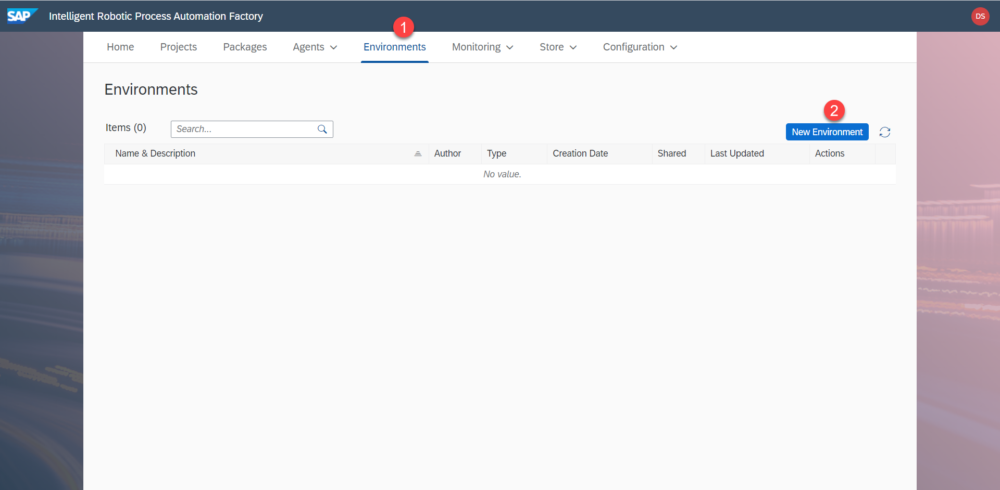

2. Benennen Sie die Umgebung, z.B. `Test` mit type = `Test`

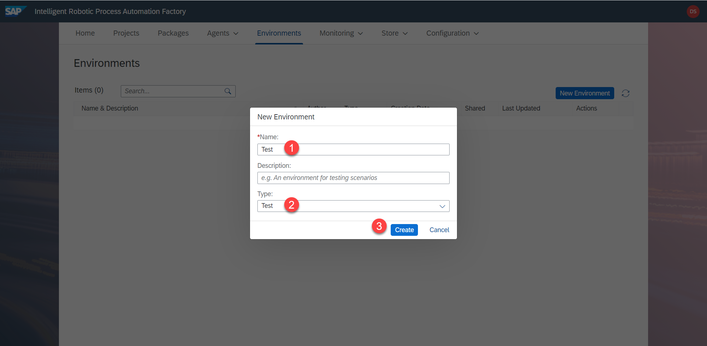

3. Die Umgebung ist nun erstellt. Fügen wir nun einen `agent` hinzu, in unserem Fall Ihren lokalen Desktop-Agenten, der die Automatisierung tatsächlich ausführen wird. Klicken Sie `Add Agent`.

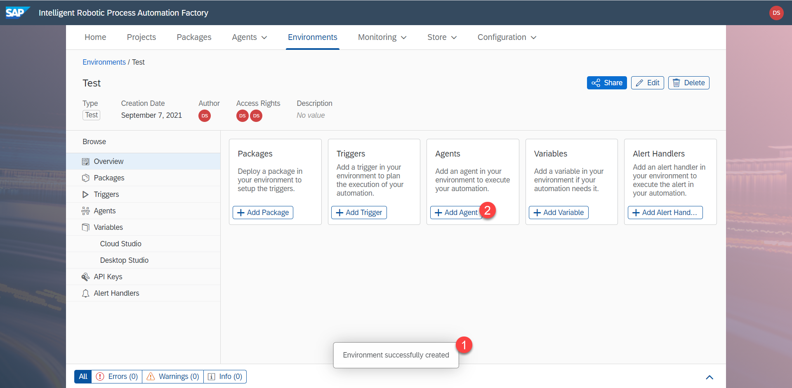

4. Wählen Sie Ihren Agenten aus und klicken Sie auf `Add agent`.

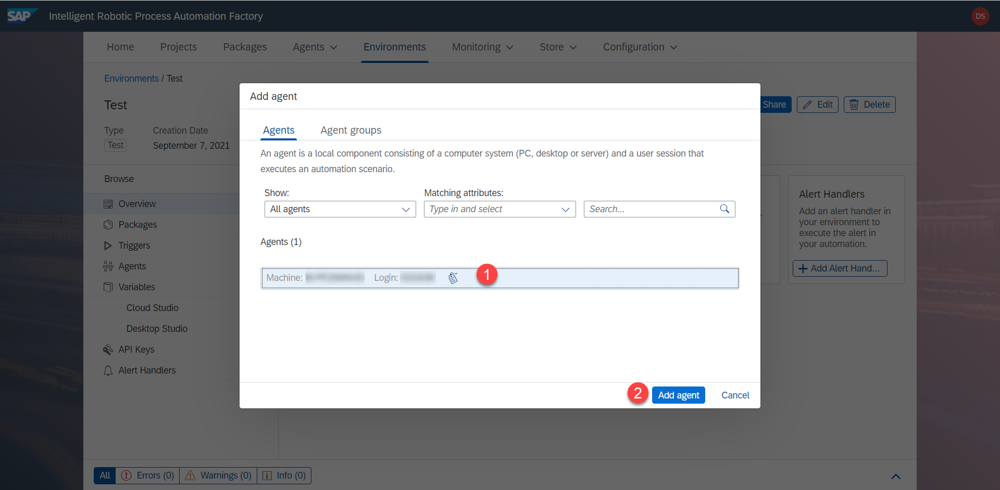

5. Wir können nun die Liste der Agenten aufrufen, indem wir auf  `Agents` klicken.

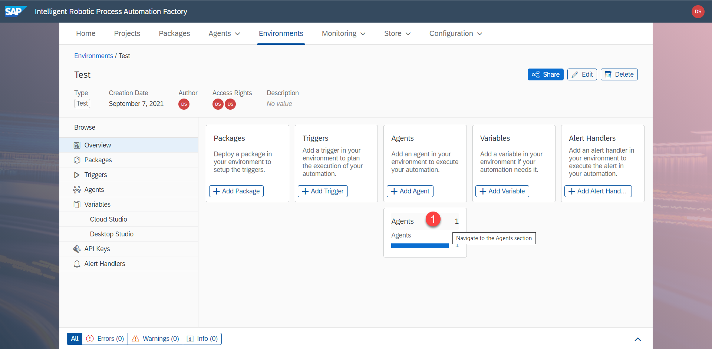

6. Hier sehen Sie Ihren Agenten, den Sie gerade hinzugefügt haben. Wir können nun fortfahren und die Automatisierung testen.

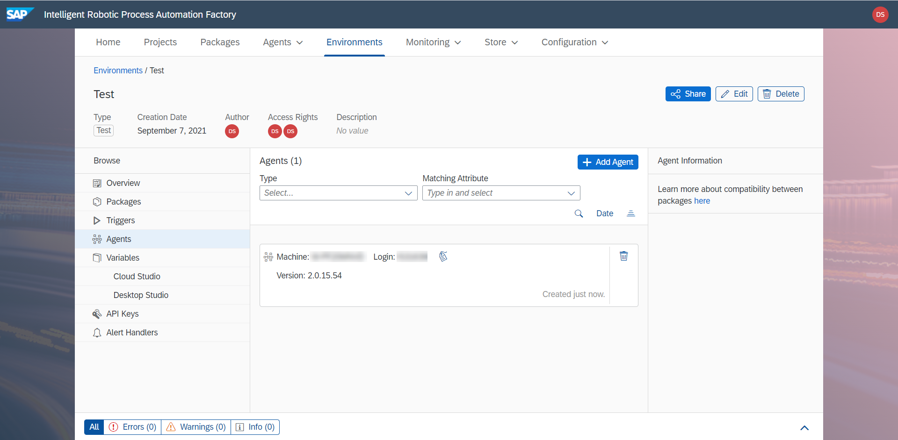


## 🔹 Wie testet man die Automatisierung?

Wir sollten uns nicht zu viel Änderungen vornehmen, ohne zu sehen, was der Bot macht und ob wir Fehler machen.

1. Speichern Sie die Automatisierung (auf `Save` klicken) und klicken Sie dann auf `test`.

2. Wählen Sie Ihre Umgebung aus.

3. Klicken Sie auf `test`.


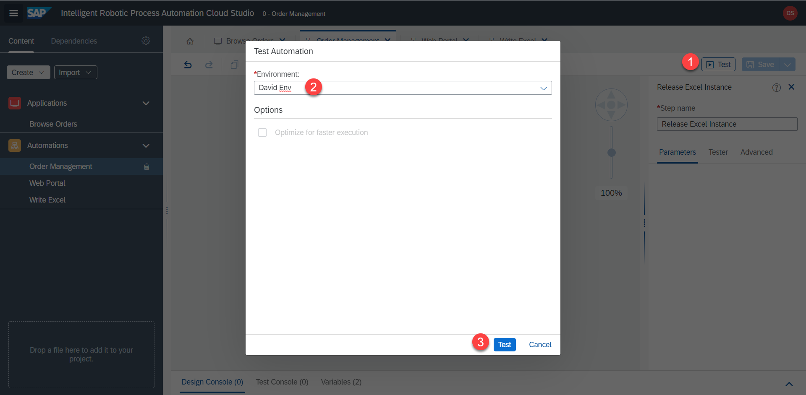

Es dauert eine Weile, bis der Desktop-Agent die Automatisierung heruntergeladen, verarbeitet und ausgeführt hat. Hier sind einige der Meldungen, die Sie sehen werden:

|  |  |  |
:-------------------------:|:-------------------------:|:-------------------------:|
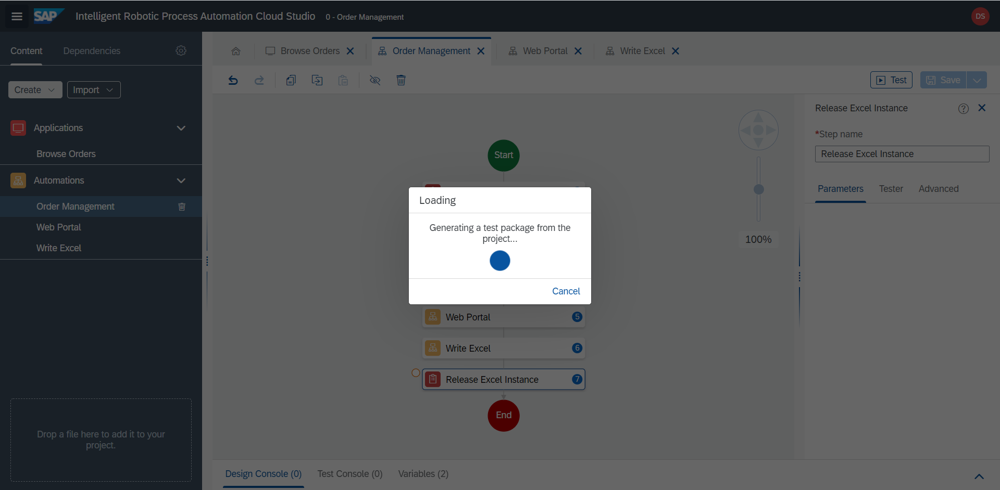  |  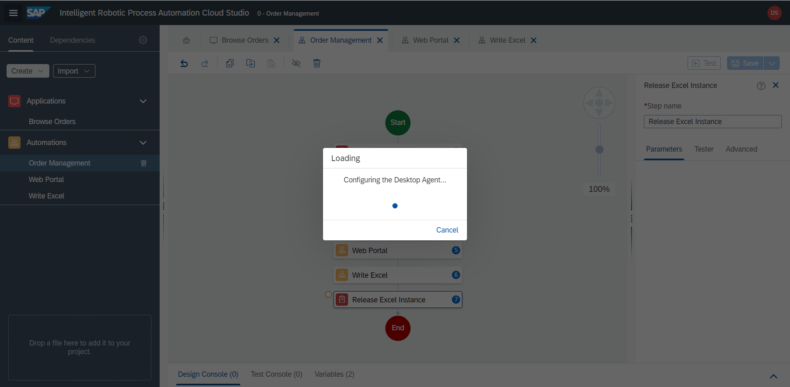 |  


Nachdem die Automatisierung abgeschlossen ist, sehen Sie den Debug-Bildschirm (`Tester`). Hier können Sie entweder die Ausgabe der Testkonsole (`test console`) überprüfen oder auf einzelne Schritte in der Automatisierung klicken, um die Details auf der rechten Seite zu sehen.

4. Klicken Sie zum Beispiel auf den Schritt `Get Values (cells)` und wir sehen den korrekten Ausgabewert auf der rechten Seite: `Bottom-Dollar Markets`. Die Automatisierung wurde korrekt ausgeführt

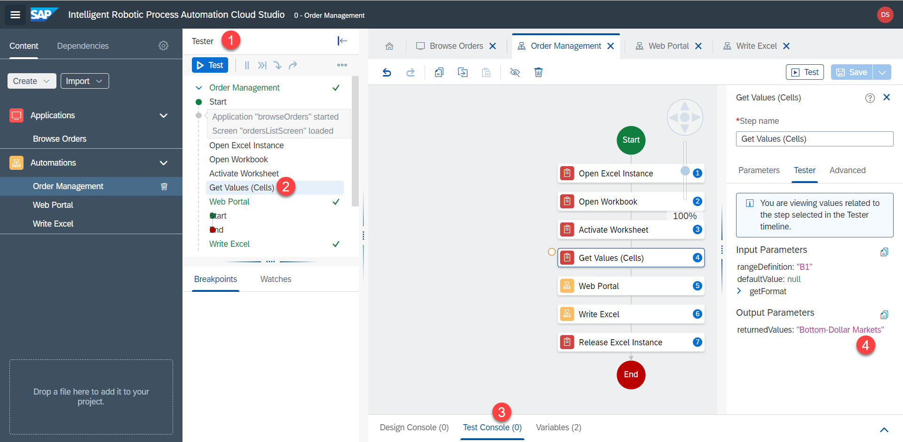

5. Bitte vergessen Sie nicht, sowohl Excel als auch die UI5-App nach jedem Test der Automatisierung zu schließen.