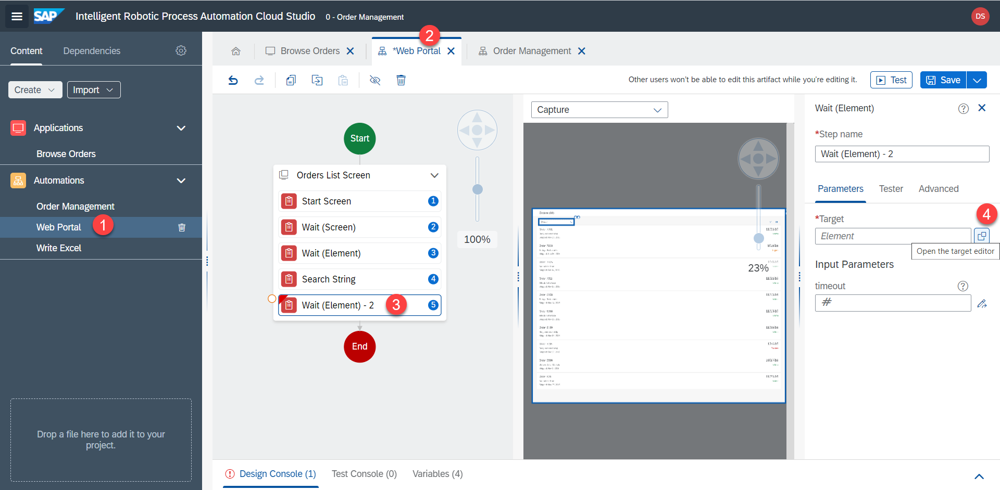
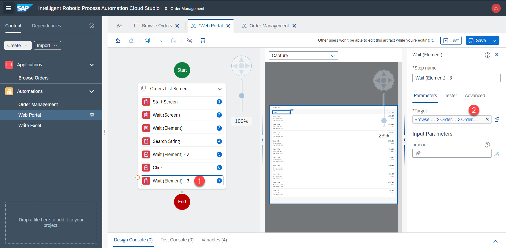
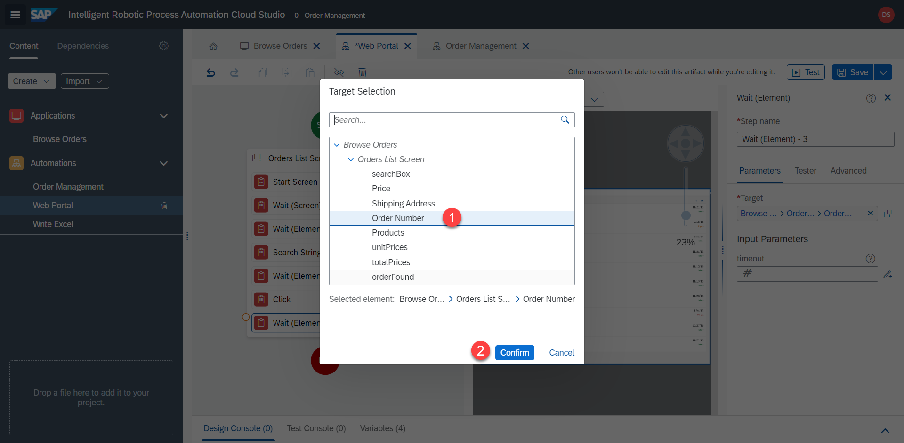
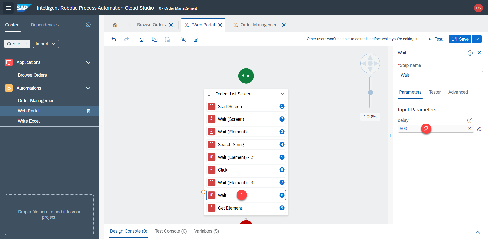
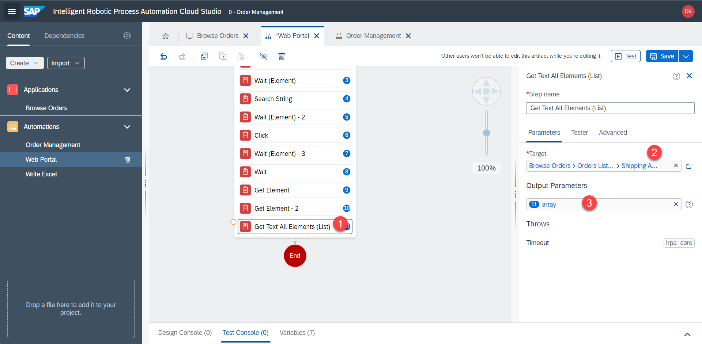

# Bestellinformationen abrufen

## Warten auf die Suchergebnisse

Als nächstes soll der Bot warten, bis die Suchergebnisse geladen sind

1. Fügen Sie den Schritt `Wait (Element)` mit `target` = Zeile hinzu

2. Wählen Sie im Popup das Element  `orderFound` und bestätigen Sie mit `confirm`.

3. Fügen Sie den Schritt `click` mit dem Ziel der Zeile  --> `orderFound`. RPA wartet, bis die Zeile erscheint, und klickt sie dann an.

## Warten bis die Details geladen sind

1. RPA sollte darauf warten, dass der Detailbildschirm geöffnet und geladen wird. Fügen Sie den Schritt `Wait (Element)` mit `Order Number` als Ziel hinzu

2. Wir speichern die Bestellnummer in einer Variable. Verwenden Sie den Schritt `Get Element`. Setzen Sie das Ziel auf `Order Number`. Benennen Sie den Ausgabeparameter output parameter = `orderNumber`. 

An diesem Punkt erhält der Bot manchmal `Order undefined` als Ergebnis. Das liegt daran, dass die Detailansicht langsamer geladen wird, als der Bot zum nächsten Schritt übergeht. Aus diesem Grund fügen wir eine manuelle Verzögerung von `500` Milisekunden für das Laden der Detailseite hinzu.

Wenn wir jetzt die Hauptautomatisierung testen, werden wir sehen, dass wir die Bestellung `Order 2686`. korrekt erhalten.

3. Als Nächstes speichern wir das Element `Price` in der Variable `price`

4. Die Lieferadresse wird in einer Liste gespeichert. Verwenden Sie den Operator `Get Text All Elements (List)`. Target = `Shipping Address`. output = `array`

