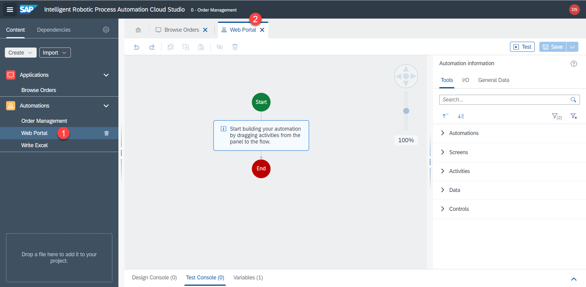
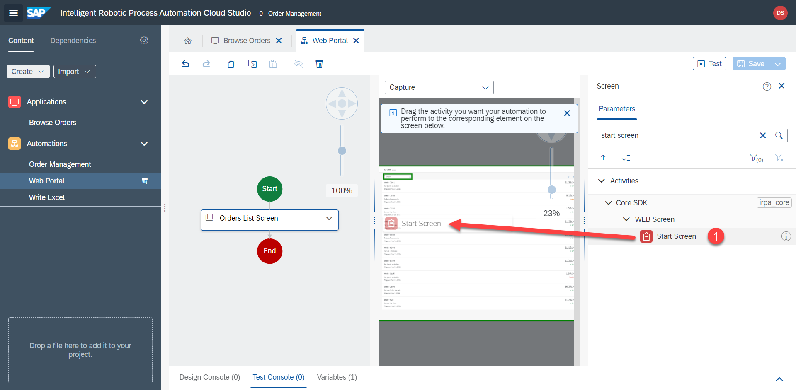
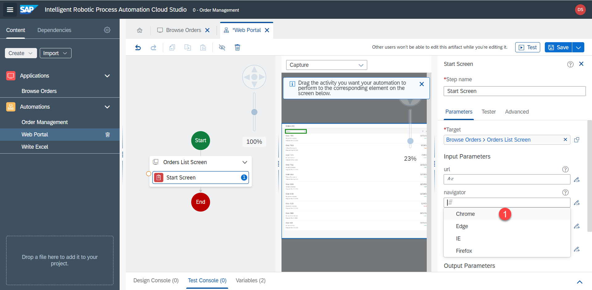
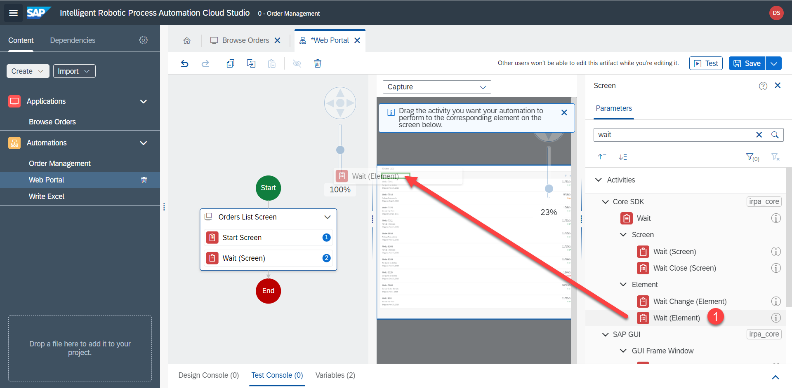
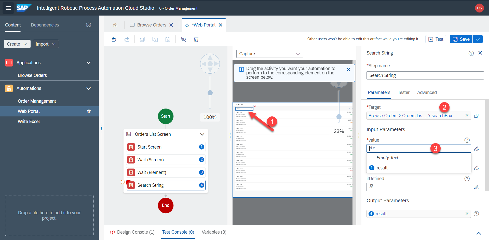

# Suche


## Web-Automatisierung

Als nächstes werden wir die Automatisierung innerhalb der UI5-App definieren. Hier ist die Übersicht der Automatisierung: 
- Eingabe des Lieferantennamens in das Suchfeld und Suche 
- Klick auf das Ergebnis 
- Dadurch werden die Details der Bestellung geöffnet 
- RPA speichert alle relevanten Informationen, die wir später in Excel schreiben werden

1. Klicken Sie entweder im Menü auf der linken Seite oder auf der Registerkarte oben auf `Web Portal`.



2. Fügen Sie die Bild-Activity `Orders List Screen` hinzu, denn wir werden mit dieser speziellen Anwendung interagieren.


3. Klicken Sie auf die Bild-Activity und dann auf `Define Screen Activities`.


4. Ziehen Sie `Start screen` auf die Bildschirmvorschau



5. Vergewissern Sie sich, dass der Schritt innerhalb der Bildschirmaktivität liegt und `target` = `orders list screen` gesetzt ist.


6. Ändern Sie den Navigator von `Internet Explorer` zu `Chrome`, damit RPA die Seite in Chrome öffnet.


|  |  |  |
:-------------------------:|:-------------------------:|:-------------------------:|
  |   |  

7. Ziehen Sie `Wait (Screen)` auf die Bildschirmvorschau and stellen Sie sicher, dass das Ziel `target` korrekt eingestellt ist. RPA wird warten, bis der Bildschirm tatsächlich geladen wird.


8. Außerdem sollte RPA warten, um sicherzustellen, dass auch die Suchleiste geladen wird. Ziehen Sie `Wait (Element)` auf die Vorschau der Suchleiste. Vergewissern Sie sich, dass das Ziel `target` auf Suchleistenelement eingestellt ist.




9. Fügen Sie den Schritt `Search string` hinzu. Stellen Sie sicher, dass das Ziel korrekt ist.



## Eingabeparameter

Wie erhalten wir den Namen des Lieferanten, den wir aus Excel erhalten haben? Dieser ist in der Unter-Automatisierung `Web Portal` noch nicht verfügbar. Diese Variable ist nur in der Hauptautomatisierung `Order Management` verfügbar. Wir können aber die Variable mit Hilfe von Parametern an die Unter-Automatisierung übergeben.

10. Schließen Sie das Bedienfeld


11. Klicken Sie auf ein leeres Feld, um die Einstellungen für die Automatisierung zu ändern. Klicken Sie auf `I/O` > `Add new input parameter`.


12. Erstellen Sie einen Eingabeparameter mit dem Namen

```
CustomerName
```

Type = `string`. Klicken Sie auf das leere Feld, um diese Einstellungen zu speichern.


13. Nun können wir im Schritt `search string` die Variable `CustomerName` auswählen, die als Eingabeparameter an die Unter-Automatisierung übergeben wird.


Der Wert wurde jedoch noch nicht von der Hauptautomatisierung übergeben. Um dies zu tun

14. Rufen Sie die Hauptautomatisierung auf, entweder über die linke Seite oder über die Registerkarten am oberen Rand. Wählen Sie den Schritt `Web Portal` und geben Sie den Eingabeparameter ein


15. Vergessen Sie nicht, den Fortschritt zu speichern: `save`