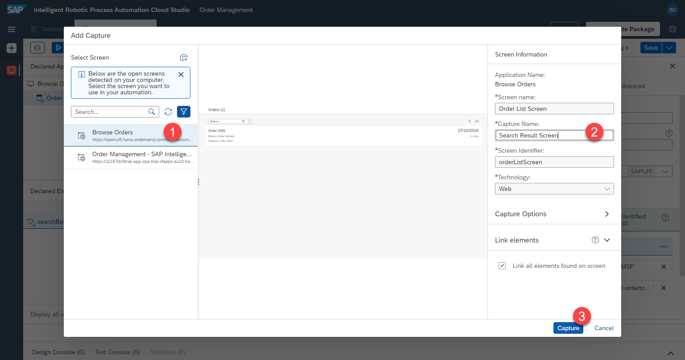

# Zweiten Bildschirm Definieren

## Zweiten Bildschirm Definieren

Als Nächstes fügen wir den zweiten Bildschirm in derselben UI5-App hinzu. Der Bot wird die Ergebnisse einer Suche erkennen

1. Öffnen Sie die [UI5-App](https://openui5.hana.ondemand.com/test-resources/sap/m/demokit/orderbrowser/webapp/test/mockServer.html) in einem separaten Fenster, und geben Sie `Bottom-` in die Suche ein. Stellen Sie sicher, dass die Bestellung `2686` gefunden wird. Lassen Sie das Fenster geöffnet.


2. Klicken Sie im Cloud Studio auf  `...` neben dem ersten Bildschirm-Capture und wählen Sie `Add Capture to Current Screen` aus.


3. Klicken Sie auf `Refresh` und wählen Sie das Fenster mit `Browse Orders`

4. Bennen Sie die neue Aufnahme, z.B. 

```
Search Result Screen
```

5. Klicken Sie auf `Capture`




## Elemente auf dem zweiten Bildschirm definieren

1. Wählen Sie den zweiten Bildschirm, den wir soeben definiert haben: `Search Result Screen`

2. Klicken Sie in der Vorschau auf die Zeile. Vergewissern Sie sich, dass die gesamte Zeile ausgewählt ist und nicht nur der Text

3. Benennen Sie das Element, z.B.

```
OrderFound
```

4. Klicken Sie noch NICHT auf `declare element`


Wir werden die Kriterien so anpassen, damit das Element unabhängig von der Bestellnummer erkannt werden kann. Derzeit würde RPA nach einer sehr spezifischen Liste von Kriterien suchen, um ein Element zu finden. Diese Kriterien können im Abschnitt `criteria` auf der rechten Seite gefunden und geändert werden.

Wir werden speziell nach dem Element suchen, welches `Order` als Text enthält.

5. Klicken Sie auf das Kriterium `text`.


6. Es wird ein Popup-Fenster geöffnet. Ändern Sie den `operator` zu `contains`. 

7. Ändern Sie `value` zu 

```
Order
```

8. Klicken Sie auf `Apply`


9. Die Kriterien wurden aktualisiert, wie auf der rechten Seite zu sehen ist.

10. Wir können nun das Element speichern, indem wir auf `Declare Element` klicken.

11. Das Element wird unter `Declared Elements` angezeigt


