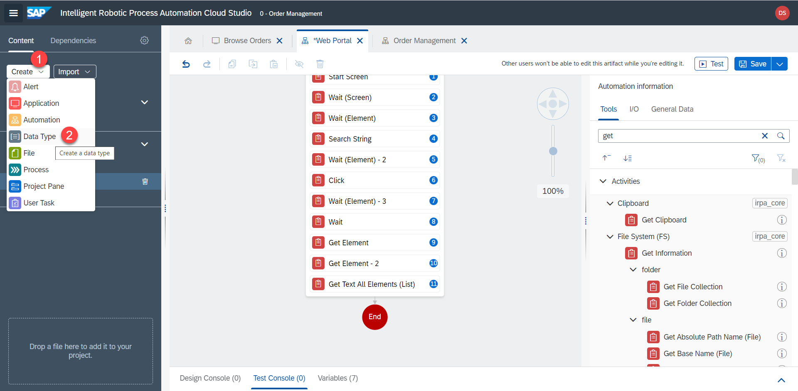
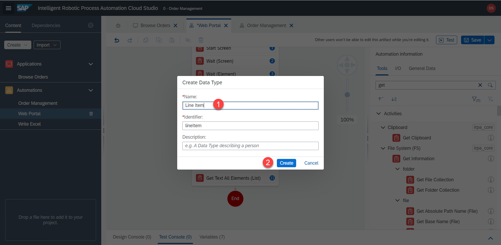
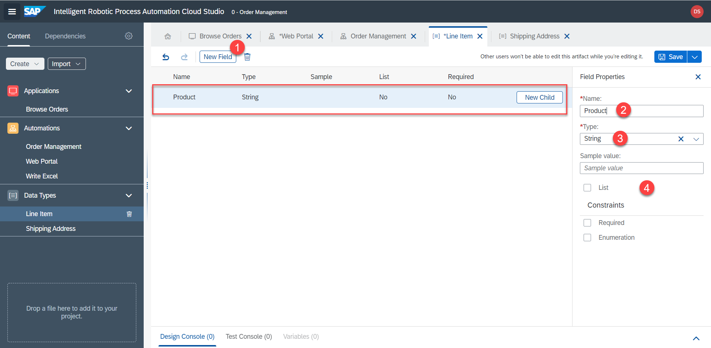
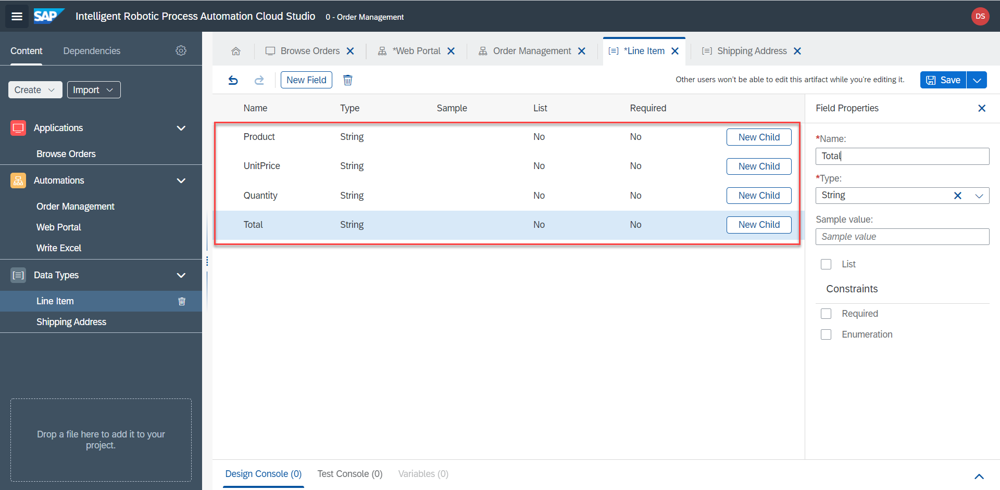
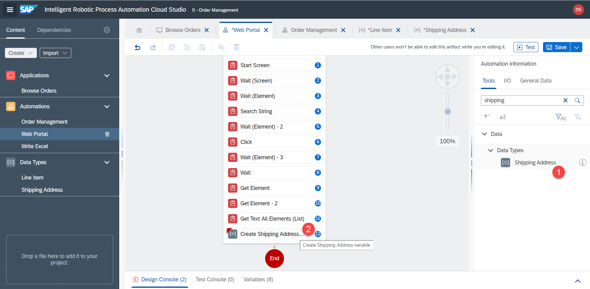
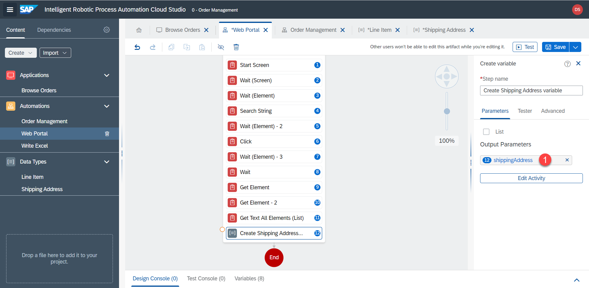
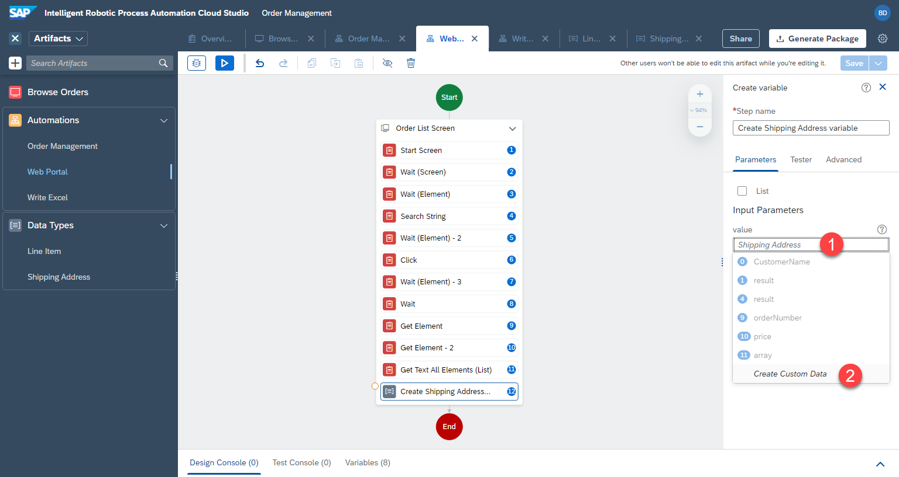
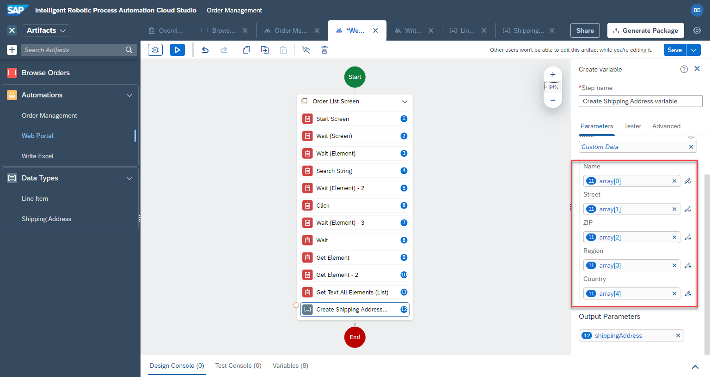

# Lieferadresse


## Datentypen

Der Name, die Adresse, die Postleitzahl usw. der Lieferadresse werden derzeit in einem Array gespeichert. Mit den Datentypen in iRPA können wir diesen Daten eine bessere Struktur geben. Diese Datentypen können mehrere Variablen und Felder speichern, um komplexere Datenstrukturen darzustellen. Wir werden 2 Datentypen anlegen: für eine Lieferadresse und eine Auftragsposition.


Speichern Sie die bisherige Automatisierung mit `Save`


5. `Create` > `Data Type`



6. Benennen Sie den Datentyp, z.B.

```
Line Item
```



7. Wiederholen Sie die gleichen Schritte, um einen weiteren Datentyp zu erstellen

```
Shipping Address
```


8. Erstellen Sie nun wieder im Datentyp `Line Item` ein neues Feld, indem Sie auf `New Field` klicken


9. Passen Sie die Feldeigenschaften an. name = `Product` und type = `String` 



10. Wiederholen Sie diese Schritte, um die anderen Felder zu erstellen: `Product`, `UnitPrice`, `Quantity`, `Total`. Alle Felder sind vom Typ `String`




11. Wiederholen Sie dieselben Schritte, um Felder innerhalb des Datentyps `Shipping Address` zu erstellen: `Name`, `Street`, `ZIP`, `Region`, `Country`. Alle diese Felder sind `String`.


12. Vergessen Sie nicht, beide Datentypen zu speichern. `Save`

## Lieferadresse Speichern 

1. Zurück in der Automatisierung `Web Portal`, fügen Sie den Schritt `Shipping Address` hinzu.




2. Benennen Sie den Ausgabeparameter zu `shippingAdress` um




3.	Nun legen wir die Werte des Datentyps aus dem Array fest. Klicken Sie auf `Edit Activity`. Wählen Sie unter `Name` die Option `array[0]`. Wenn die Option `array[0]` nicht verfügbar ist, lesen Sie bitte die nächsten Schritten, um diesen Wert manuell auszuwählen.



4. Für das andere Feld ändern wir den Array-Index auf `1`. Klicken Sie auf `open expression editor`


5. Stellen Sie in dem Popup den Index auf `1` und speichern Sie mit `save`

```
Step11.array[1]
```


6. Wiederholen Sie diese Schritte für die anderen Felder, von `0` bis `4`


