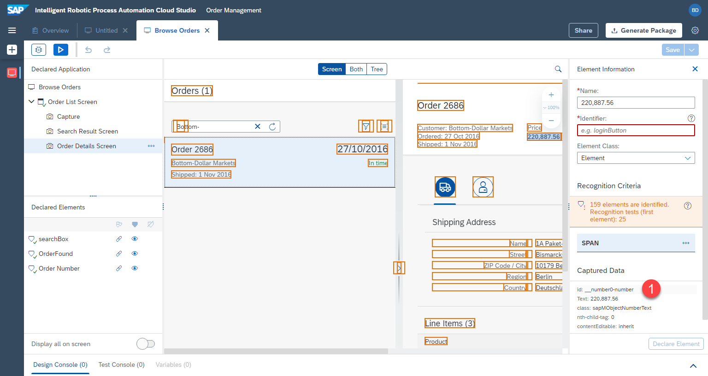

# Dritten Bildschirm Definieren

## Dritten Bildschirm Definieren

Als Nächstes fügen wir den dritten Bildschirm in derselben UI5-App hinzu. Auf diese Weise kann der Bot die Details einer bestimmten Bestellung erkennen


1. Öffnen Sie die [UI5-App](https://openui5.hana.ondemand.com/test-resources/sap/m/demokit/orderbrowser/webapp/test/mockServer.html) in einem separaten Fenster, und geben Sie `Bottom-` in die Suche ein. Stellen Sie sicher, dass die Bestellung `2686` gefunden wird. Klicken Sie auf diese Bestellung, um die Detailansicht zu sehen. Lassen Sie das Fenster geöffnet.


2. Klicken Sie im Cloud Studio auf  `...` neben dem ersten Bildschirm-Capture und wählen Sie `Add Capture to Current Screen` aus.


3. Klicken Sie auf `Refresh` und wählen Sie das Fenster mit `Browse Orders`

4. Bennen Sie die neue Aufnahme, z.B. 

```
Order Details Screen
```

5. Klicken Sie auf `Capture`


## Elemente auf dem dritten Bildschirm definieren

### Bestellnummer

1. Wählen Sie den dritten Bildschirm aus, den wir soeben definiert haben  `Order Details Screen`

2. Klicken Sie auf die Bestellnummer in der Vorschau

3. Benennen Sie das Element um, z. B.

```
Order Number
```

4. Klicken Sie noch NICHT auf `declare element`.


Wie zuvor werden wir die Kriterien anpassen.

5. Klicken Sie auf das Textkriterium `text`

6. Es wird ein Popup-Fenster geöffnet. Ändern Sie `operator` zu `contains`. 

7. Ändern Sie `value` zu `Order ` **mit einem Leerzeichen am Ende**

```
Order 
```

8. Klicken Sie auf `Apply`

9. Vergessen Sie nicht, auf `Declare Element` zu klicken


### Preis

1. Wählen Sie den dritten Bildschirm aus, den wir soeben definiert haben: `Order Details Screen`

2. Klicken Sie auf den Preis in der Vorschau

3. Entfernen Sie as Kriterium `text`


4. Fügen Sie stattdessen die `id` des Elements als Kriterium hinzu. Dadurch wird der Preis eindeutig identifiziert.



5. Benennen Sie das Element um, z. B.

```
Price
```
6. Vergewissern Sie sich, dass das richtige id-Kriterium ausgewählt ist, und vergessen Sie nicht, auf `Declare Element` zu klicken.


### Adresse

Als Nächstes werden wir die Adresse anders als eine Sammlung von mehreren Elementen definieren

1. Klicken Sie in der Vorschau auf den Namen unter der Lieferadresse


2. Entfernen Sie as Kriterium `text`


3. Wählen Sie `class` als Kriterium


In iRPA können wir auch die zugrundeliegende technische Dokumentstruktur der Seite sehen. Wir werden dies nutzen, um das gewünschte Element genauer auszuwählen.

4. Klicken Sie oben auf `both`, um sowohl die Vorschau als auch die technische Struktur der Seite anzuzeigen.

5. Wählen Sie `div` (Container) anstelle des `span`. Auf diese Weise können wir dieses Element mit den anderen Elementen der Adresse verbinden.


6. `div` ist ausgewählt. Entfernen wir nun das Kriterium `text`, da es zu spezifisch ist.


7. Fügen Sie stattdessen das Kriterium `class` hinzu.


8. Legen Sie den Namen fest, z. B.
```
Shipping Address
```

9. Klicken Sie auf  `declare element`


Nun kann das Element nicht mehr eindeutig identifiziert werden, da mehrere Elemente die gleichen Kriterien erfüllen. RPA zeigt dies in der Fehler-Statusmeldung sowie ein `rotes X` im Abschnitt `declared elements` an.

10. Wir können eine Sammlung/Liste dieser mehreren Elemente erstellen, indem wir auf die `3 Tags/Dreiecke` unter `declared elements` klicken, während `shipping address` ausgewählt ist.


Als Ergebnis wird eine Sammlung definiert. Das Häkchen ist nun grün. Das Element ist eindeutig identifiziert. Und die technische Seitenstruktur zeigt, dass mehrere Elemente in dieser Sammlung enthalten sind (0, 1, 2, 3, 4).


11. Vergessen Sie nicht, den Fortschritt zu speichern, indem Sie auf die `save` oben rechts klicken.

