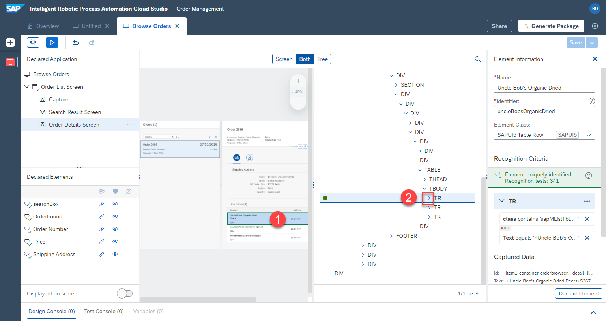
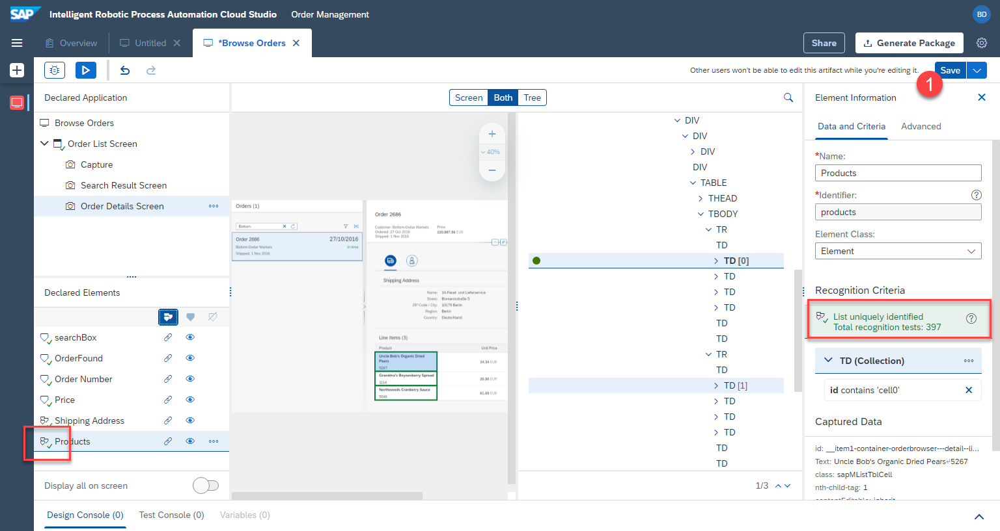
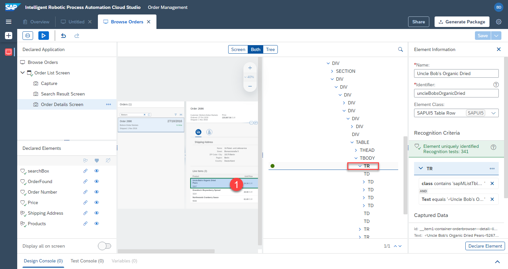
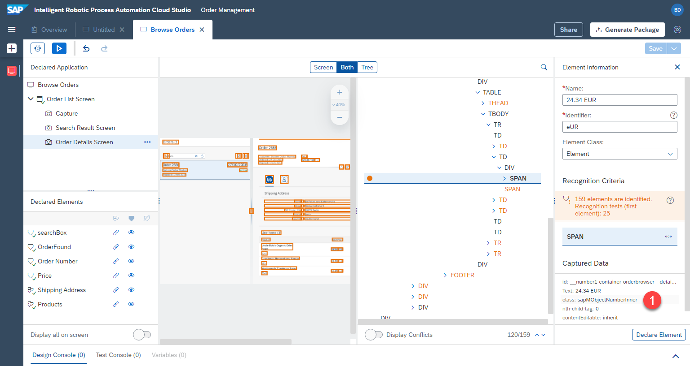
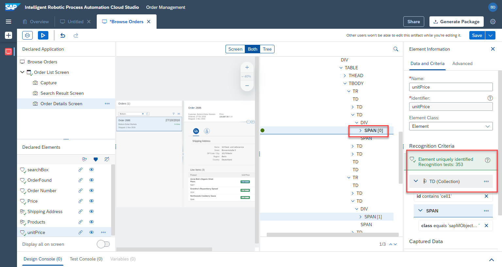
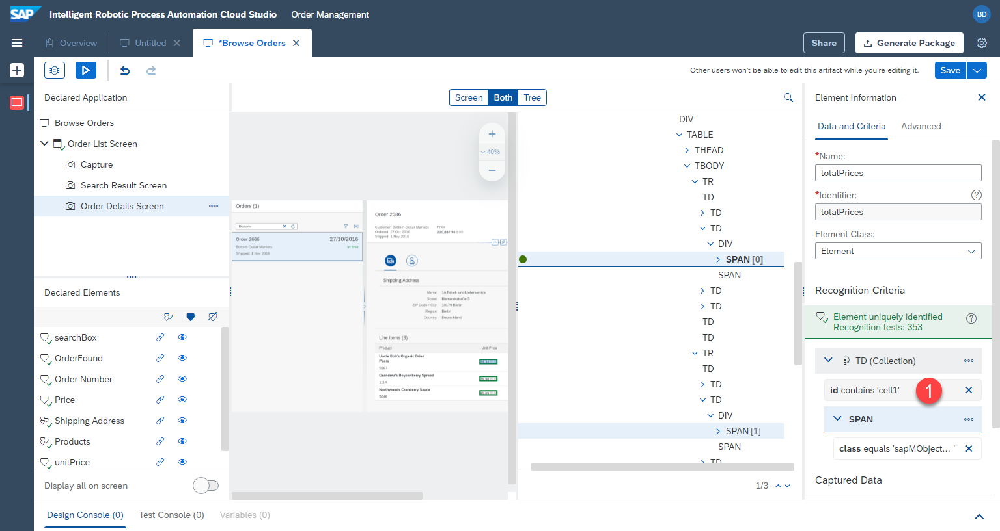

# Dritten Bildschirm Definieren - Teil 2


## Auftragspositionen Definieren

Als Nächstes werden wir die Auftragspositionen der Bestellung definieren. Wir werden jede Spalte als Liste definieren.

### Produkte

1. Klicken Sie auf die erste Produktzelle. Stellen Sie sicher, dass `td` in der Baumansicht ausgewählt ist. 

2. Benennen Sie dieses Element, z.B.

```
Products
```
3. Entfernen Sie das Kriterium `text`




4. Wählen Sie stattdessen `id` aus


5. Ändern Sie die Kriterien. `id`, `contain`, `cell0`, also die 0. Spalte enthalten

```
cell0
```


Nun sind alle 3 Produktzellen identifiziert worden. Wir wollen diese als eine Liste definieren.

6. Klicken Sie auf  `declare element`.


7. Klicken Sie auf  `3 Dreiecke`, um diese Elemente als eine Liste zu definieren


Die Elemente wurden erkannt. `td` ist jetzt eine Liste. Die Elemente wurden eindeutig identifiziert.





### Stückpreise

1. Wählen Sie den Stückpreis in der ersten Zeile aus.

2. Vergewissern Sie sich, dass es sich um das `span`-Element im Baum handelt, das mehrere Elemente enthält (`24.34 EUR` statt nur `24.34`)




3. Entfernen Sie das Kriterium `text`


4. Wählen Sie stattdessen `class` aus



Jetzt wollen wir sicherstellen, dass die Liste von mehreren Elementen auf den Tabellenzellen basiert. Zu diesem Zweck verwenden wir `td` als Kriterium für die Suche nach den `span`-Elementen.

5. Klicken Sie mit der rechten Maustaste auf `td` und wählen Sie `add to criteria` aus.


`td` ist jetzt Teil der Kriterien.

6. Passen Sie die  `id` von `td` an: `contains` und Wert:

```
cell1
```


7. Benennen Sie das Element um, z.B. in

```
unitPrices
```

8. Klicken Sie auf `declare element`


Anstatt nun eine Liste zu definieren, wie wir es zuvor getan haben, werden wir die List auf der Grundlage des übergeordneten Elements `td` deklarieren, das wir als Bedingung hinzugefügt haben. Auf diese Weise wird der Bot eine Schleife über die `td`-Zellen ziehen und `span`-Elemente darin finden.

9. Klicken Sie auf  `...` neben `td` und dann auf `set as collection`.


Das Element wurde definiert.



10.	Vergessen Sie nicht, den Fortschritt zu speichern, indem Sie auf `save` oben rechts klicken.


### Gesamtpreis

Die letzte Spalte ist der Gesamtpreis (`total prices`). Diese Spalte hat eine ähnliche Struktur wie der Stückpreis. Wir können den Definitionsprozess beschleunigen, indem wir das Element `unitPrice` kopieren und die Konfiguration leicht anpassen.

1. Klicken Sie auf `...` neben `unitPrices`.

2. Klicken Sie auf `duplicate`


3. Benennen Sie das neue Element, z.B.

```
totalPrices
```


Als Nächstes passen Sie die `id` der Zelle von `1` zu `3` an (Die vierte Spalte statt der Zweiten. Die Zählung beginnt bei `0`)

4. Klicken Sie auf `id` unter `td`.



5. Ändern Sie das Kriterium: `contains` und Wert

```
cell3
```


Die Gesamtpreise sind bereits definiert. Wir mussten sie nicht von Grund auf neu definieren und konnten durch das Duplizieren Zeit sparen.


### Mengen

1. Klicken Sie auf die Zelle mit den Mengen. Stellen Sie sicher, dass das Element `td` (Tabellenzelle) in der Baumansicht ausgewählt ist.

2. Entfernen Sie das Kriterium `text`. Passen Sie das Kriterium auf `id` an. Im Popup wählen Sie `contains` und `cell2`.


3. Benennen Sie das Element in `quantities` um und stellen Sie sicher, dass die Kriterien wie im Screenshot aussehen.

4. Klicken Sie auf `declare` und machen Sie das Element zu einer Liste, indem Sie auf die `Dreiecke` unter `declared elements` klicken.


## Spreichern


Die Bildschirme und Elemente sind nun definiert. Wir können nun mit der Definition der Automatisierung fortfahren.

Vergessen Sie nicht, Ihre Arbeit zu speichern, indem Sie oben rechts auf `save` klicken.


Sehr schön! Wir haben die Erfassung der Anwendung abgeschlossen und können nun mit der Erstellung der eigentlichen Automatisierung beginnen.