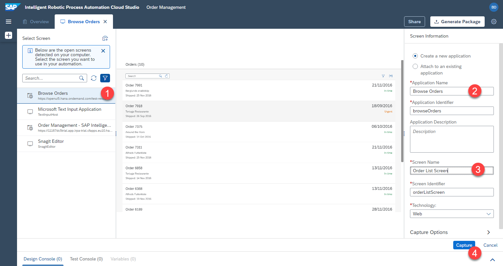
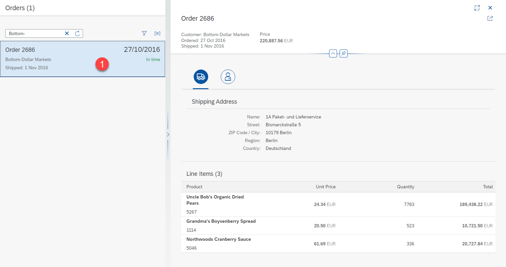
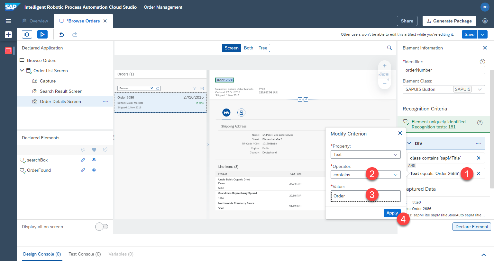
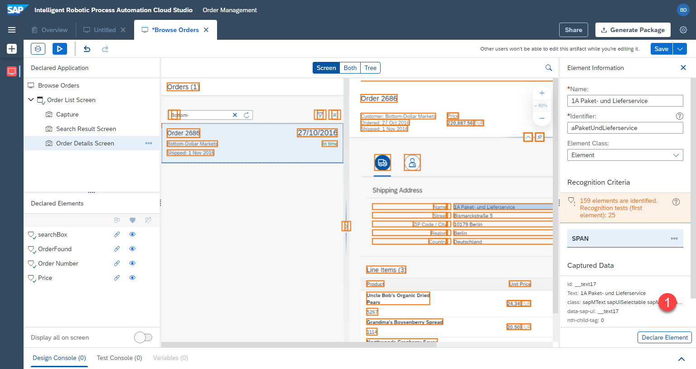
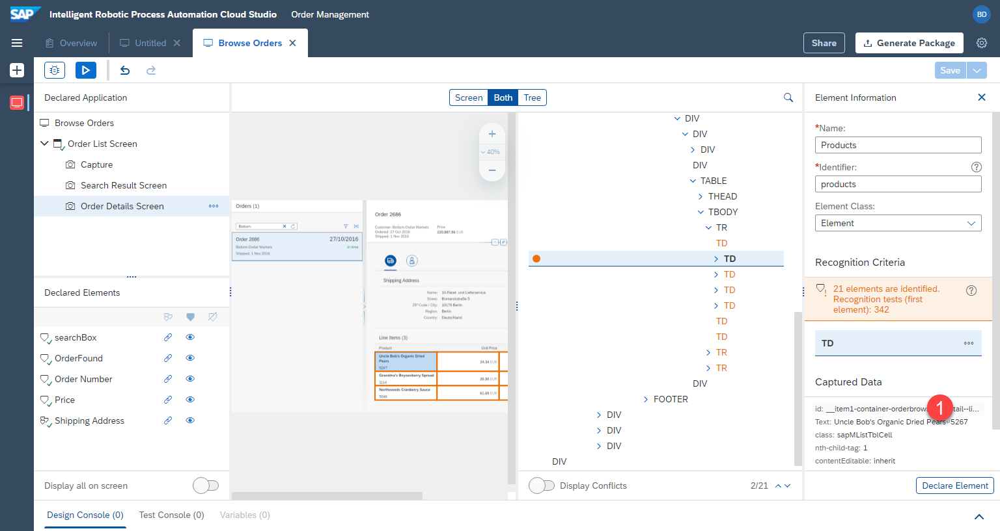
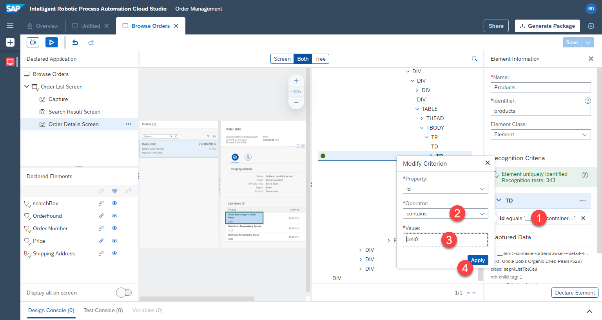
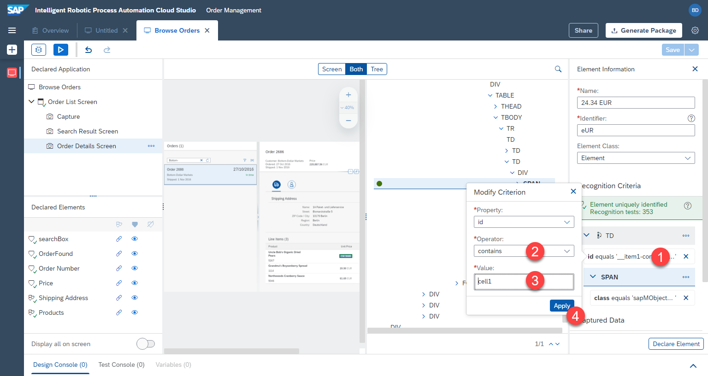
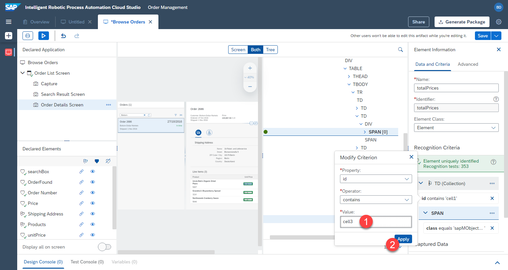
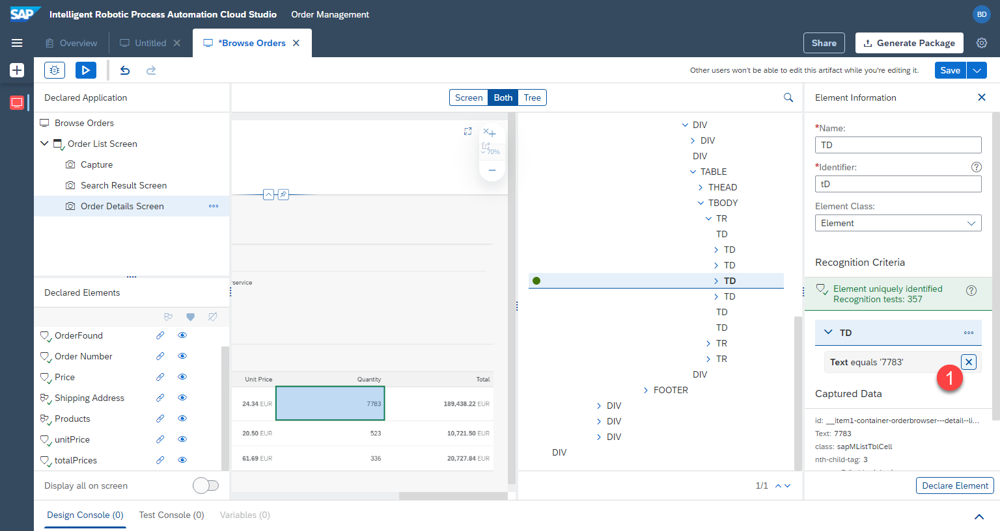
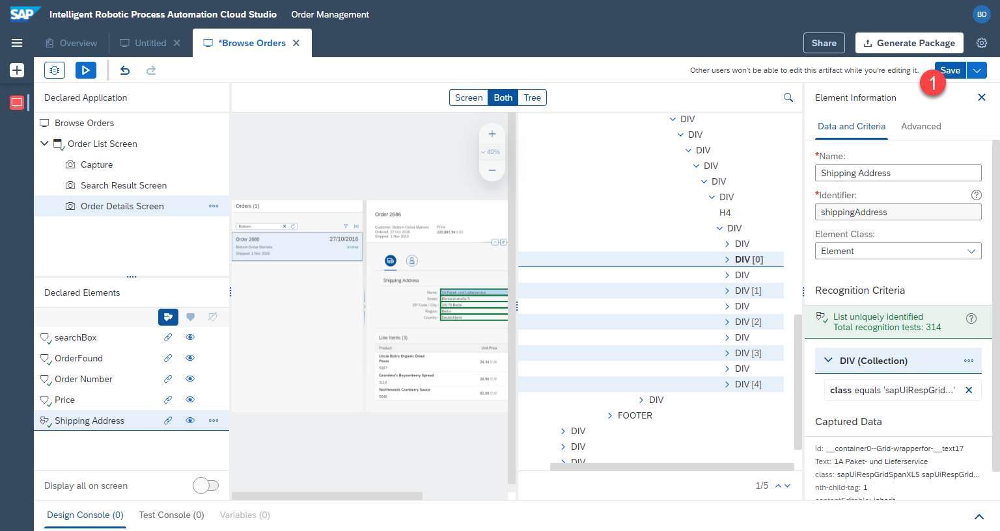

# Define Application

## Overview
Next, we will define the application which will be used in our automation. In our case we will define the orders UI5 app, the various screens and the elements on the web page. We will use these screens and elements in the automation later.

## Create application

1. Make sure the [UI5 app](https://openui5.hana.ondemand.com/test-resources/sap/m/demokit/orderbrowser/webapp/test/mockServer.html) is opened in a seperate window, not just in a new tab. Desktop Agent should also be running and connected to the correct tenant.

2. Select `Create` > `Application`


3. Click on `refresh icon` multiple times to get the currently open windows

4. Select the window titled `Browse order`. This is our UI5 application

5. Give a name to the application. `Application name` E.g.


```
Browse Orders
```

6. Give a name to the first `screen` we are capturing. The application changes the view, when we click on one of the orders. A new screen with the detailed information appears. For this reason we will capture multiple `screens` of a single `application`. Screen name example:


```
Orders List Screen
```



4. The result is a captured application and captured first screen


## Define elements on first screen

Next, we will define the only relevant element on the first screen --> `search box`. Our bot will search for the supplier in this search box, so we have to define this element. 

1. To do this, click on the search box within the preview. 
2. Name the search box element. E.g.

```
searchBox
```

3. Make sure the element is uniquely recognized (green status)
4. Don't forget to click on `declare element` to make sure this element is actually saved. 
5. The defined search box element will appear under `Declared elements` with a green status, meaning that the element has been successfully defined.


## Define second screen

Next we will add the second screen from within the same UI5 app. This way the bot can recognize the results of a search

1. Open the [UI5 app](https://openui5.hana.ondemand.com/test-resources/sap/m/demokit/orderbrowser/webapp/test/mockServer.html) is opened in a seperate window, and enter `Bottom-` in the search. Make sure the order `2686` is found. Keep the window open.


2. Within the cloud studio, click on `...` next to the first screen capture and select `Add Capture to Current Screen`.


3. `Refresh` and Select the window with `Browse Orders`

4. Name the new capture, e.g. 

```
Search Result Screen
```

5. Press `Capture`


## Define elements on second screen

1. Select the second screen we just defined `Search Result Screen`

2. Click on the list row in the preview. Make sure the whole row is selected, and not just single text

3. Rename the element, e.g. 

```
OrderFound
```

4. Don't click on declare element yet.


We are going to adjust the criteria, so that the element can be recognized regardless of the order number. Currently RPA would be looking for a very specific list of criteria to find an element. These criteria can be found and changed under `criteria` section on the right.

We will specifically look for the element containing `Order` as text.

5. Click on the `text` criteria.


6. A popup will be opened. Change the `operator` to `contains`. 

7. Change `value` to 

```
Order
```

8. `Apply` the criteria


9. The criteria have been updated, as seen on the right.

10. We can now save the element by clicking on `Declare Element`

11. The element will be saved under `Declared Elements`


## Define third screen

Next we will add the third screen from within the same UI5 app. This way the bot can recognize the details of a specific order

1. Open the [UI5 app](https://openui5.hana.ondemand.com/test-resources/sap/m/demokit/orderbrowser/webapp/test/mockServer.html) is opened in a seperate window, and enter `Bottom-` in the search. Make sure the order `2686` is found. Click on that order to see the detail view. Keep the window open.




2. Within the cloud studio, click on `...` next to the first screen capture and select `Add Capture to Current Screen`.


3. `Refresh` and Select the window with `Browse Orders`

4. Name the new capture, e.g. 

```
Order Details Screen
```

5. Press `Capture`


## Define elements on third screen

### Order Number

1. Select the third screen we just defined `Order Details Screen`

2. Click on the order number in the preview

3. Rename the element, e.g. 

```
Order Number
```

4. Don't click on declare element yet.


As before, we are going to adjust the criteria.

5. Click on the `text` criteria.

6. A popup will be opened. Change the `operator` to `contains`. 

7. Change `value` to `Order ` with a space in the end

```
Order 
```

8. `Apply` the criteria

9. Don't forget to click on `Declare Element`




### Price

1. Select the third screen we just defined `Order Details Screen`

2. Click on the price in the preview

3. Remove the text criteria


4. Add the `id` of the element as criteria instead. This will uniquely identify the price.


5. Rename the element, e.g. 

```
Price
```
6. Make sure the correct id criterion is selected and don't forget to click on `Declare Element`


### Address

Next, we will define address in a different way, as a collection of multiple elements

1. Click on the name under shipping address in the preview


2. Remove the `text` criteria, it's too specific


3. Select `class` as element



Within iRPA we can also see the underlying technical document structure of the page. We will use this to more precisely select the element that we want.

4. Click on `both` at the top to show both the preview, as well as the technical structure.

5. Select the `div` (the container), instead of `span`. This way we will be able to connect it to the other elements of the address.


6. `div` is selected. Now let's remove the `text` criteria as it is too specific. 


7. Add the `class` criteria instead.


8. Class is selected. Set the name, e.g.
```
Shipping Address
```

9. Click on `declare element`


Now the element cannot be uniquely identified, because multiple elemnts fulfill the same criteria. RPA shows this in the error status message as well as a `red x` in the `declared elements` section. 

10. We can create a collection of these multiple elements, by clicking the `3 tags/triangles` under declared elements, while `shipping address` is selected.


As a result, a collection is defined. The `check mark` is now green. The element is uniquely identified. And the technical page structure shows that multiple elements are contained in this collection (0, 1, 2, 3, 4).


## Define Line Items

Next we will define the line items of an order. We will define each column as a collection.

### Products

1. Press on the first product cell. Make sure `td` is selected in the tree view. 

2. Name this element, e.g.

```
Products
```
3. Remove the text criteria


4. Select `id` instead



5. Modify the criteria. Id should contain `cell0`, meaning the 0th column. 

```
cell0
```



Now all 3 product cells have been identified. We want to define these as a collection.

6. Click on `declare element`.


7. Click on `3 triangles`, to define these elements as a collection


The elements have been detected. `td` is the collection. The elements have been uniquely identified.


### Unit Prices

1. Select the unit price in the first row.

2. Make sure it's the `span` element in the tree, containing multiple elements (`24.34 EUR` instead of just `24.34`)


3. Remove text as criteria


4. Set `class` as criteria instead.


Now we want to make sure that the collection of multiple elements is based on the table cells. For this we will use `td` as the criteria for finding the `span` elements. 

5. Right click on `td` and select `add to criteria`.


`td` is now part of the criteria. 

6. Adjust the `id` of `td` to be `contains` and value:

```
cell1
```



7. `Rename` the element to e.g.

```
unitPrices
```

8. Click on `declare element`


Now instead of defining a collection like we did before, we will declare the collection based on the parent element `td` we added as condition. This way the bot will loop over the `td` cells and find the `span` within these.

9. Click on `...` next to `td` and click `set as collection`.


The element has been defined.


### Total Prices

The last column is `total prices`. That column has a similar structure as `unit price`, so we will speed up the definition process by copying `unitPrice` element and adjusting the configuration slightly.

1. Click on `...` next to `unitPrices`. 

2. Select `duplicate`


3. Name the new element, e.g.

```
totalPrices
```


Next, adjust the `id` of the cell from 2nd=`1` to 4th=`3` (counting starts from `0`)

4. Click on `id` under `td`.


5. Set criteria to `contains`  and value

```
cell3
```



The total prices have been defined. We didn't have to define them from scratch and were able to save time by duplicating another definition.


### Quantities

1. Click on the quantities cell. Make sure the `td` (table cell) element is selected in the tree view.

2. Adjust the criteria to `id`. In the popup choose `contains` and `cell2`.


Rename the element to `quantities`, make sure the criteria are like in the screen shot.

Click on declare and make the element a collection by clicking on the triangles in the declared elements section.




## Save


The screens and elements have been defined. We can now move on to defining the automation.

Don't forget to save your work by clicking `save` in the top right.



