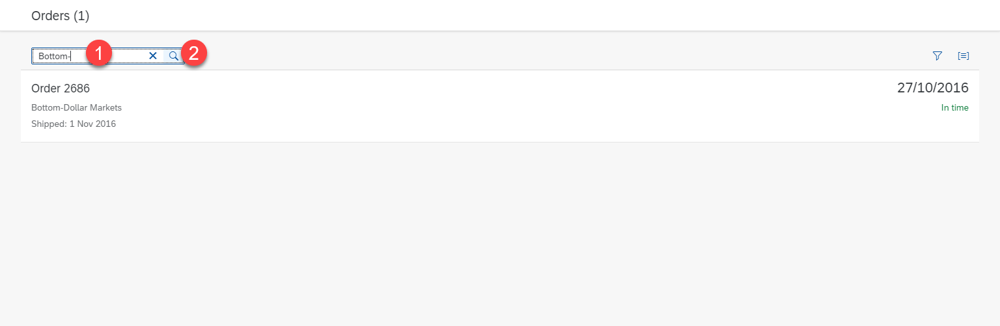
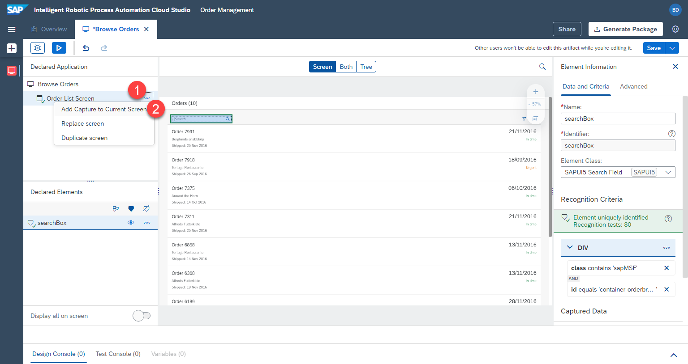
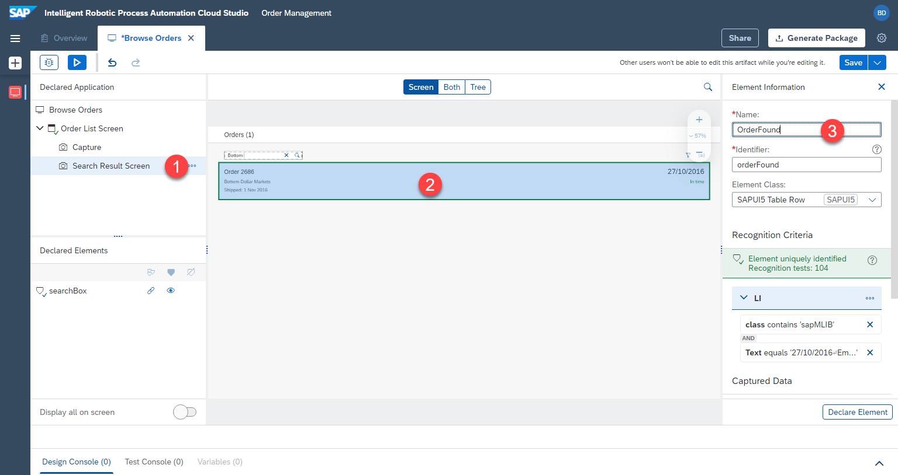
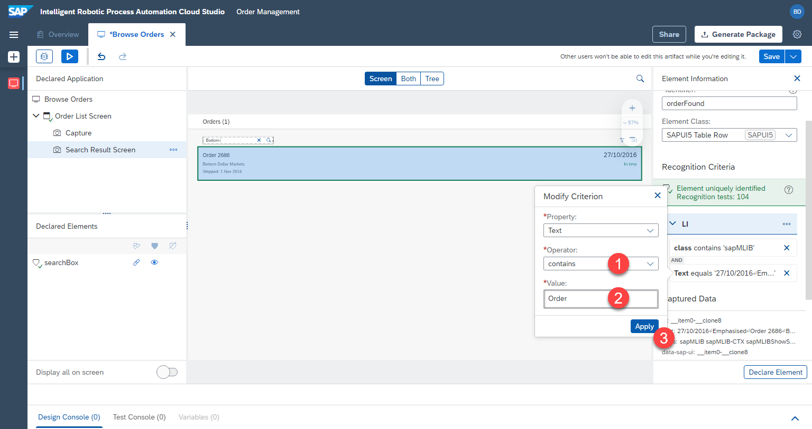

# Define Application

## Overview
Next, we will define the application which will be used in our automation. In our case we will define the orders UI5 app, the various screens and the elements on the web page. We will use these screens and elements in the automation later.

## Create application

1. Make sure the [UI5 app](https://openui5.hana.ondemand.com/test-resources/sap/m/demokit/orderbrowser/webapp/test/mockServer.html) is opened in a seperate window, not just in a new tab. Desktop Agent should also be running and connected to the correct tenant.

2. Select `Create` > `Application`


3. Click on `refresh icon` multiple times to get the currently open windows

4. Select the window titled `Browse order`. This is our UI5 application

5. Give a name to the application. `Application name` E.g.


```
Browse Orders
```

6. Give a name to the first `screen` we are capturing. The application changes the view, when we click on one of the orders. A new screen with the detailed information appears. For this reason we will capture multiple `screens` of a single `application`. Screen name example:


```
Orders List Screen
```


4. The result is a captured application and captured first screen


## Define elements on first screen

Next, we will define the only relevant element on the first screen --> `search box`. Our bot will search for the supplier in this search box, so we have to define this element. 

1. To do this, click on the search box within the preview. 
2. Name the search box element. E.g.

```
searchBox
```

3. Make sure the element is uniquely recognized (green status)
4. Don't forget to click on `declare element` to make sure this element is actually saved. 
5. The defined search box element will appear under `Declared elements` with a green status, meaning that the element has been successfully defined.


## Define second screen

Next we will add the second screen from within the same UI5 app. This way the bot can recognize the results of a search

1. Open the [UI5 app](https://openui5.hana.ondemand.com/test-resources/sap/m/demokit/orderbrowser/webapp/test/mockServer.html) is opened in a seperate window, and enter `Bottom-` in the search. Make sure the order `2686` is found. Keep the window open.




2. Within the cloud studio, click on `...` next to the first screen capture and select `Add Capture to Current Screen`.




3. `Refresh` and Select the window with `Browse Orders`

4. Name the new capture, e.g. 

```
Search Result Screen
```

5. Press `Capture`


## Define elements on second screen

1. Select the second screen we just defined `Search Result Screen`

2. Click on the list row in the preview. Make sure the whole row is selected, and not just single text

3. Rename the element, e.g. 

```
OrderFound
```

4. Don't click on declare element yet.




We are going to adjust the criteria, so that the element can be recognized regardless of the order number. Currently RPA would be looking for a very specific list of criteria to find an element. These criteria can be found and changed under `criteria` section on the right.

We will specifically look for the element containing `Order` as text.

5. Click on the `text` criteria.


6. A popup will be opened. Change the `operator` to `contains`. 

7. Change `value` to 

```
Order
```

8. `Apply` the criteria



9. The criteria have been updated, as seen on the right.

10. We can now save the element by clicking on `Declare Element`

11. The element will be saved under `Declared Elements`


