# Define Automation

## Overview
The screens and elements have been defined. We can now create the actual automation.

Let's think about what our bot should do. On a very high level it should:
- Open Excel and read out some data from there
- Open a webpage and extract some other data from there, based on the data from excel
- Write the found data back into excel

We can start creating our automation from this high level and go down, implementing the details. 

## Creating sub-automations

Let's start by creating 3 automation: one main one, one for the UI5 part, one for Excel one

1. Click on `create` > `automation`

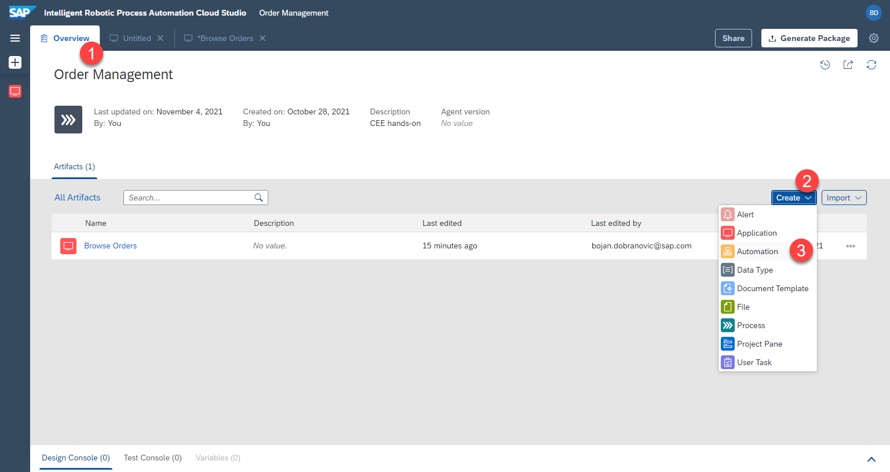


2. Select the version which is tagged `local`. This is the version of your desktop agent installed locally. Even if a higher version is available in the dropdown, please select the `local` version, to make sure that the automation can run on your machine.

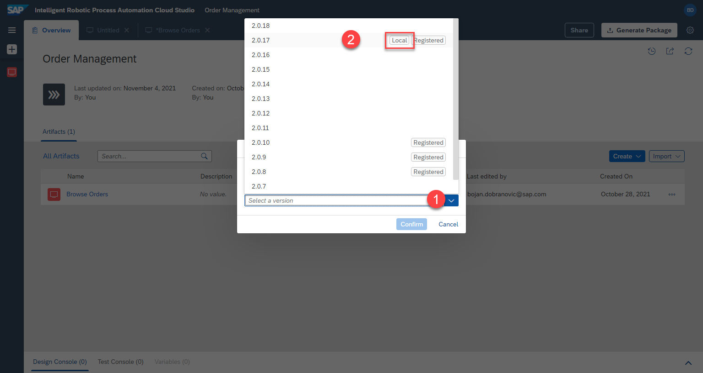

3. Click `Confirm`


4. Name the automation, e.g.

```
Order Management
```


An empty automation has been created.


Repeat the steps `1` - `4` to create 2 more automations:

```
Web Portal
```

and 

```
Write Excel
```

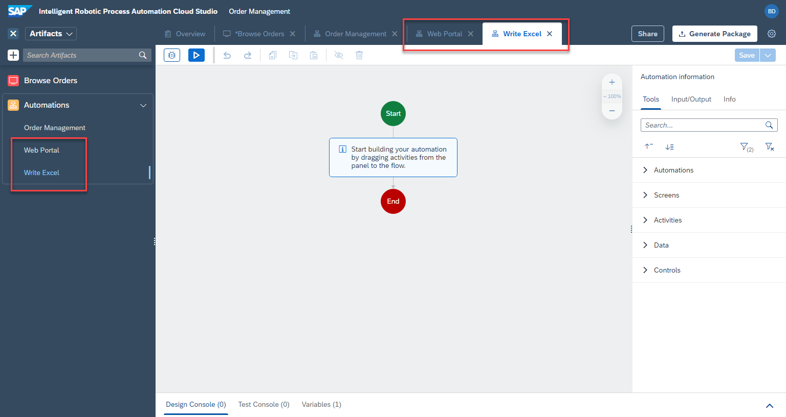


## 🔹 How to add automation steps 

We will repeat this process multiple times to add new steps to the automation. Please do this in the following steps.

1. Press on the empty space within the preview to close all other open options

2. Search for the step name in the seach bar

3. If necessary, click on `clear filter` to show all available steps

4. Select the desired action and `drag and drop` it in the correct position

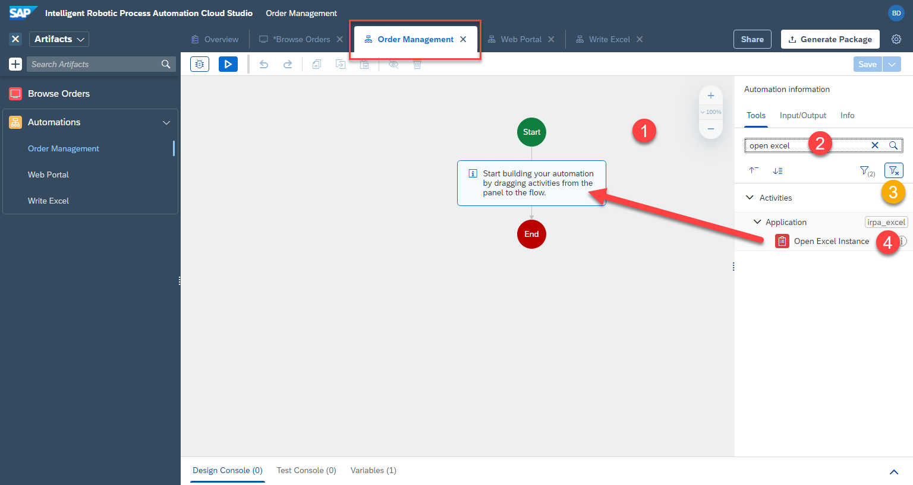

## Main Automation

Let's define the general structure of our automation. Here is the data we want from excel:


1. We want to open Excel. Repeat the steps above for `Open Excel Instance`.


2. We want to open the correct workbook. Repeat the steps above for `Open Workbook`.

In the parameters on the right, edit the expression and enter the full path to your file. Make sure the path is within quotation marks `"..."` E.g.

```
"C:\Users\you\Desktop\Demo_Procurement.xlsx"
```


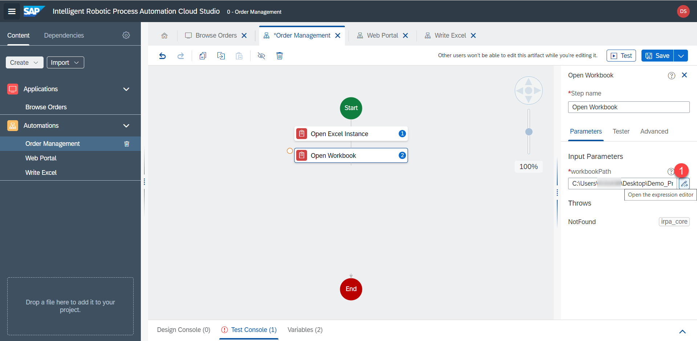


3. We want to open a specific worksheet. Repeat the steps above for `Activate Worksheet`. Set `worksheetName` = 

```
Overview
```


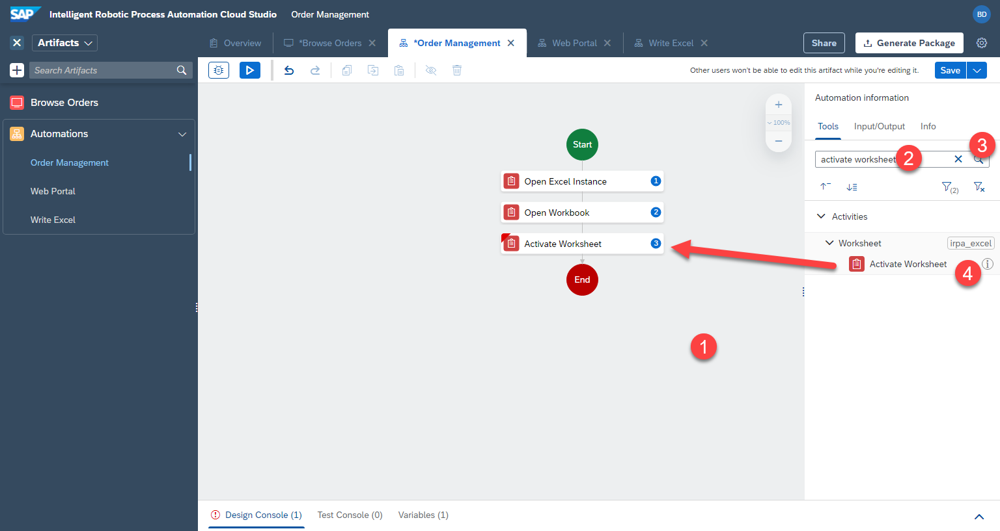


4. We want to get a value from a cell. Repeat the steps above for `Get Values (Cells)`. Set `rangeDefinition` = `B1`. And rename outputParamenter to  

```
supplierName
```

This means that this step will run and the result (value from cell B1) will be saved in a variable called `supplierName`


5. And `Web Portal` and `Write Excel` subautomations. So far they are not doing anything, but just acting as placeholders. 


6. At the end we want to make sure that Excel is not used by iRPA anymore. We release the instance. Repeat the steps above for `Release Excel Instance`


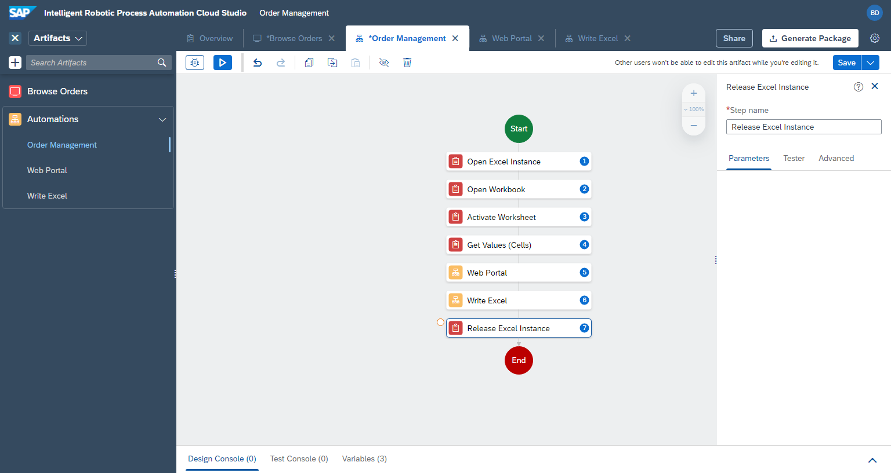


## 🔹 How to test automation

Let's not do too much work without seeing what the bot does and if we make any mistakes. 

1. `Save` the automation, then click on `test`.

2. Select your environment.

3. Click on `test`.


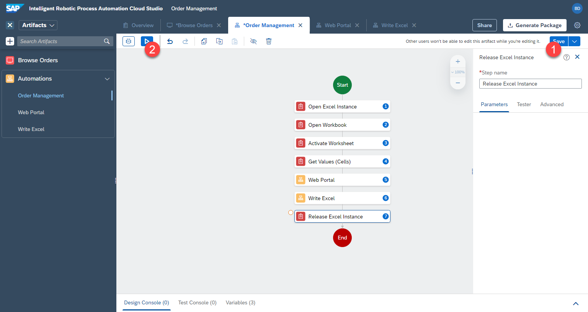

It takes a while for the desktop agent to download, process and run the automation. Here are some of the messages you will see:

|  |  |  |
:-------------------------:|:-------------------------:|:-------------------------:|
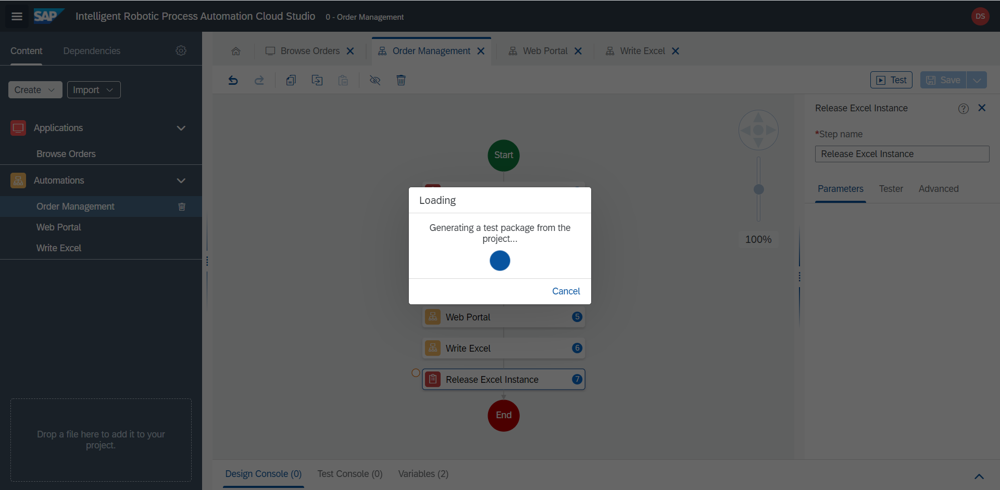  |   |  


After the automation has completed, you can see the debug screen (`Tester`). In here you can either check the output of the `test console` or click on single steps in the automation to see the details on the right side. 

4. For instance, click on the step `Get Values (cells)` and we see the correct output value on the right `Bottom-Dollar Markets`. The automation ran correctly


## Web Automation

Next we will define the automation within the UI5 app. On a high level it will:
- Enter supplier name in the search box and search
- Click on the result
- This will open the details of the order
- RPA will save all the relevant information, which we will later write into Excel

1. Click on `Web Portal` either in the menu on the left or on the tab at the top.


2. Drag and drop the screen activity `Orders List Screen`, because we will be interacting with this specific application we defined.

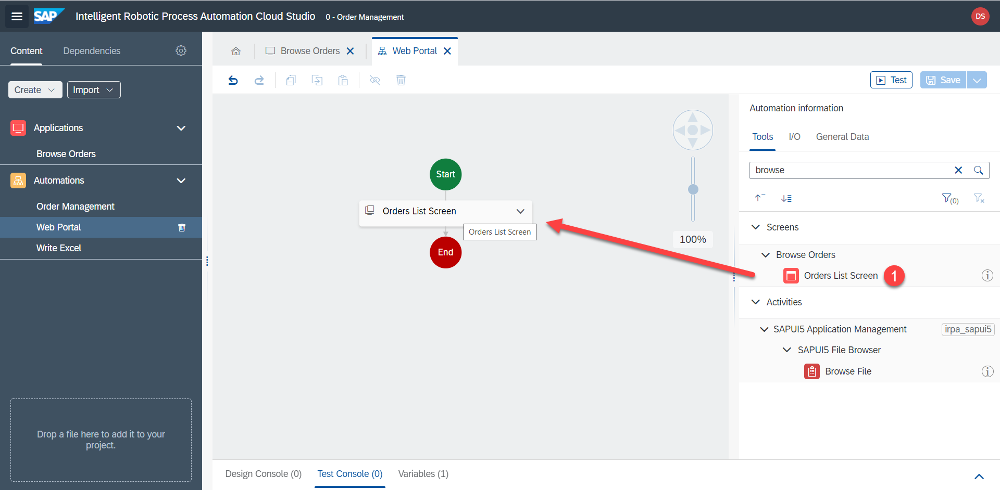

3. Click on the screen activity and then on `Define Screen Activities`.


4. Drag and drop `Start screen` onto the screen preview


5. Make sure the step is inside the screen activity and target is set to `orders list screen`.


6. Change the navigator from `Internet Explorer` to `Chrome`, so that RPA open the page in Chrome.


|  |  |  |
:-------------------------:|:-------------------------:|:-------------------------:|
  |   |  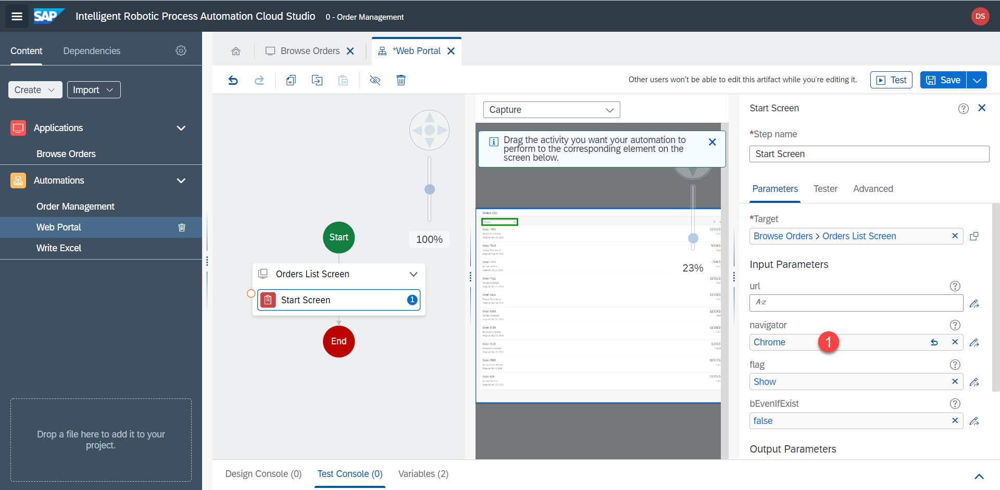

7. Drag `Wait (Screen)` operator onto the screen preview and make sure the target is set correctly. RPA will wait until the screen actually loads. 


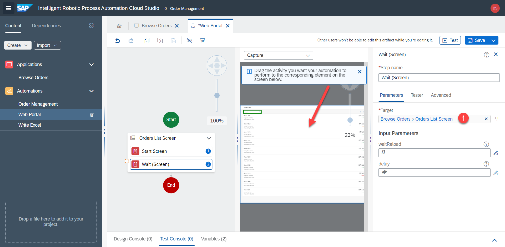

8. Aditionally, RPA should wait to ensure that the search bar loads as well. Drag `Wait (Element)` onto the search bar preview. Make sure the target is set to search bar element.


9. Add `Search string` action. Make sure the target is correct. 


### Input Parameter

But how do we get the name of the supplier we got from Excel? It's not available in the `Web Portal` subautomation yet. That variable is only available in the main automation `Order Management`. But we can pass the variable to the subautomation using `parameters`. 

10. Close the panel


11. Press on empty space to change the settings of the automation. Click on `I/O` > `Add new input parameter`.


12. Create input parameter named 

```
CustomerName
```

Type is `string`. Click on the empty space to save these settings. 


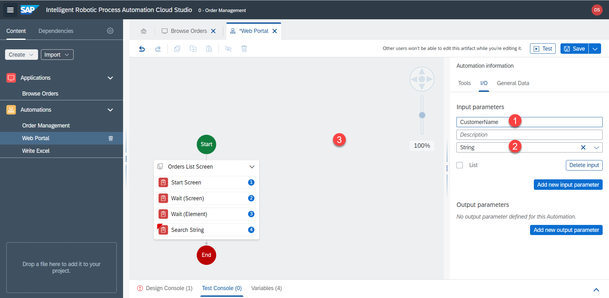

13. Now back in the `search string` step we can select the `CustomerName` variable, which is our input parameter passed to the subautomation.


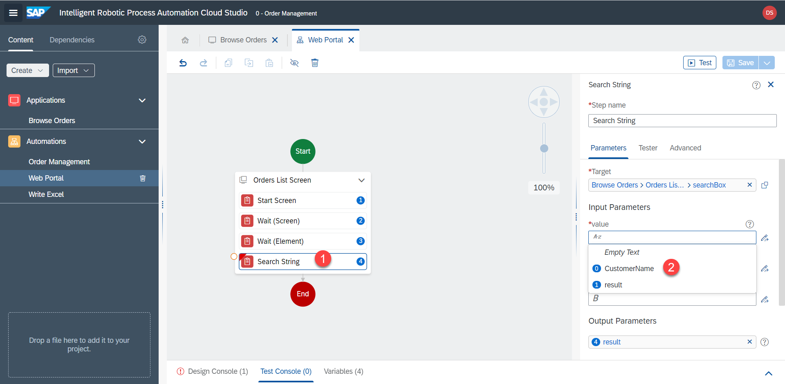

However, the value still hasn't been passed from the main automation. To do that

14. Go to the main automation either from the left side or from the tabs at the top. Select the `Web Portal` step and provide the input parameter


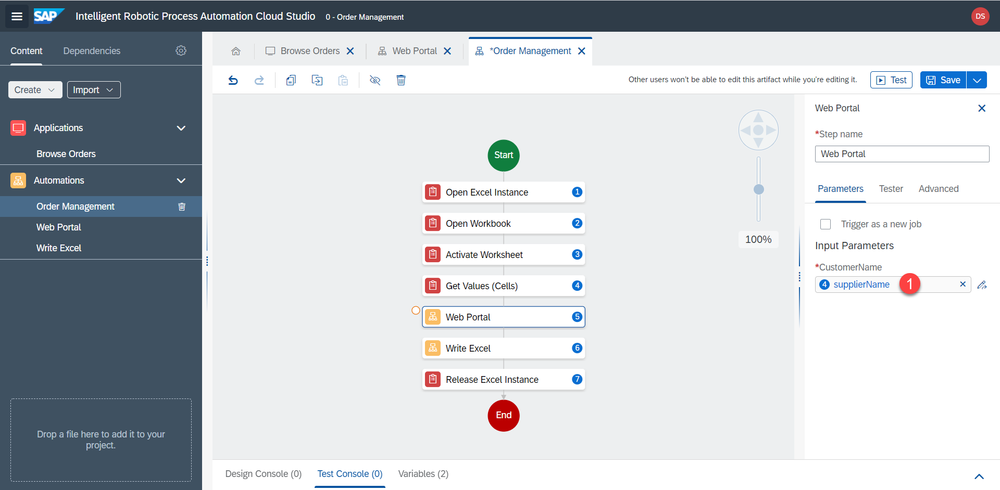


## Continuing Web Automation

Next let's wait for the search results to load

1. Add `Wait (Element)` with target of the row


2. Select `orderFound` element in the popup and `confirm`.

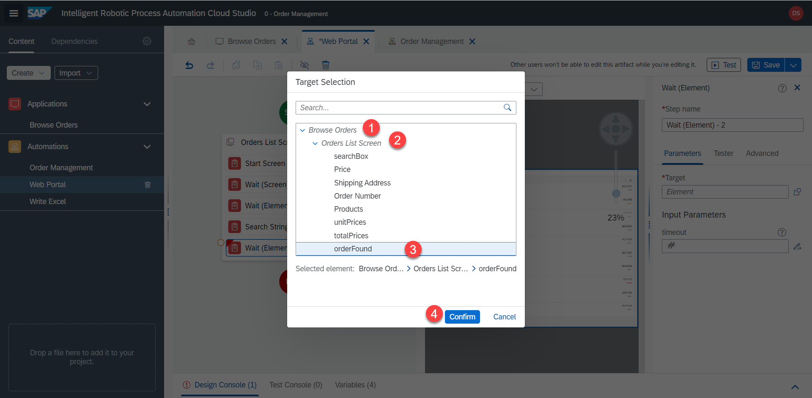

3. Add `click` step with the target of the row --> `orderFound` element. RPA will wait for the row to appear and then click on it.


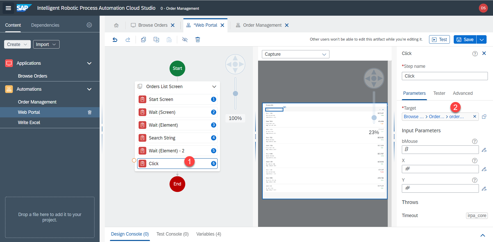

## Details view automation

1. RPA should wait for the details screen to open and load. Add `Wait (Element)` step with `Order Number` as target


2. Let's save the order number in a variable. Set the target to `Order Number`. Rename output parameter to `orderNumber`. 


Actually at this point the bot would sometimes receive `Order undefined` as the result. That's because the details view loads slower than the bot moving to the next step. For this reason, let's add a manual delay of `500` miliseconds for the details page to load.


If we test the main automation now, we will see that we correctly receive `Order 2686`.


3. Next, let's get the `Price` element and save it in the `price` variable


4. The shipping address is saved in a collection. Use the `Get Text All Elements (List)` operator. `Shipping Address` is the target. Name the output `array`


## Data Types

The name, adress, zip, etc from the shipping address are currently stored in an array. Let's add better structure to that by using `Data Types` from iRPA. These data types can store multiple variables and named fields, to represent more complex data structures. Let's create 2 data types: for a shipping address and a line item.


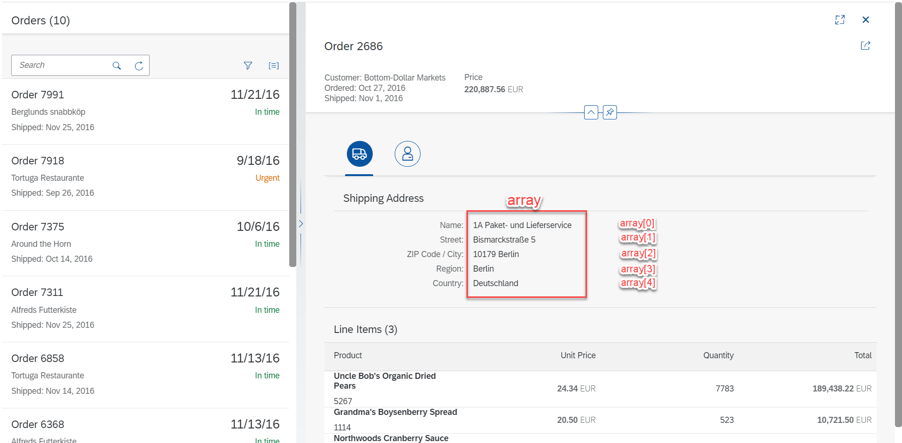


5. `Create` > `Data Type`


6. Name the data type, e.g.

```
Line Item
```


7. Repeat the same steps to create another data type 

```
Shipping Address
```


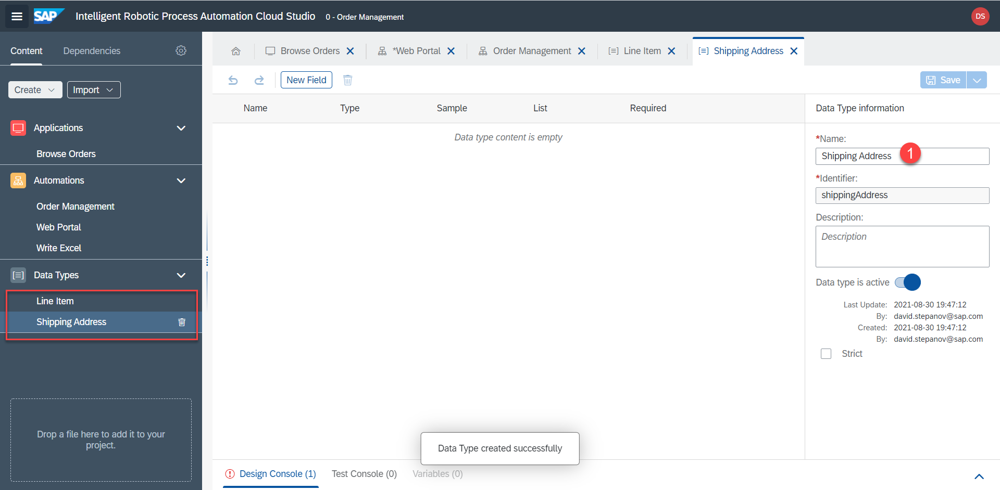

8. Now back in the `Line Item` data type, create a new field by clicking on `New Field`

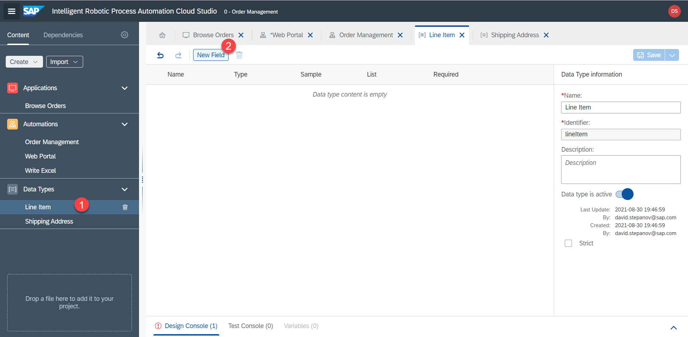

9. Adjust the field properties to name = `Product` and type = `String` 


10. Repeat the steps to create the other fields: `Product`, `UnitPrice`, `Quantity`, `Total`. All of the are of type `String`


11. Repeat same steps to create fields inside the `Shipping Address` datatype: `Name`, `Street`, `ZIP`, `Region`, `Country`. All of these are `String`.

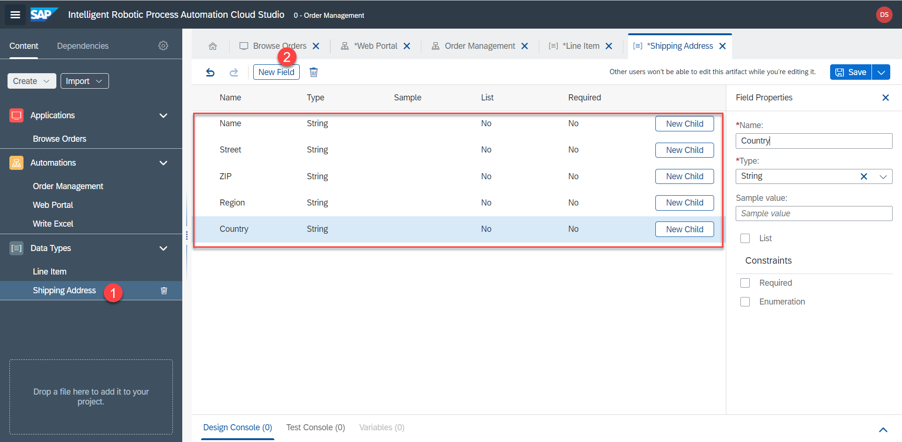

## Saving shipping address

1. Back in the automation add the `Shipping Address` step. 


2. Rename the output parameter to `shippingAdress`


3. Now let's set the values of the data type from the array. Click on `Edit Activity`. Under `Name` select `array[0]`


4. For the other field, let's change the array index to `1`. Click on `open expression editor`


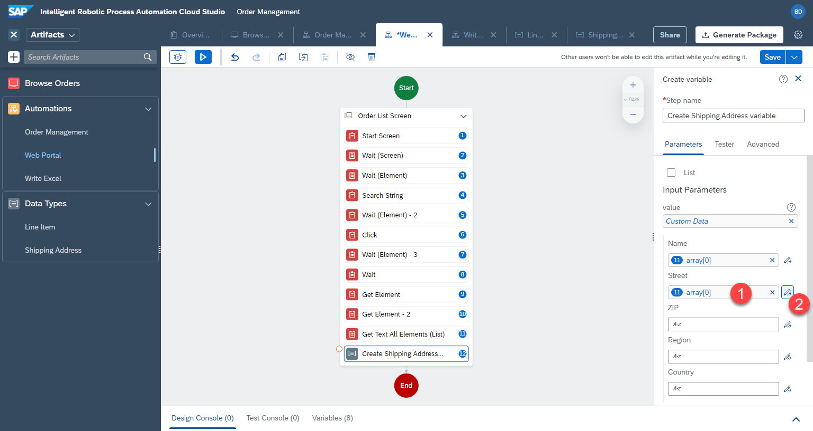

5. In the popup, adjust the index to `1` and `save`

```
Step11.array[1]
```


6. Repeat these steps for the other fields, from `0` to `4`


## Saving line Items

1. Let's start by creating a variable which will contain multiple line items. Add the `Line Item` step, make sure to check the `list` option and rename the output parameter to 

```
lineItems
```

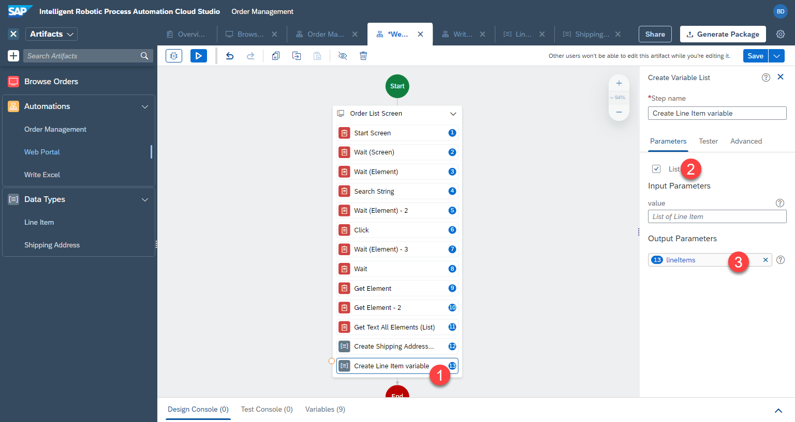


2. Create a `for each` loop

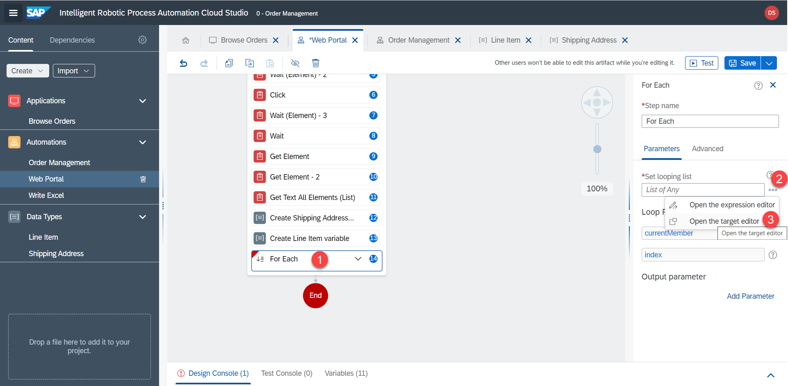

3. Select `Products` as a looping list


4. Inside the for loop add `Get Element` step, set target = `currentMember` and output = `products`

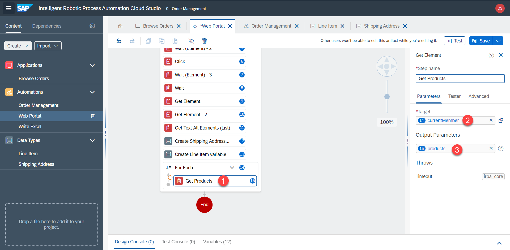

5. Now duplicate the step by `right clicking` on get product. 


6. Rename the step, set target to `unitPrices` and output to `prices`


7. Again, duplicate the step and similarly set target to `quantities` element and output to `quantities`.


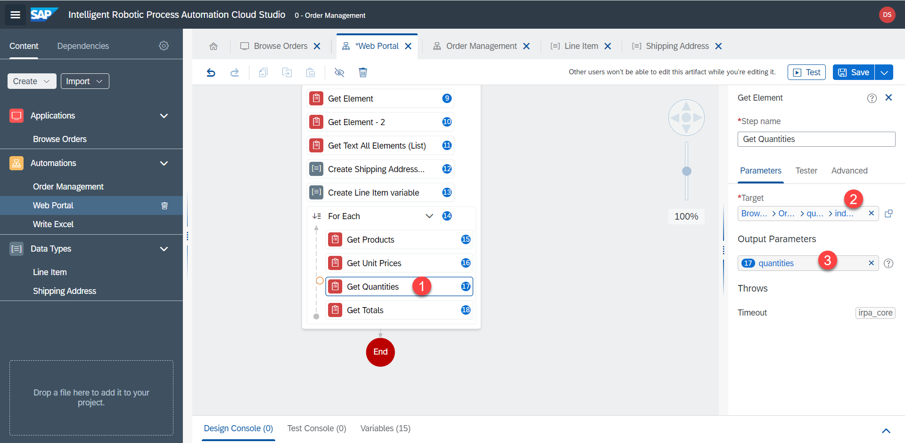

8. Repeat the steps for the total prices elements. Target is `totalPrices`. Output is `total`.

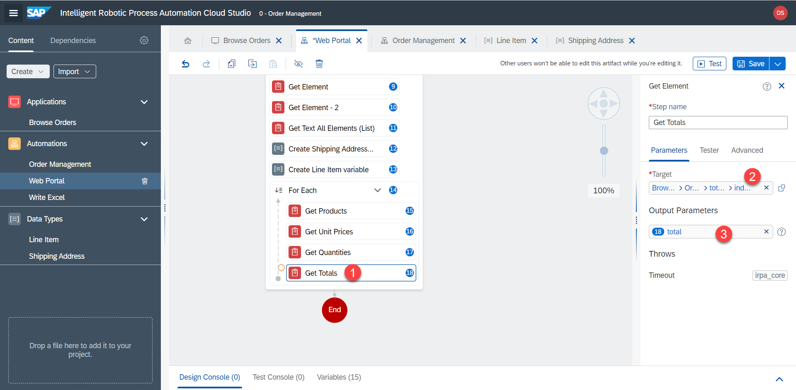

9. Add a line item variable step. Set the output to `lineItem`.


10. Click on `Edit activity` and adjust the varibles for this data type. 


Now let's add the data type containing just a single line item to the list of all line itmes. 

11. Insert an `add item` step. List = `lineItems`. itemToAdd = `lineItem`


If we test the automation now we will see that the list is being generated. 


## Input output params - Web automation

We have to pass data between sub-automation. We can do this by using input and output parameters.

The web automation will get the partner name from the main automation and give back the order number, price, shipping info and line item details. This data will in turn be passed to the excel automation.

1. Select `Web Portal` automation. Click anywhere on the grey area to open the automation parameters.

2. Add an input parameter called `CustomerName` of type `string`

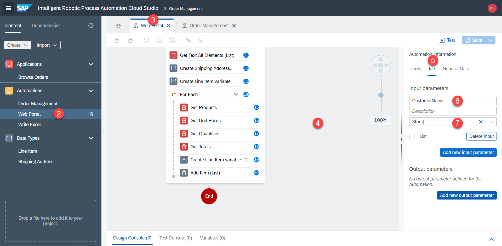

3. Similarly create output parameters

| Name        | Type           | List  |
| ------------- |-------------| -----|
| orderNumber      | String | no |
| price      | String      |   no |
| shippingAddress | Shipping Address      |    no |
| lineItems | Line Item      |    yes |

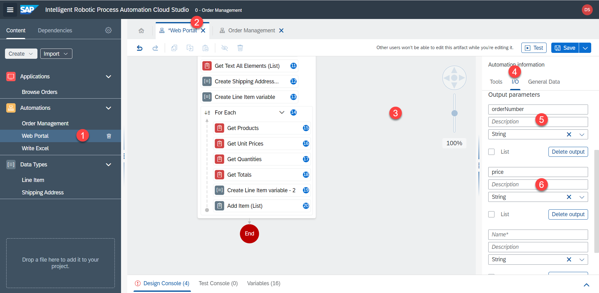


4. Now actually define which variables will be returned, by selecting `parameters` and selecting the respective variables for outputs. 


## Excel automation

Now let's automate the Excel part. We have collected the data from the UI5 app. Now let's insert the data back into Excel. We will do this in the `Write Excel` sub-automation.

Here is the expected result: 


1. Switch to the `Write Excel` automation. Let's start by adding input parameters, which we got from the `Web Portal` sub-automation.


2. Add the same input paramers as the output paramers we added in the web automation.

| Name        | Type           | List  |
| ------------- |-------------| -----|
| orderNumber      | String | no |
| price      | String      |   no |
| shippingAddress | Shipping Address      |    no |
| lineItems | Line Item      |    yes |

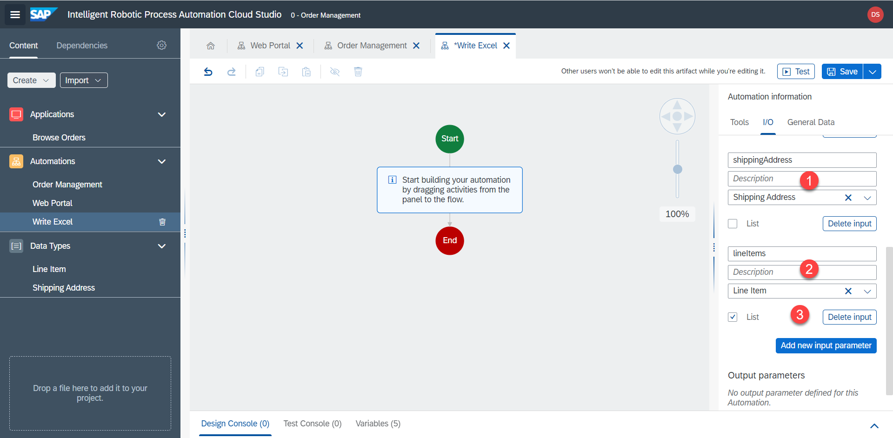


3. Use the `Set Values (Cells)` to write data into a specific cell. 

`B2` and `orderNumber`

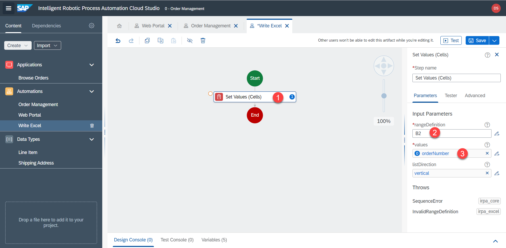

4. Duplicate this step


5. Change to `B3` and `price`

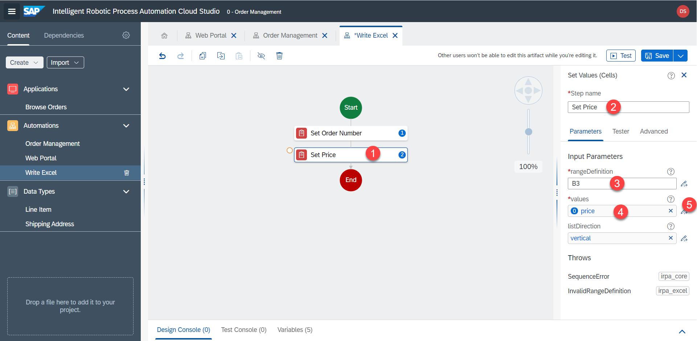

6. Duplicate and change using the expression editor, to get the value inside the data type.

`B4` 

```
Step0.shippingAddress.Name
```

`Step0` contains the input parameters

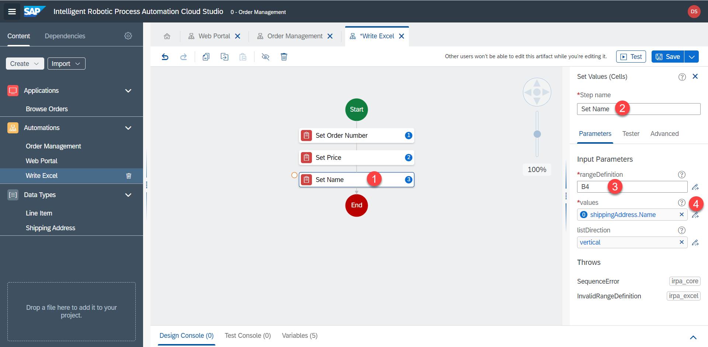

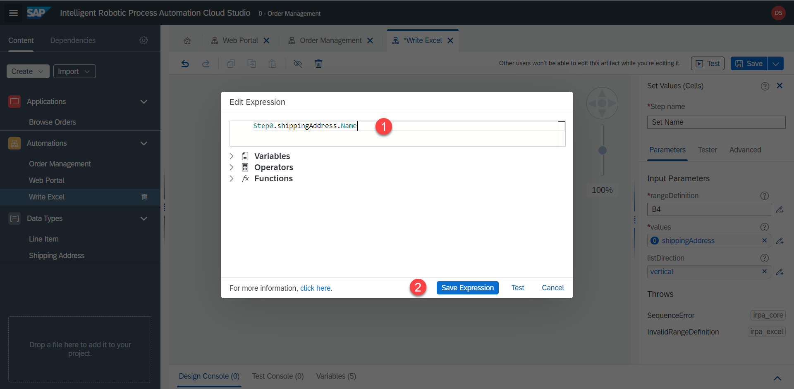

7. Repeat the steps for `Street` inside the shipping address.


8. Duplicate the steps to save time and adjust the parameters according to this table:

| rangeDefinition        | Value           | 
| ------------- |-------------|
| B2      | orderNumber |
| B3      | price      | 
| B4 | Step0.shippingAddress.Name      | 
| B5 | Step0.shippingAddress.Street      | 
| B6 | Step0.shippingAddress.ZIP      | 
| B7 | Step0.shippingAddress.Region      | 
| B8 | Step0.shippingAddress.Country      | 


9. Add `Active Worksheet` step to which to the second worksheet with the order details. worksheetName = `Details`


10. Create a `For Each` loop to loop through the order line items. The looping list is `lineItems`


11. Drop `Set Values (Cells)` step inside the loop


12. Adjust parameters. The data cells start at row `2`, the index starts at `0`, so we use this formula to termine the correct cell

```
"A" + (Step9.index + 2)
```

`Values` = 

```
currentMember.Product
```


13. Duplicate and repeat for unit price, with column `B` instead.


14. Duplicate and repeat for quantity, with column `C` instead.


14. Duplicate and repeat for total, with column `D` instead.


15. Within the main automation `Order Management` we now pass the outputs from `Web Portal` into inputs of `Write Excel`

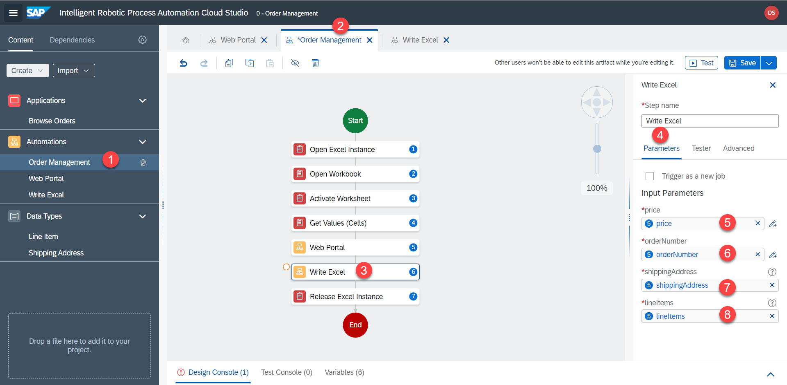


## Testing automation

If we now test the automation, we see the expected results. There are additional automation steps in RPA which can be used to format the cells. Because of the limited available time in this workshop we didn't include those steps. 


## Congrats! 

Nice, we have successfully created this automation! 🎉