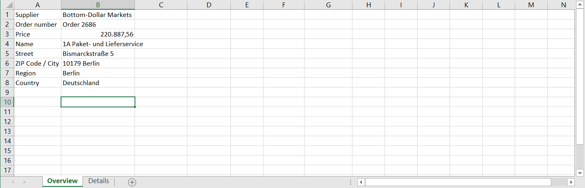
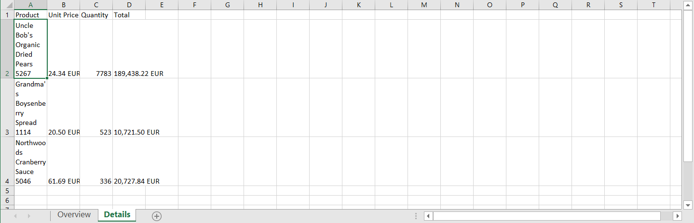

# End

## Testing automation

If we now test the automation, we see the expected results. There are additional automation steps in RPA which can be used to format the cells. Because of the limited available time in this workshop we didn't include those steps. 

## Congrats! 🎉

Nice, we have successfully created this automation! 🎉

This is what the final result looks like: 

[Video](images/OrderManagementVideo.mp4 ':include :type=video width=100% controls' )