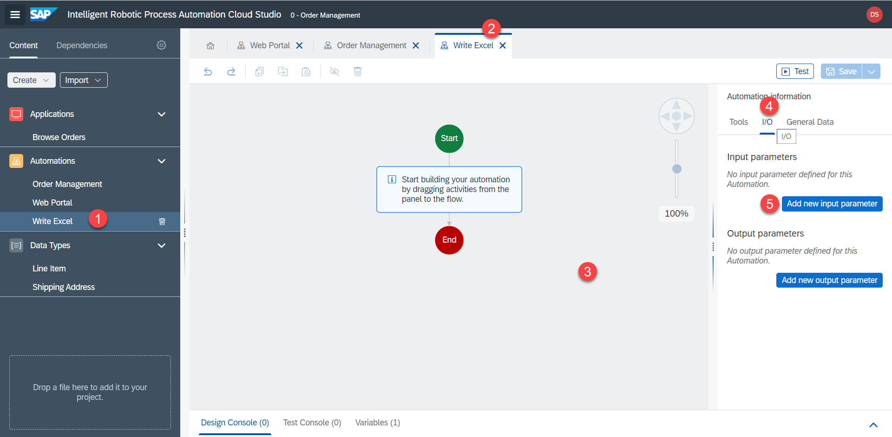
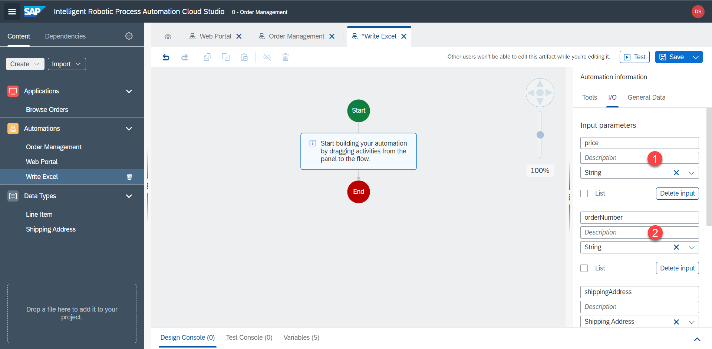
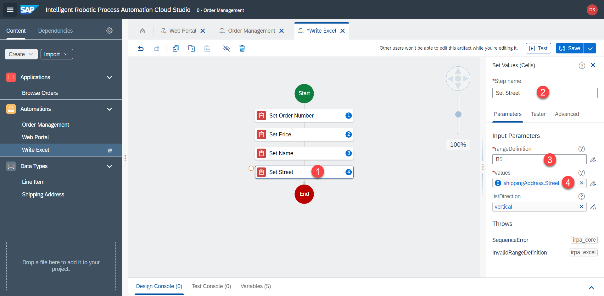

# Excel - First Worksheet


<!-- ## Excel automation -->

Now let's automate the Excel part. We have collected the data from the UI5 app. Now let's insert the data back into Excel. We will do this in the `Write Excel` sub-automation.

Here is the expected result: 


1. Switch to the `Write Excel` automation. Let's start by adding input parameters, which we got from the `Web Portal` sub-automation.



2. Add the same input paramers as the output paramers we added in the web automation.

| Name        | Type           | List  |
| ------------- |-------------| -----|
| orderNumber      | String | no |
| price      | String      |   no |
| shippingAddress | Shipping Address      |    no |
| lineItems | Line Item      |    yes |




3. Use the `Set Values (Cells)` to write data into a specific cell. 

`B2` and `orderNumber`


4. Duplicate this step


5. Change to `B3` and `price`


6. Duplicate and change using the expression editor, to get the value inside the data type.

`B4` 

```
Step0.shippingAddress.Name
```

`Step0` contains the input parameters


7. Repeat the steps for `Street` inside the shipping address.




8. Duplicate the steps to save time and adjust the parameters according to this table:

| rangeDefinition        | Value           | 
| ------------- |-------------|
| B2      | orderNumber |
| B3      | price      | 
| B4 | Step0.shippingAddress.Name      | 
| B5 | Step0.shippingAddress.Street      | 
| B6 | Step0.shippingAddress.ZIP      | 
| B7 | Step0.shippingAddress.Region      | 
| B8 | Step0.shippingAddress.Country      | 


