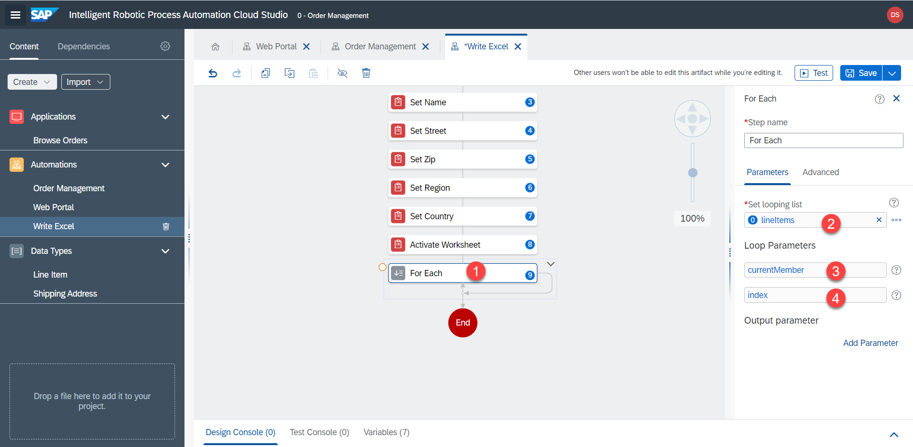

# Excel - Second Worksheet

Desired result:


1. Add `Active Worksheet` step to switch to the second worksheet with the order details. worksheetName = `Details`


2. Create a `For Each` loop to loop through the order line items. The looping list is `lineItems`



3. Drop `Set Values (Cells)` step inside the loop


4. Adjust parameters. The data cells start at row `2`, the index starts at `0`, so we use this formula to termine the correct cell

```
"A" + (Step9.index + 2)
```

`Values` = 

```
Step9.currentMember.Product
```


5. Duplicate and repeat for unit price, with column `B` instead.


6. Duplicate and repeat for quantity, with column `C` instead.


7. Duplicate and repeat for total, with column `D` instead.


8. Save all automations 

9. Within the main automation `Order Management` we now pass the outputs from `Web Portal` into inputs of `Write Excel`

