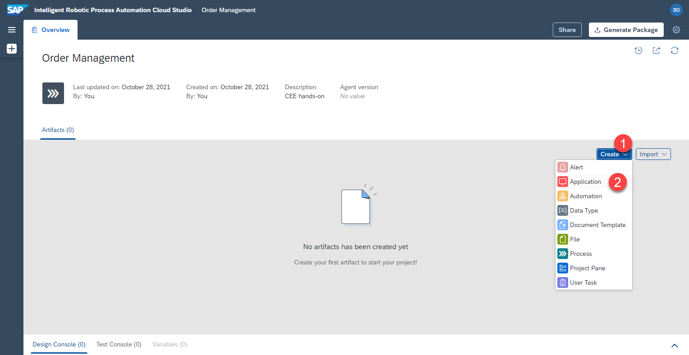
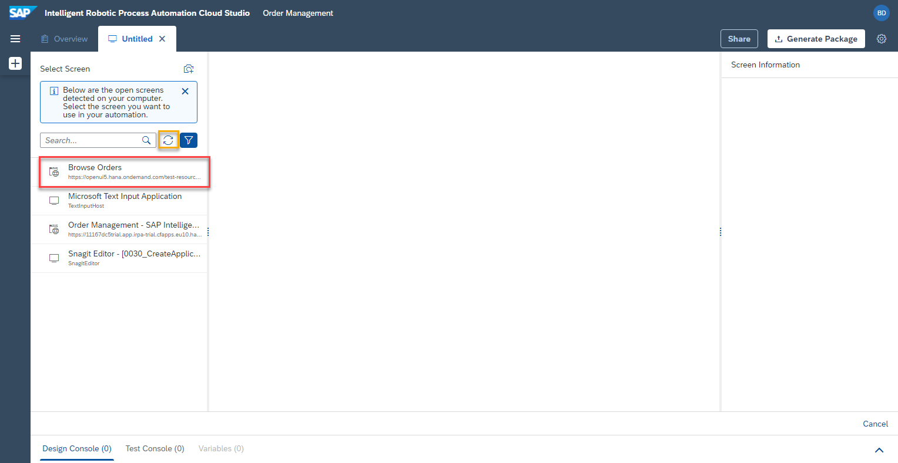
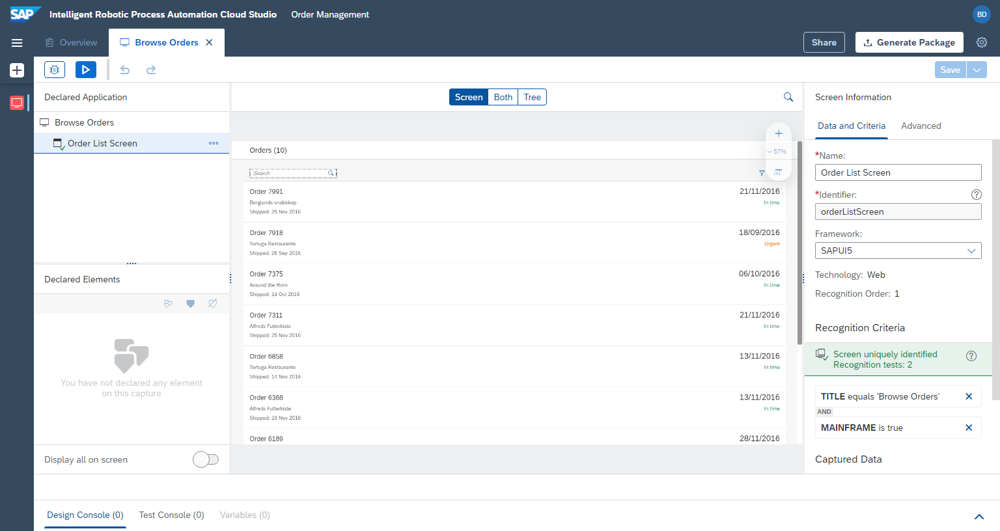
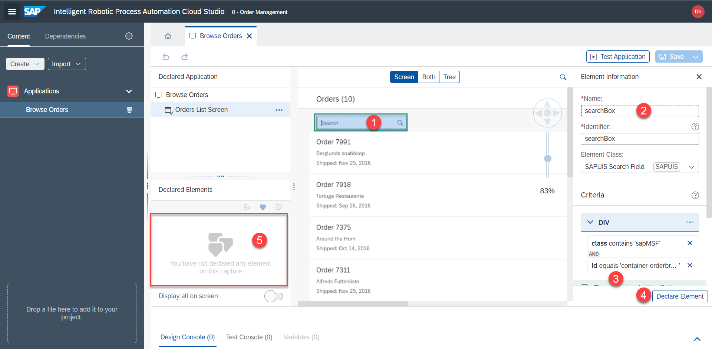
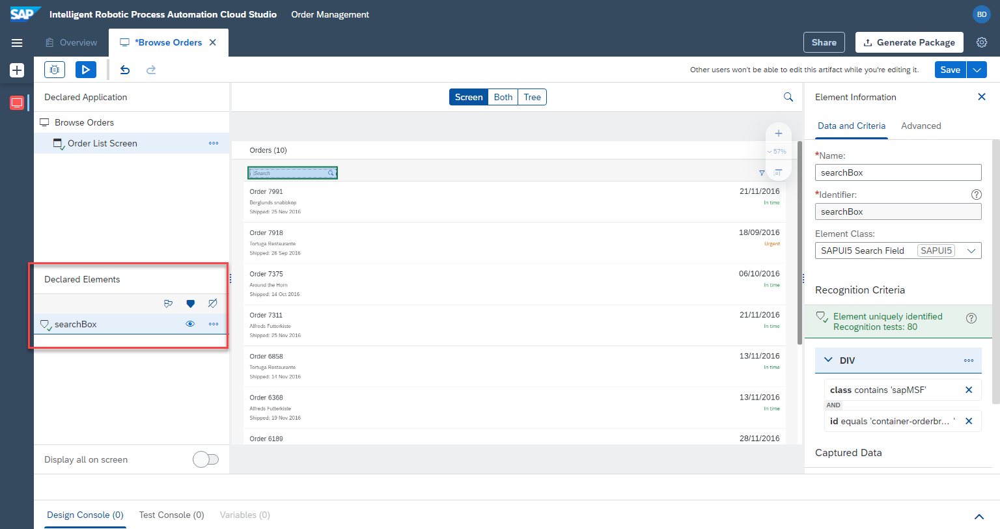

# Define Application and First Screen

## Overview
Next, we will define the application which will be used in our automation. In our case we will define the orders UI5 app, the various screens and the elements on the web page. We will use these screens and elements in the automation later.

## Create application

1. Make sure the [UI5 app](https://openui5.hana.ondemand.com/test-resources/sap/m/demokit/orderbrowser/webapp/test/mockServer.html) is opened in a separate window, not just in a new tab. Desktop Agent should also be running and connected to the correct tenant.

2. Select `Create` > `Application`



4. Select (click) the window titled `Browse order`. This is our UI5 application. You should see



Note: If UI5 application (step 1 - Create application) is not opened in separate window, open it and click on `refresh icon` to get the currently open windows

5. Give a name to the application. `Application name` (see picture below) E.g.


```
Browse Orders
```

6. Give a name to the first `screen` we are capturing. The application changes the view, when we click on one of the orders. A new screen with the detailed information appears. For this reason we will capture multiple `screens` of a single `application`. Screen name example:


```
Orders List Screen
```

7. Click on `capture`


8. The result is a captured application and captured first screen





## Define elements on first screen

Next, we will define the only relevant element on the first screen --> `search box`. Our bot will search for the supplier in this search box, so we have to define this element.

1. To do this, click on the search box within the preview.
2. Name the search box element. E.g.

```
searchBox
```

3. Make sure the element is uniquely recognized (green status)
4. Don't forget to click on `declare element` to make sure this element is actually saved.
5. The defined search box element will appear under `Declared elements` with a green status, meaning that the element has been successfully defined.




