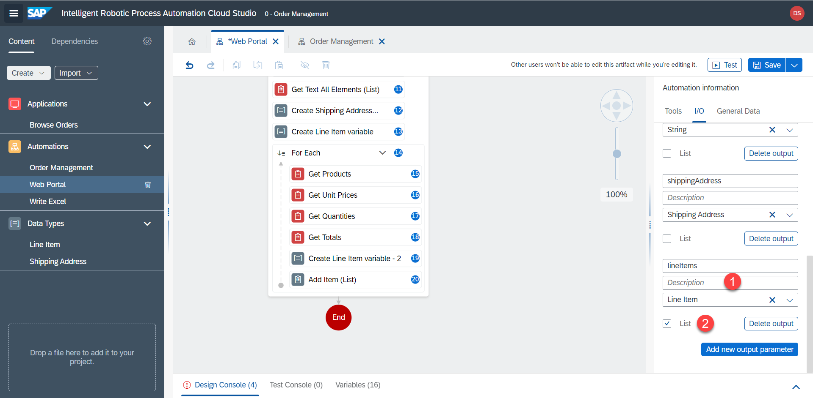

# Input / Output Parameters

<!-- ## IO params - Web automation -->

We have to pass data between sub-automation. We can do this by using input and output parameters.

The web automation will get the partner name from the main automation and give back the order number, price, shipping info and line item details. This data will in turn be passed to the excel automation.

1. Select `Web Portal` automation. Click anywhere on the grey area to open the automation parameters.

2. Add an input parameter called `CustomerName` of type `string`

3. Similarly create output parameters

| Name        | Type           | List  |
| ------------- |-------------| -----|
| orderNumber      | String | no |
| price      | String      |   no |
| shippingAddress | Shipping Address      |    no |
| lineItems | Line Item      |    yes |

4. Now actually define which variables will be returned. Click on the `End` step, select `parameters` and select the respective variables for outputs. 

5. Don't forget to save the automation.