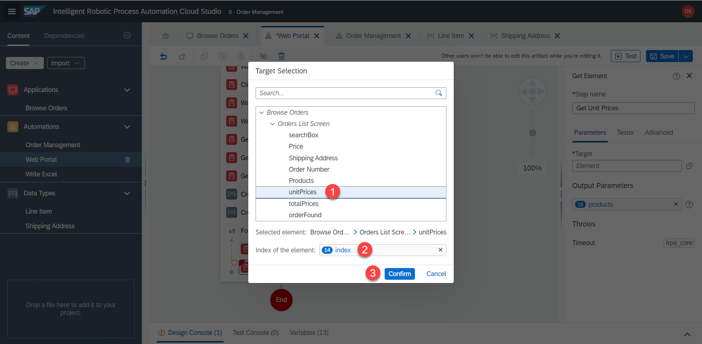

# Line Items

<!-- ## Saving line Items -->

1. Let's start by creating a variable which will contain multiple line items. Add the `Line Item` step, make sure to check the `list` option and rename the output parameter to 

```
lineItems
```


2. Create a `for each` loop


3. Select `Products` as a looping list


4. Inside the for loop add `Get Element` step, set target = `currentMember` and output = `products`. Rename the step if you wish


5. Now duplicate the step by `right clicking` > `Duplicate` on the `get product` step. 


6. Rename the step, set target to `unitPrices` and output to `price`




7. Again, duplicate the step and similarly set target to `quantities` element and output to `quantity`.


8. Repeat the steps for the total prices elements. Target is `totalPrices`. Output is `total`.


9. Add a line item variable step. Set the output to `lineItem`.


10. Click on `Edit activity` and adjust the variables for this data type. 


Now let's add the data type containing just a single line item to the list of all line itmes. 

11. Insert an `add item` step. List = `lineItems`. itemToAdd = `lineItem`


If we test the automation now we will see that the list is being generated. 

