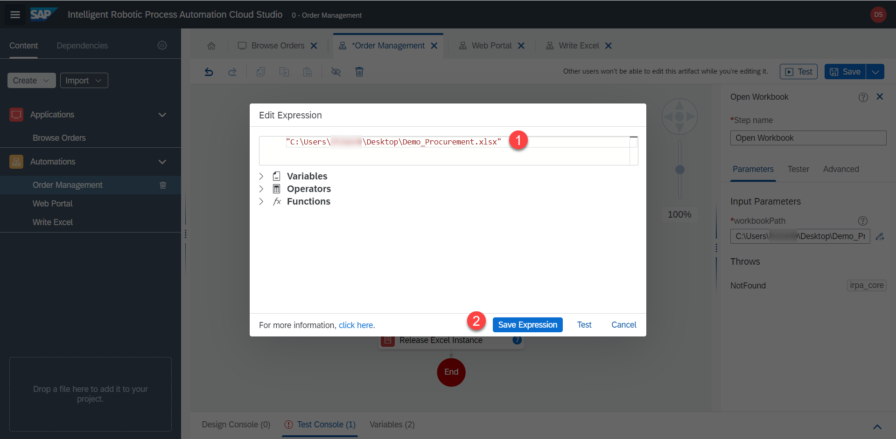
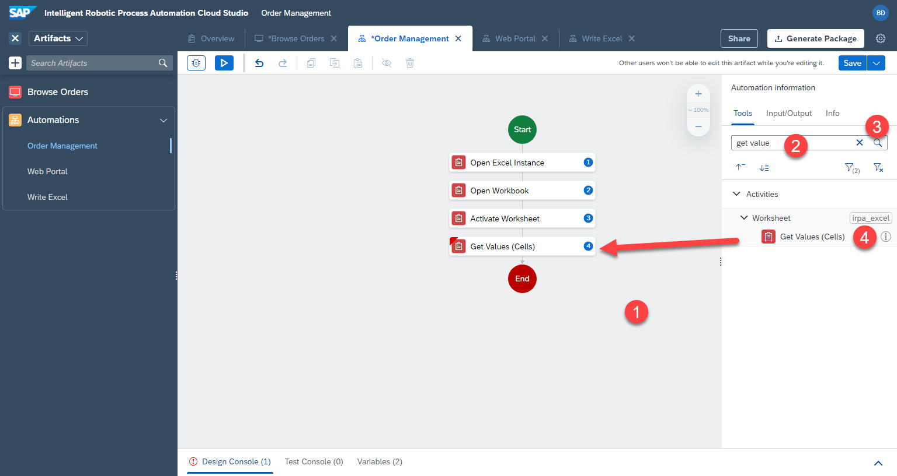

# Main Automation 

## Define steps

Let's define the general structure of our automation. Here is the data we want from excel:


1. We want to open Excel. Repeat the steps above for `Open Excel Instance`.


2. We want to open the correct workbook. Repeat the steps above for `Open Workbook`.

In the parameters on the right, edit the expression and enter the full path to your file. Make sure the path is within quotation marks `"..."` E.g.

```
"C:\Users\you\Desktop\Demo_Procurement.xlsx"
```




3. We want to open a specific worksheet. Repeat the steps above for `Activate Worksheet`. Set `worksheetName` = 

```
Overview
```


4. We want to get a value from a cell. Repeat the steps above for `Get Values (Cells)`. Set `rangeDefinition` = `B1`. And rename outputParamenter to  

```
supplierName
```

This means that this step will run and the result (value from cell B1) will be saved in a variable called `supplierName`




5. And `Web Portal` and `Write Excel` subautomations. So far they are not doing anything, but just acting as placeholders. 


6. At the end we want to make sure that Excel is not used by iRPA anymore. We release the instance. Repeat the steps above for `Release Excel Instance`


## 🔹 How to test automation

Let's not do too much work without seeing what the bot does and if we make any mistakes. 

1. `Save` the automation, then click on `test`.

2. Select your environment.

3. Click on `test`.


It takes a while for the desktop agent to download, process and run the automation. Here are some of the messages you will see:

|  |  |  |
:-------------------------:|:-------------------------:|:-------------------------:|
  |   |  


After the automation has completed, you can see the debug screen (`Tester`). In here you can either check the output of the `test console` or click on single steps in the automation to see the details on the right side. 

4. For instance, click on the step `Get Values (cells)` and we see the correct output value on the right `Bottom-Dollar Markets`. The automation ran correctly

