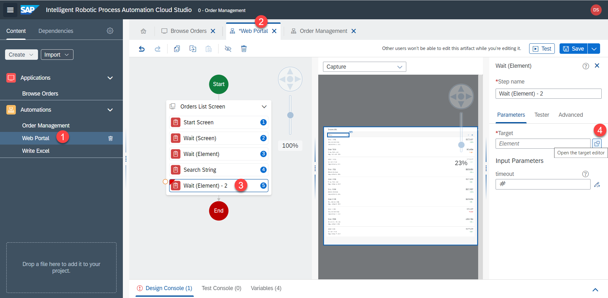
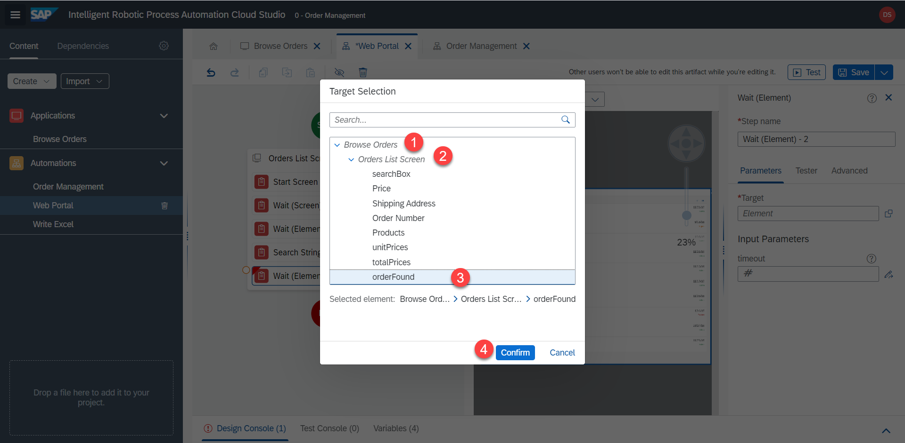
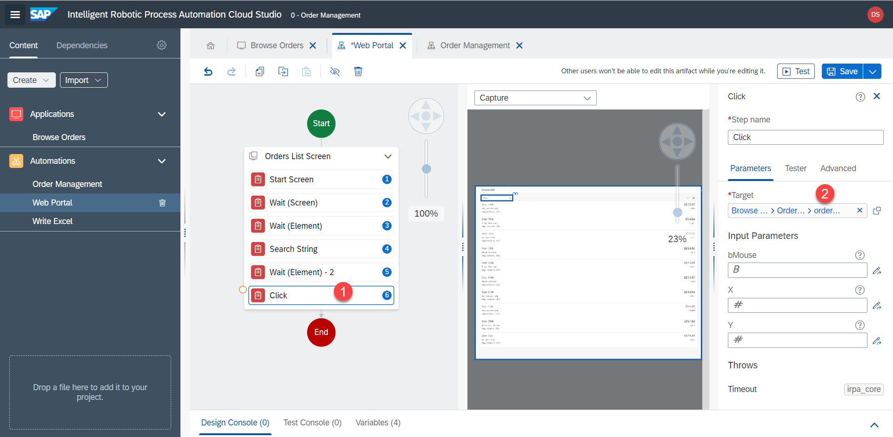
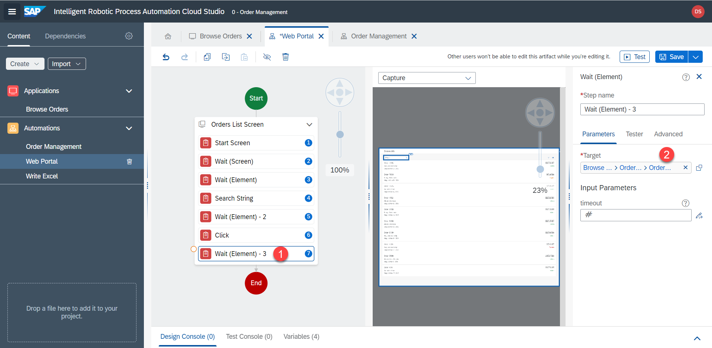
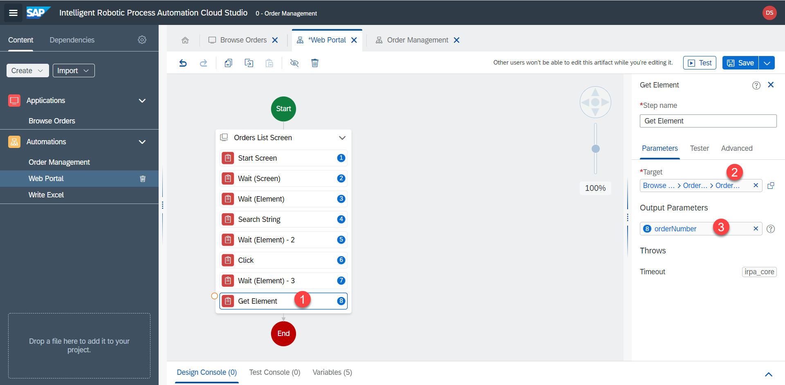
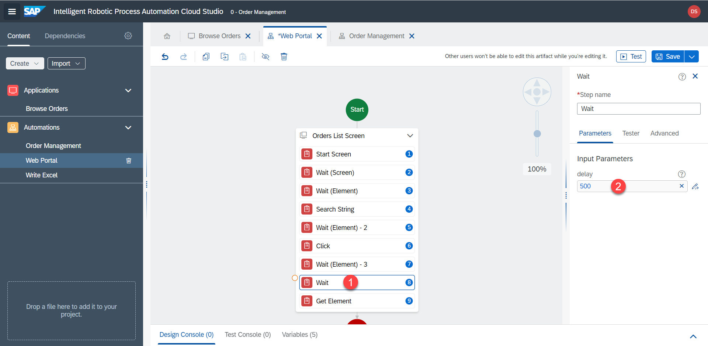
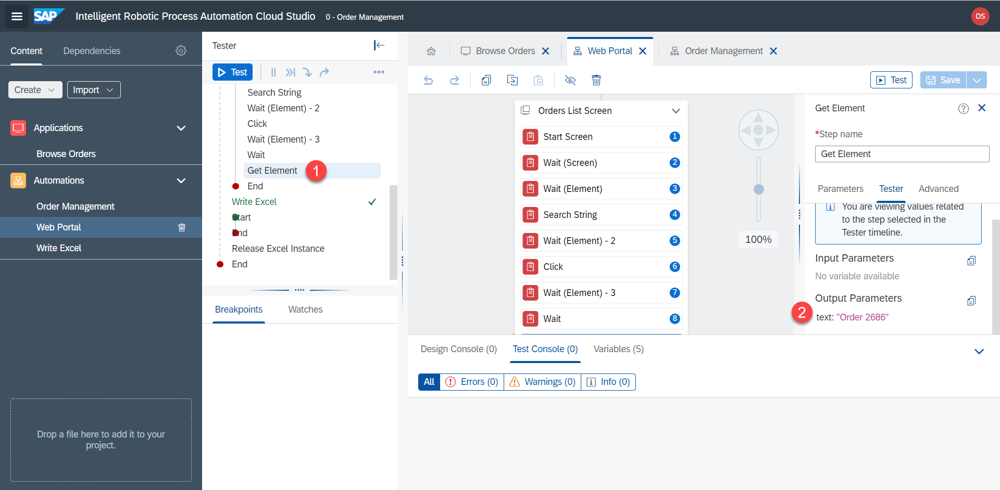
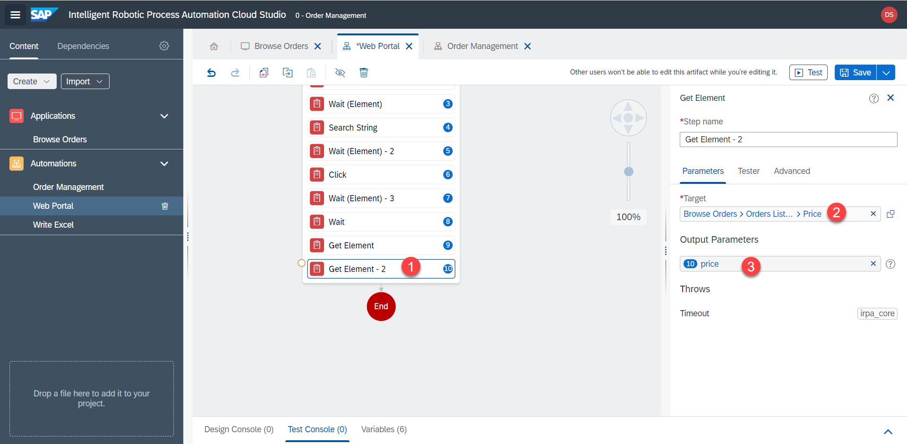
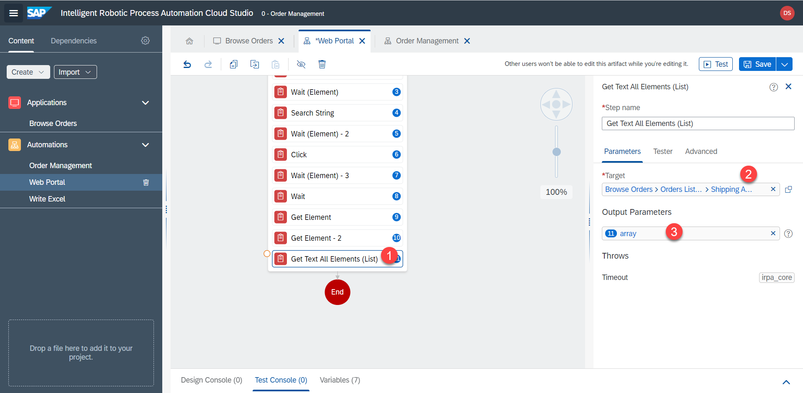

# Get Order Info

## Wait for search results

Next let's wait for the search results to load

1. Add `Wait (Element)` with target of the row

2. Select `orderFound` element in the popup and `confirm`.

3. Add `click` step with the target of the row --> `orderFound` element. RPA will wait for the row to appear and then click on it.

## Wait for details to load

1. RPA should wait for the details screen to open and load. Add `Wait (Element)` step with `Order Number` as target

2. Let's save the order number in a variable. Use the step `Get Element`. Set the target to `Order Number`. Rename output parameter to `orderNumber`. 

Actually at this point the bot would sometimes receive `Order undefined` as the result. That's because the details view loads slower than the bot moving to the next step. For this reason, let's add a manual delay of `500` miliseconds for the details page to load.

If we test the main automation now, we will see that we correctly receive `Order 2686`.

3. Next, let's get the `Price` element and save it in the `price` variable

4. The shipping address is saved in a collection. Use the `Get Text All Elements (List)` operator. `Shipping Address` is the target. Name the output `array`

