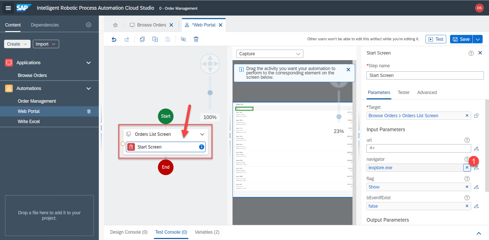

# Searching


## Web Automation

Next we will define the automation within the UI5 app. On a high level it will:
- Enter supplier name in the search box and search
- Click on the result
- This will open the details of the order
- RPA will save all the relevant information, which we will later write into Excel

1. Click on `Web Portal` either in the menu on the left or on the tab at the top.


2. Drag and drop the screen activity `Orders List Screen`, because we will be interacting with this specific application we defined.


3. Click on the screen activity and then on `Define Screen Activities`.


4. Drag and drop `Start screen` onto the screen preview


5. Make sure the step is inside the screen activity and target is set to `orders list screen`.



6. Change the navigator from `Internet Explorer` to `Chrome`, so that RPA open the page in Chrome.


|  |  |  |
:-------------------------:|:-------------------------:|:-------------------------:|
  |   |  

7. Drag `Wait (Screen)` operator onto the screen preview and make sure the target is set correctly. RPA will wait until the screen actually loads. 


8. Aditionally, RPA should wait to ensure that the search bar loads as well. Drag `Wait (Element)` onto the search bar preview. Make sure the target is set to search bar element.


9. Add `Search string` action. Make sure the target is correct. 


## Input Parameter

But how do we get the name of the supplier we got from Excel? It's not available in the `Web Portal` subautomation yet. That variable is only available in the main automation `Order Management`. But we can pass the variable to the subautomation using `parameters`. 

10. Close the panel


11. Press on empty space to change the settings of the automation. Click on `I/O` > `Add new input parameter`.


12. Create input parameter named 

```
CustomerName
```

Type is `string`. Click on the empty space to save these settings. 


13. Now back in the `search string` step we can select the `CustomerName` variable, which is our input parameter passed to the subautomation.


However, the value still hasn't been passed from the main automation. To do that

14. Go to the main automation either from the left side or from the tabs at the top. Select the `Web Portal` step and provide the input parameter


15. Don't forget to `save` the progress. 