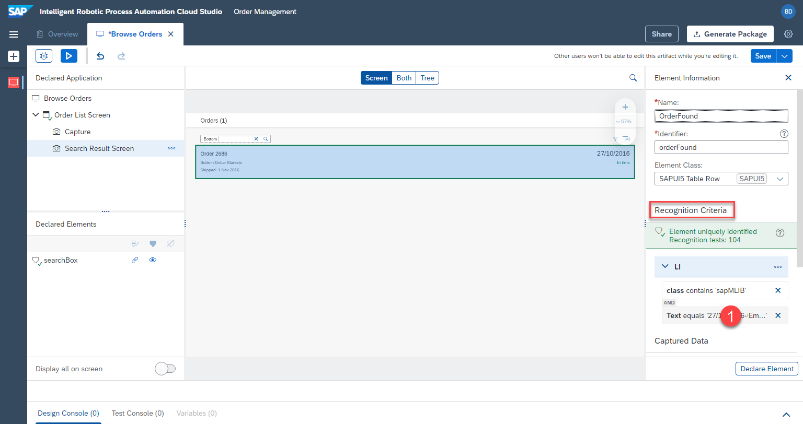

# Define Second Screen

## Define second screen

Next we will add the second screen from within the same UI5 app. This way the bot can recognize the results of a search

1. Open the [UI5 app](https://openui5.hana.ondemand.com/test-resources/sap/m/demokit/orderbrowser/webapp/test/mockServer.html) is opened in a seperate window, and enter `Bottom-` in the search. Make sure the order `2686` is found. Keep the window open.


2. Within the cloud studio, click on `...` next to the first screen capture and select `Add Capture to Current Screen`.


3. `Refresh` and Select the window with `Browse Orders`

4. Name the new capture, e.g. 

```
Search Result Screen
```

5. Press `Capture`


## Define elements on second screen

1. Select the second screen we just defined `Search Result Screen`

2. Click on the list row in the preview. Make sure the whole row is selected, and not just single text

3. Rename the element, e.g. 

```
OrderFound
```

4. Don't click on declare element yet.


We are going to adjust the criteria, so that the element can be recognized regardless of the order number. Currently RPA would be looking for a very specific list of criteria to find an element. These criteria can be found and changed under `criteria` section on the right.

We will specifically look for the element containing `Order` as text.

5. Click on the `text` criteria.



6. A popup will be opened. Change the `operator` to `contains`. 

7. Change `value` to 

```
Order
```

8. `Apply` the criteria


9. The criteria have been updated, as seen on the right.

10. We can now save the element by clicking on `Declare Element`

11. The element will be saved under `Declared Elements`


