# Shipping Address


## Data Types

The name, adress, zip, etc from the shipping address are currently stored in an array. Let's add better structure to that by using `Data Types` from IRPA. These data types can store multiple variables and named fields, to represent more complex data structures. Let's create 2 data types: for a shipping address and a line item.


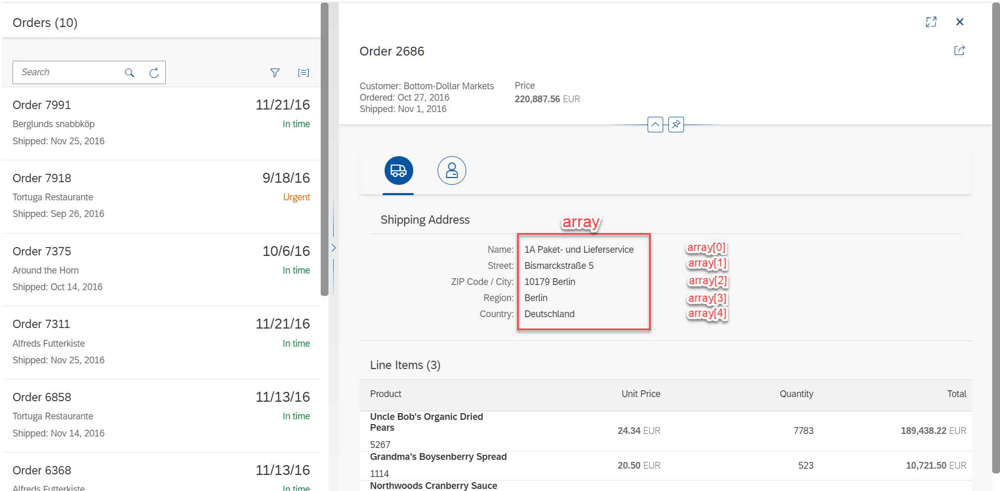

`Save` the automation you have so far.


5. `Create` > `Data Type`

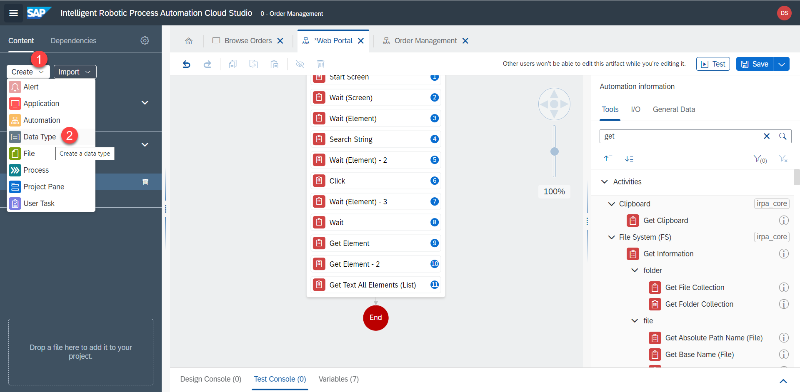

6. Name the data type, e.g.

```
Line Item
```

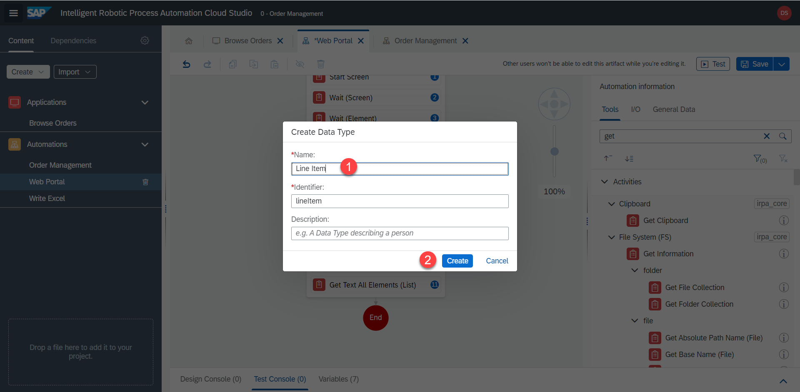

7. Repeat the same steps to create another data type 

```
Shipping Address
```


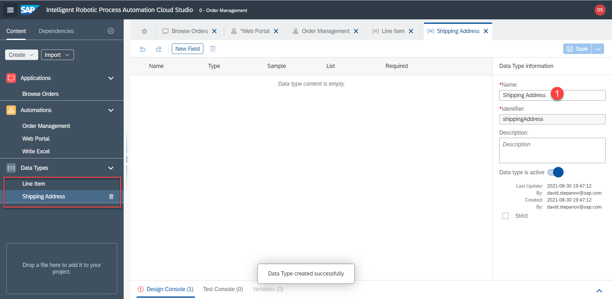

8. Now back in the `Line Item` data type, create a new field by clicking on `New Field`


9. Adjust the field properties to name = `Product` and type = `String` 

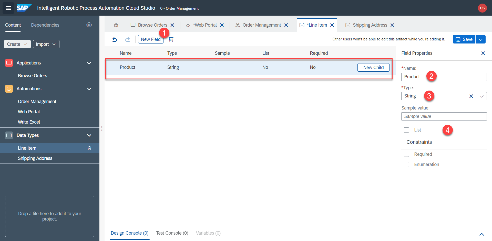

10. Repeat the steps to create the other fields: `Product`, `UnitPrice`, `Quantity`, `Total`. All of the are of type `String`


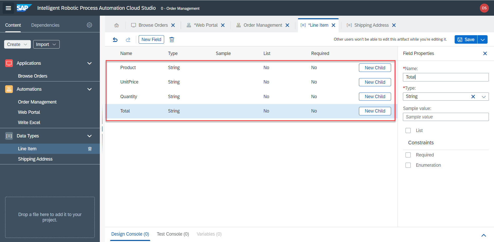

11. Repeat same steps to create fields inside the `Shipping Address` datatype: `Name`, `Street`, `ZIP`, `Region`, `Country`. All of these are `String`.

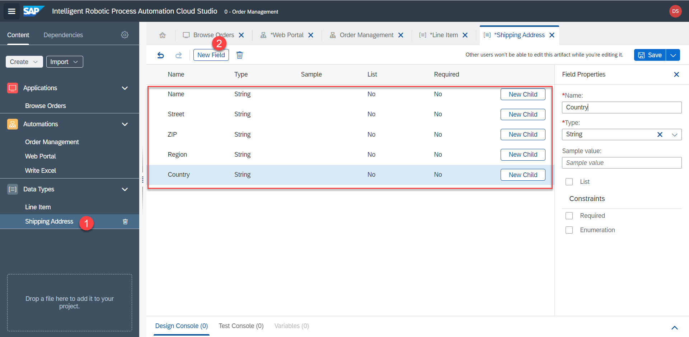

12. Don't forget to `Save` both data types

## Saving shipping address

1. Back in the `Web Portal` automation add the `Shipping Address` step. 


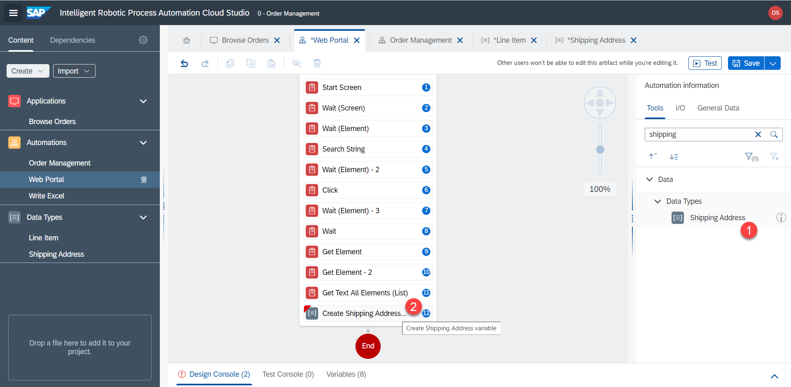

2. Rename the output parameter to `shippingAdress`


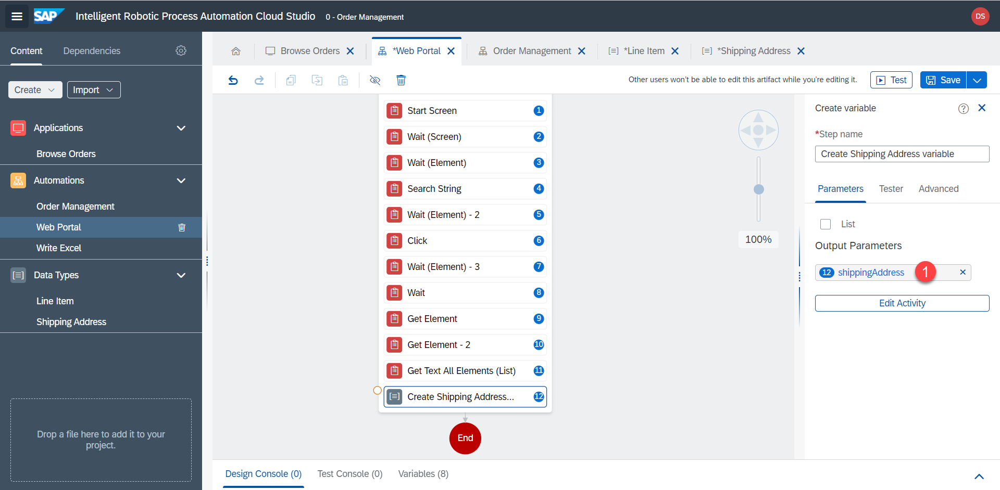

3. Now let's set the values of the data type from the array. Click on `Input Prameters value`. Select `Create Custom Data`. Under `Name` select `array[0]`. If `array[0]` option is not available, please see how to manually select that, like in the next steps.

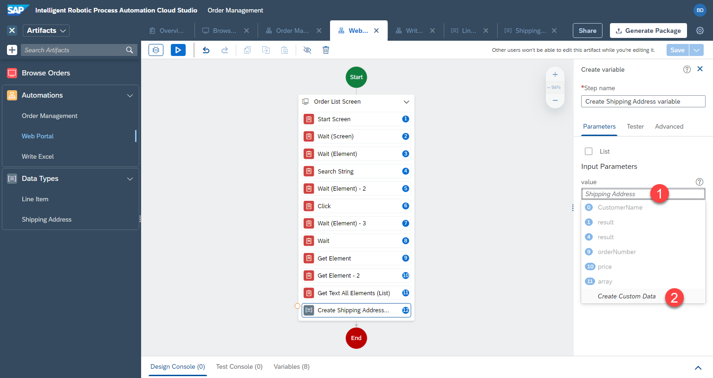

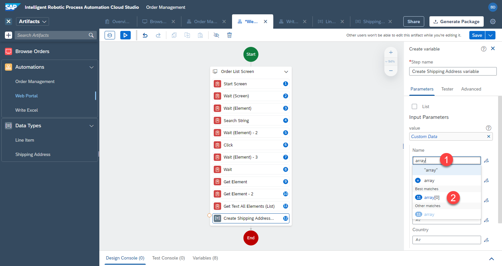

4. For the other field, let's change the array index to `1`. Click on `open expression editor`


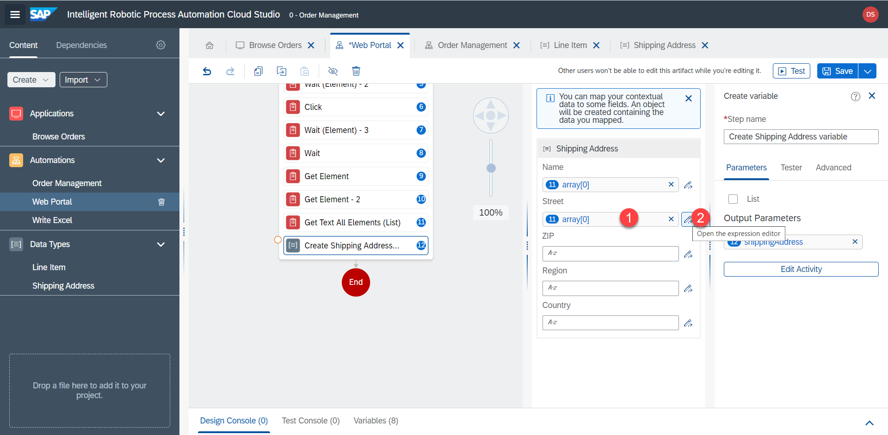

5. In the popup, adjust the index to `1` and `save`

```
Step11.array[1]
```

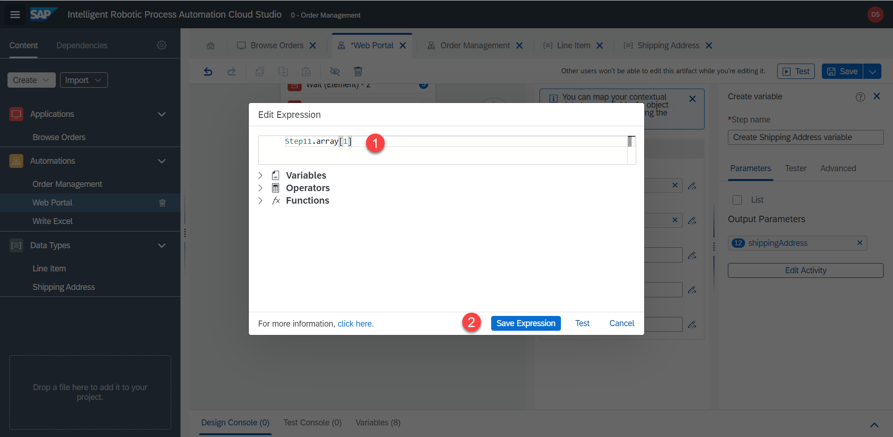

6. Repeat these steps for the other fields, from `0` to `4`


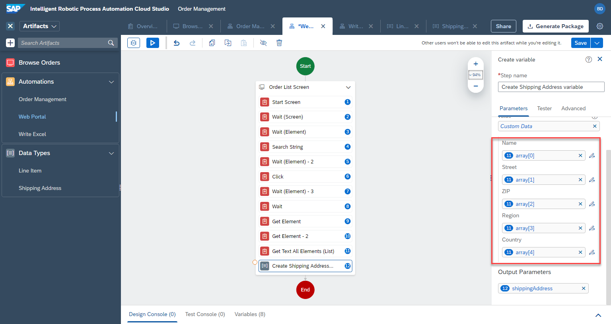