# Define Third Screen

## Define Third screen

Next we will add the third screen from within the same UI5 app. This way the bot can recognize the details of a specific order

1. Open the [UI5 app](https://openui5.hana.ondemand.com/test-resources/sap/m/demokit/orderbrowser/webapp/test/mockServer.html) is opened in a seperate window, and enter `Bottom-` in the search. Make sure the order `2686` is found. Click on that order to see the detail view. Keep the window open.


2. Within the cloud studio, click on `...` next to the first screen capture and select `Add Capture to Current Screen`.


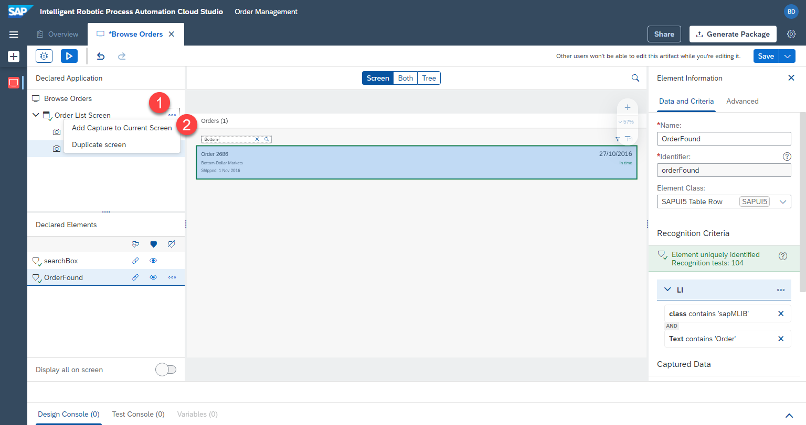

3. `Refresh` and Select the window with `Browse Orders`

4. Name the new capture, e.g.

```
Order Details Screen
```

5. Press `Capture`


## Define elements on third screen

### Order Number

1. Select the third screen we just defined `Order Details Screen`

2. Click on the order number in the preview

3. Rename the element, e.g.

```
Order Number
```

4. Don't click on declare element yet.

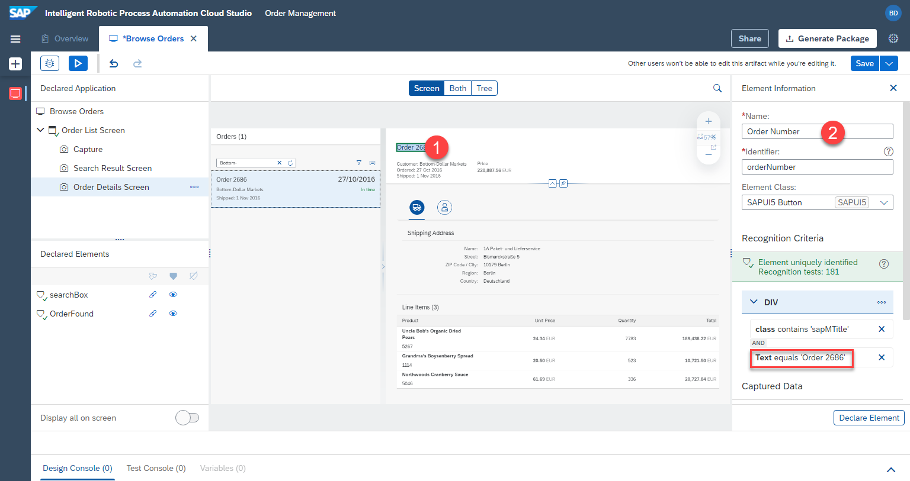

As before, we are going to adjust the criteria.

5. Click on the `text` criteria.

6. A popup will be opened. Change the `operator` to `contains`.

7. Change `value` to `Order ` **with a space at the end**

```
Order
```

8. `Apply` the criteria.

9. Don't forget to click on `Declare Element`


### Price

1. Select the third screen we just defined `Order Details Screen`

2. Click on the price in the preview

3. Remove the text criteria

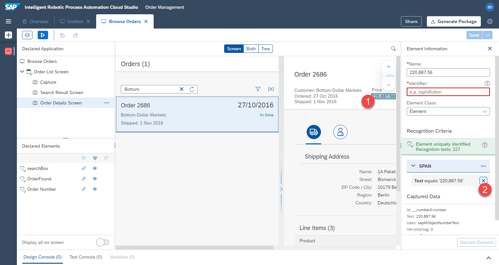

4. Add the `id` of the element as criteria instead. This will uniquely identify the price.


5. Rename the element, e.g.

```
Price
```
6. Make sure the correct id criterion is selected and don't forget to click on `Declare Element`

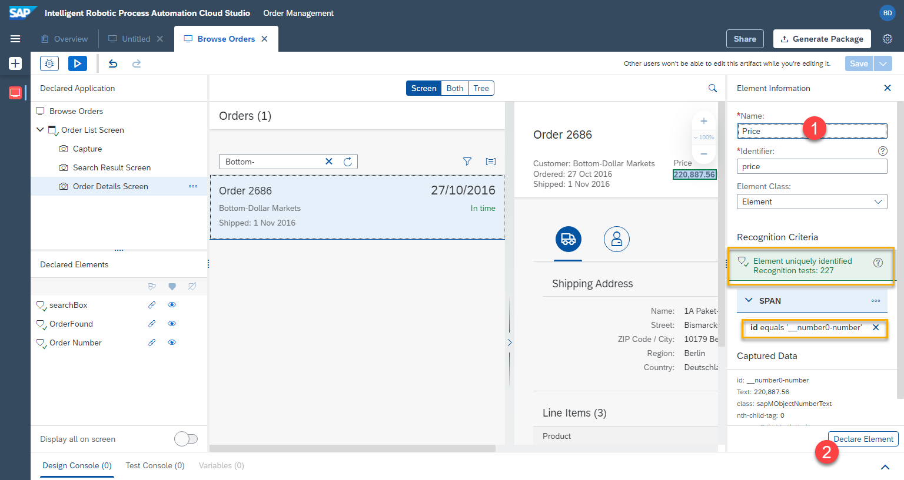


### Address

Next, we will define address in a different way, as a collection of multiple elements

1. Click on the name under shipping address in the preview

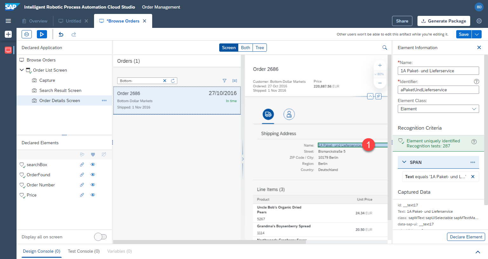

2. Remove the `text` criteria, it's too specific

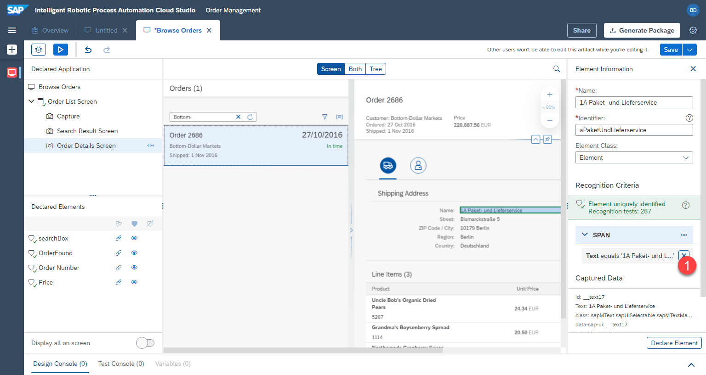


3. Select `class` as element


Within IRPA we can also see the underlying technical document structure of the page. We will use this to more precisely select the element that we want.

4. Click on `both` at the top to show both the preview, as well as the technical structure.

5. Select the `div` (the container), instead of `span`. This way we will be able to connect it to the other elements of the address.


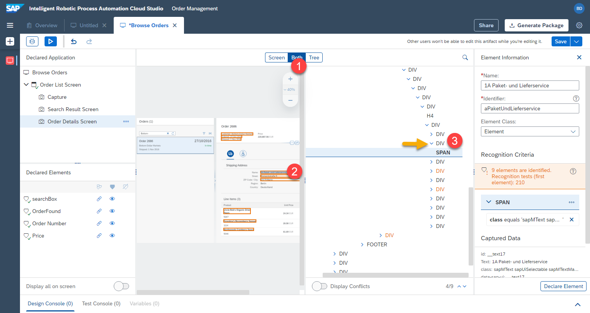

6. `div` is selected. Now let's remove the `text` criteria as it is too specific.

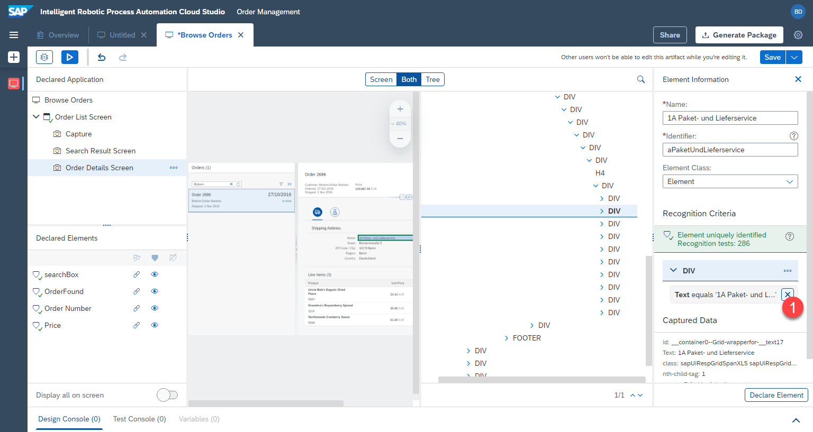

7. Add the `class` criteria instead.

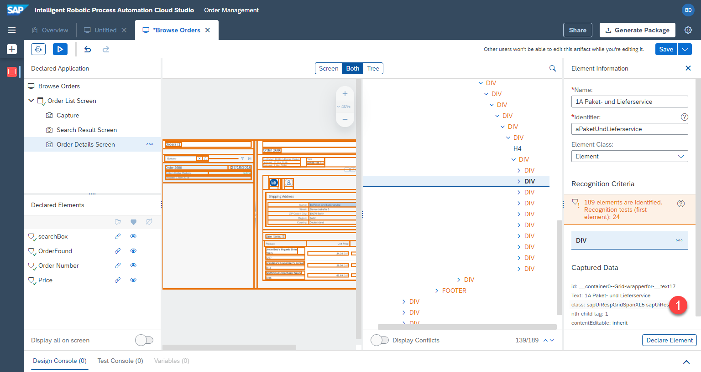

8. Class is selected. Set the name, e.g.
```
Shipping Address
```

9. Click on `declare element`
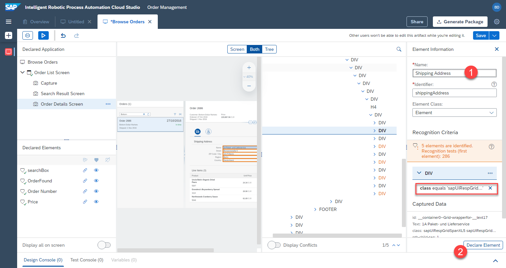

Now the element cannot be uniquely identified, because multiple elemnts fulfill the same criteria. RPA shows this in the warning status message as well as a `yellow !` in the `declared elements` section.

10. We can create a collection of these multiple elements, by clicking the `3 tags/triangles` under declared elements, while `shipping address` is selected.

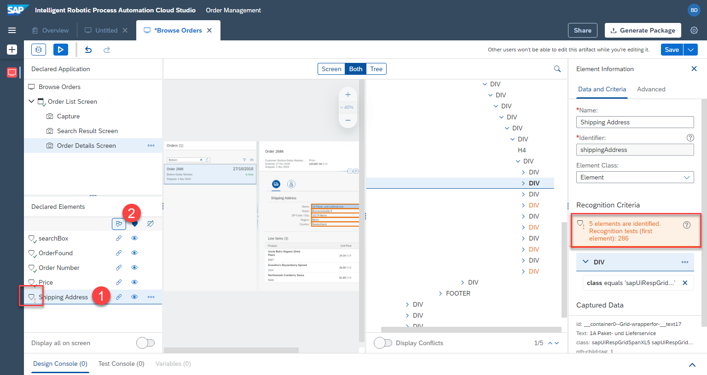

As a result, a collection is defined. The `check mark` is now green. The element is uniquely identified. And the technical page structure shows that multiple elements are contained in this collection (0, 1, 2, 3, 4).


11. Don't forget to save the progress by clicking on the `save` button at the top right.


