# Continue Defining Third Screen


## Define Line Items

Next we will define the line items of an order. We will define each column as a collection.

### Products

1. Press on the first product cell. Click on the `>` > just before selected `TR` TR element. Make sure that the second `TD` is selected in the tree view. 


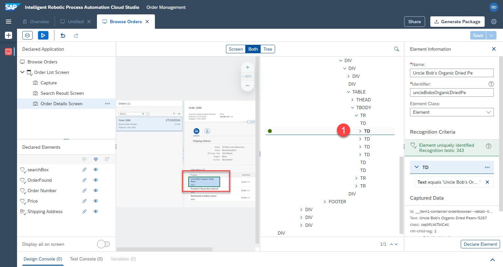

2. Name this element, e.g.

```
Products
```
3. Remove the text criteria


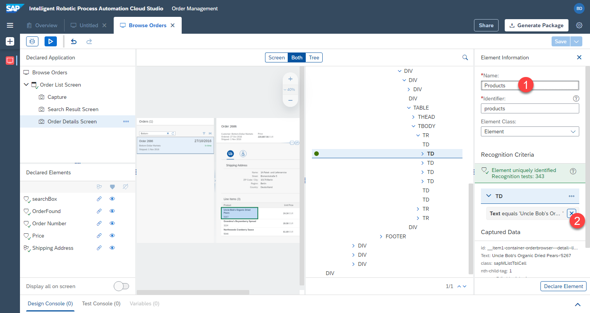

4. Select `id` instead


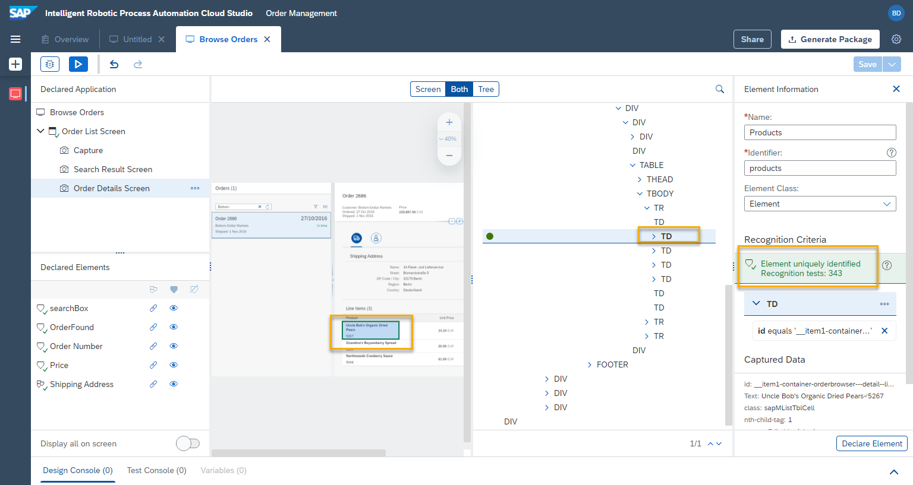

5. Modify the criteria. Id should `contain` `cell0`, meaning the 0th column. 

```
cell0
```


Now all 3 product cells have been identified. We want to define these as a collection.

6. Click on `declare element`.


7. Click on `3 triangles`, to define these elements as a collection


The elements have been detected. `TD` is the collection. The elements have been uniquely identified. Click on `Save` button.


### Unit Prices

1. Click on the first product row. Now we want to select the unit price in the first row.

2. Make sure it's the `SPAN` element in the tree, containing multiple elements (`24.34 EUR` instead of just `24.34`)


3. Remove text as criteria


4. Set `class` as criteria instead.


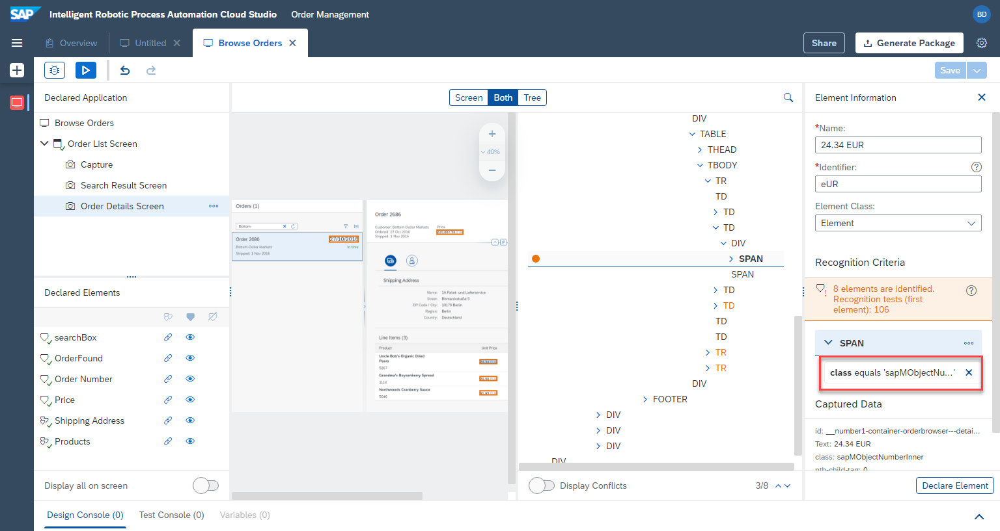

Now we want to make sure that the collection of multiple elements is based on the table cells. For this we will use `TD` as the criteria for finding the `SPAN` elements. 

5. Right click on `TD` and select `add to criteria`.

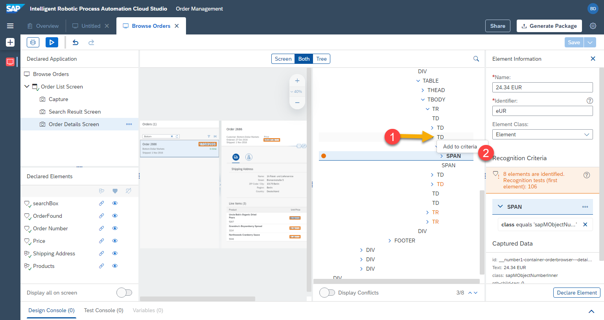

`TD` is now part of the criteria. 

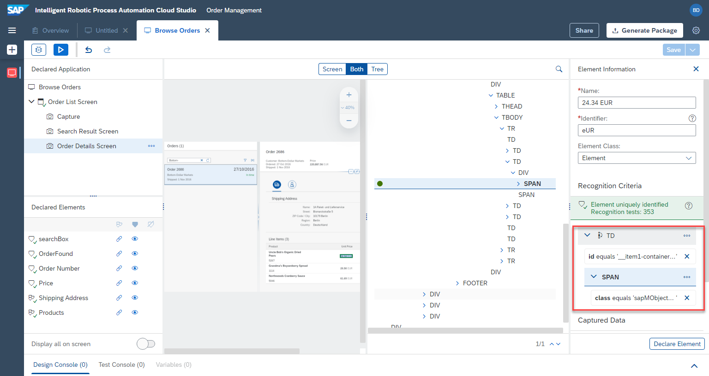

6. Adjust the `id` of `TD` to be `contains` and value:

```
cell1
```


7. `Rename` the element to e.g.

```
unitPrices
```

8. Click on `declare element`


Now instead of defining a collection like we did before, we will declare the collection based on the parent element `TD` we added as condition. This way the bot will loop over the `TD` cells and find the `SPAN` within these.

9. Click on `...` next to `TD` and click `set as collection`.


The element has been defined.


10. Don't forget to save the progress by clicking on the `save` button at the top right.

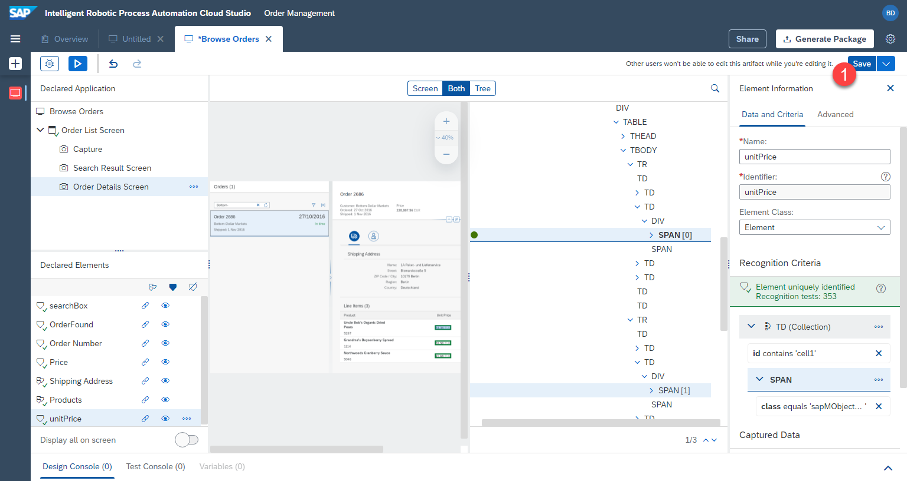

### Total Prices

The last column is `total prices`. That column has a similar structure as `unit price`, so we will speed up the definition process by copying `unitPrice` element and adjusting the configuration slightly.

1. Click on `...` next to `unitPrices`. 

2. Select `duplicate`


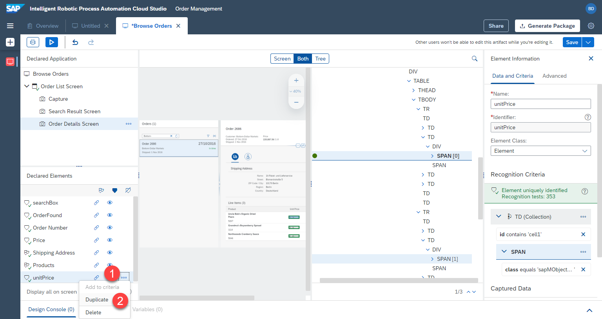

3. Name the new element, e.g.

```
totalPrices
```

Click on button `Duplicate`


Next, adjust the `id` of the cell from 2nd=`1` to 4th=`3` (counting starts from `0`)

4. Click on `id` under `td`.


5. Set criteria to `contains`  and value

```
cell3
```


The total prices have been defined. We didn't have to define them from scratch and were able to save time by duplicating another definition.


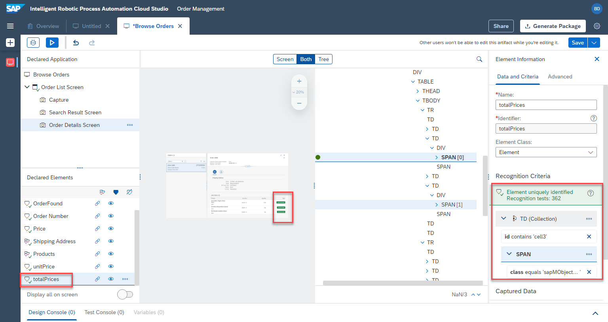


### Quantities

1. Click on the quantities cell. Expand and make sure the `td` (table cell) element is selected in the tree view.

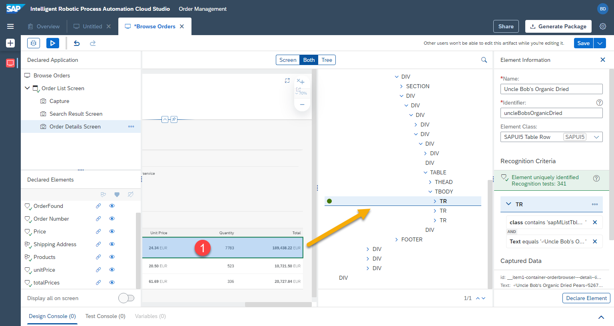


2. Remove the text criteria. Adjust the criteria to `id`. In the popup choose `contains` and `cell2`.


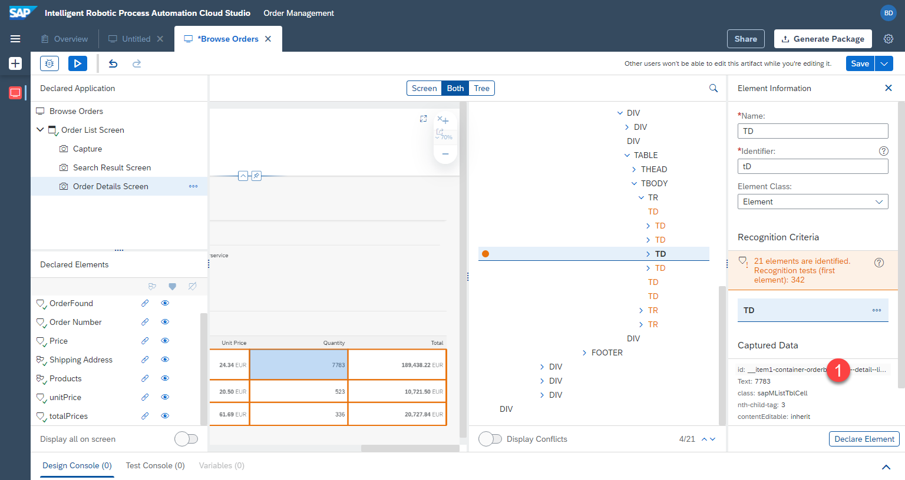


3. Rename the element to `quantities`, make sure the criteria are like in the screenshot.

4. Click on declare and make the element a collection by clicking on the triangles in the declared elements section.

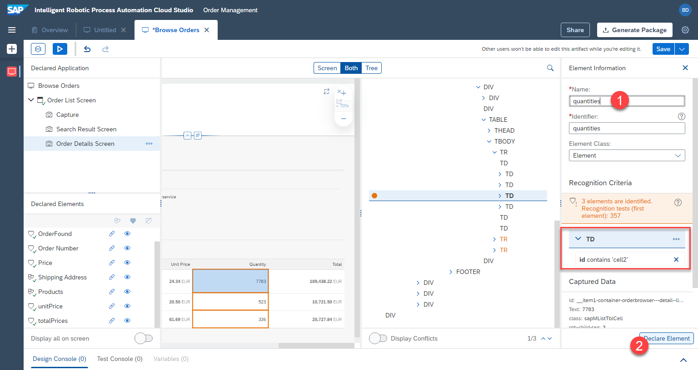

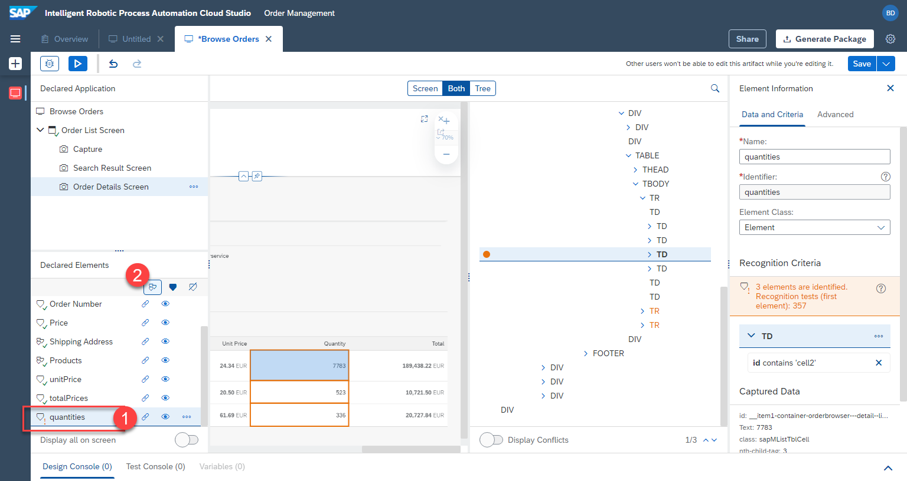


## Save


The screens and elements have been defined. We can now move on to defining the automation.

Don't forget to save your work by clicking `save` in the top right.


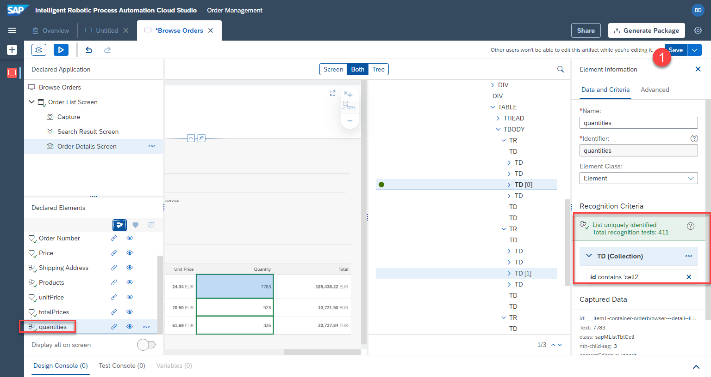


Nice! We have completed the capturing of the application and can now start creating the actual automation.